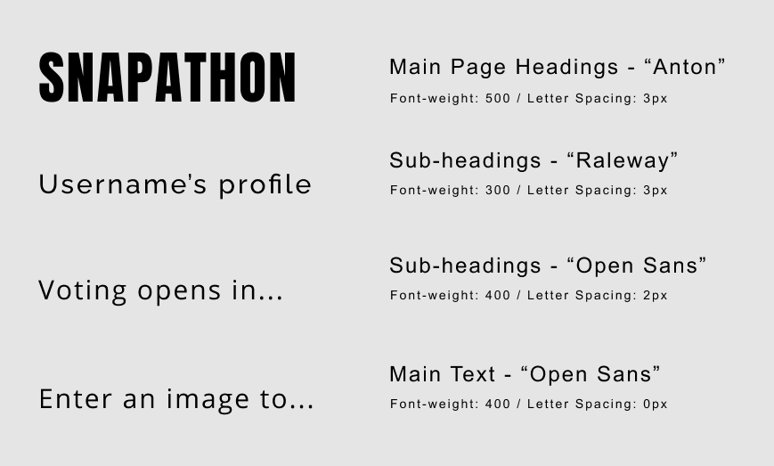

# Snapathon!
## Shoot, Compete, Rate, Repeat!
## Code Institute Milestone Project 3

Snapathon seeks to gamify photography. It is a community-led photo-sharing application that enhances the user experience with friendly competition.
Users register accounts and then they enter one competition a week on a particular theme. Every user that enters also has one vote to cast for a photo (not theirs).


# Table of Contents


- [1. UX](#ux)
  * [User Stories](#user-stories)
      - [*First Time User Stories*](#first-time-user-stories)
      - [*Returning User Stories*](#returning-user-stories)
      - [*Accessibility User Stories*](#accessibility-user-stories)
  * [Strategy](#strategy)
      - [*Project Goals*](#project-goals)
      - [*Target Users*](#target-users)
      - [*Research*](#research)
      - [*Value To The User*](#value-to-the-user)
  * [Scope](#scope)
    - [*Core Theme*](#core-theme)
    - [*Feature Ideas Table*](#feature-ideas-table)
    - [*List of Final Features*](#list-of-final-features)
    - [*Content Requirements*](#content-requirements)
  * [Structure](#structure)
      - [*Interaction Design*](#interaction-design)
        - [*Navigation*](#navigation)
        - [*Consistency, conventions and predictability*](#consistency-conventions-and-predictability)
        - [*Learnability and Communication of Functionality*](#learnability-and-communication-of-functionality)
        - [*Feedback*](#feedback)
        - [*Flash Messages*](#flash-messages)
        - [*Form Validation Messages*](#form-validation-messages)
        - [*Deletion Confirmation Modals*](#deletion-confirmation-modals)
        - [*Small Specific Messages*](#small-specific-messages)
        - [*State Changes*](#state-changes)
        - [*404 Error Pages*](#404-error-pages)
      - [*Information Architecture*](#information-architecture)
      - [*Application Sections*](#application-sections)
        - [Guest Users (not logged in)](#guest-users-not-logged-in)
        - [Guest User Flow](#guest-user-flow)
        - [Logged in Users](#logged-in-users)
  * [Skeleton](#skeleton)
      - [*Progressive Disclosure*](#progressive-disclosure)
      - [*Metaphorical Thinking*](#metaphorical-thinking)
      - [*Establishing Value Through Design*](#establishing-value-through-design)
      - [*Reassuring Conventions*](#reassuring-conventions)
      - [*Contextually Organised Content*](#contextually-organised-content)
      - [*Wireframes*](#wireframes)
  * [Surface](#surface)
      - [*Design Considerations*](#design-considerations)
      - [*Colour Palette*](#colour-palette)
      - [*Typography*](#typography)
      - [*Design Mockups*](#design-mockups)
- [2. Front-End Features](#2-frontend-features)
    - [1. Home](#1-home)
    - [2. Winners](#2-winners)
    - [3. Browse](#3-browse)
    - [4. Contact](#4-contact)
    - [5. Login](#5-login)
    - [6. Register](#6-register)
    - [7. Profile](#7-profile)
    - [8. Compete](#8-compete)
    - [9. Vote](#9-vote)
    - [10. Photo Details](#10-photo-details)
    - [11. Logout](#11-logout)
- [3. Back-End Features](#3-backend-features)
    - [12. Awards Calculations](#12-awards-calculations)
    - [13. New Competition](#13-new-competition)
    - [14. Edit Profile](#14-edit-profile)
    - [15. Edit Photo Details](#15-edit-photo-details)
    - [16. Delete Account](#16-delete-account)
    - [17. Delete Photo](#17-delete-photo)
- [4. Security](#4-security)
    - [1. CSRF Protection](#1-csrf-protection)
    - [2. Securing the upload filename](#2-securing-the-upload-filenames)
    - [3. Approved File Extensions](#3-approved-file-extensions)
    - [4. Uploaded file size](#4-uploaded-file-size)
    - [5. Validating file contents](#5-validating-file-contents)
    - [6. Securing the upload filename](#6-securing-the-upload-filenames)

# UX
## User Stories

This application is targeted towards photography enthusiasts. Anyone who takes photographs for fun and loves to share them with others.
Other photo sharing platforms have indicated an opportunity for an application that successfully gamifies photography and this aims to achieve that.
Snapathon hopes to entice users to register and upload their images in weekly competitions pitting their best images against others'.

## First Time User Stories

### *As a first time user / prospective user I want to be able to...*

- Easily understand the purpose of this web application. 
- Quickly and easily understand how to navigate and use the application.
- Read the competition rules and how to enter and have these be clearly explained.
- View an application that is visually and creatively appealing and physically easy to look at. 
- Browse images entered by other people to get a sense of what the application does and how it runs. 
- Filter my browsing by keyword, or by selecting only images that have won awards.
- View the most recent winning images and see how many points they got and who they were created by.
- Register an account using my email and password. 
- Confirm my password when registering, to ensure that I don't enter a typo.
- Contact the application owner if I have any questions. 

## Returning User Stories
### *As a returning user I want to be able to...*

#### Login & Profile 
- Login to the application.
- View my profile.
- Upload an avatar. 
- Edit my account information - change my password, username or avatar.
#### Competition
- Enter an image for competition. 
- Edit the details of the image I entered for competition. 
- Delete the image I entered for competition.
- View all the images that have been entered into this week's competition.
- Use my vote to vote for the image I think is the best.
#### Profile View & Functionality
- See how many points I have won.
- See all the images I've entered into competition.
- View my award-winning images separately from the main collection. 
- View all the images I've voted for.
#### Other 
- View other user profiles to see their images, who they've voted for and how many points they've won.
- Browse all the images entered from all competitions.
- Filter my browsing by keyword, or by selecting only images that have won awards.
- View the most recent award-winning images and see how many points they got and who they were created by.

## Accessibility User Stories

- As a user who is colourblind, I want the colours and design elements used to employ sufficient contrast so that any visual cues are easily apparent.
- As a keyboard user, I want to be able to navigate the application using the keyboard. 
- As a user using screen reader technology, I want my screen reader to describe the page elements correctly.


### *As the application creator I want to be able to...*

- Create and maintain a user-friendly platform allowing photography enthusiasts to compete with each other and to inspire each other with excellent images. 
- Ensure that the application is as accessible as possible to include as wide a variety of users as possible.
- Create a competition application that is re-usable for other fields, if this one proves popular. 
- Eventually introduce a profit-earning aspect to the application, perhaps by monetizing awards for professional photographers. 
 
#### back to [contents](#table-of-contents) 

--- 
# Strategy

## Project Goals
As already touched upon, the aim with this project is to create a usable photography competition application that enhances the quality of photography users display on the internet. 
As a professional photographer, I would love to use an application where the emphasis is less on sharing personal images and more on sharing images based on the quality of their photography.
High quality cameras on phones and mobile devices have made photography hugely accessible for everyone, however there has also been a marked drop in the quality of the photography people post online. 

The main goal for this application is to create an interface and an environment that encourage great quality images. That encourages looking for good light and interesting subjects.

My application goals summarized: 

- Create a workable photography competition application that is fun and intutive to use. 
- Gamify photography (both amateur & professional), and thus encourage high quality imagery as opposed to the current trend of low-quality personal images.
- Make the content publicly accessible / viewable, so as to encourage users to register and use the application. 
- Create a loyal community of users who regularly engage and compete against each other for points and bragging rights. 
- Allow users to easily register and then login and out of the application and have them be able to store and retrieve their data easily.
- Create an application that is easy to use and fully responsive on all major screen sizes and types.
- Create an application that might be monetized in the future once it develops a decent sized following of loyal users.

## Target users
The target users for this application are anyone who enjoys photography as a pasttime or professionally. There are no restrictions on tools or technology used to take photographs, a mobile phone camera is just as valid as a high-end dSLR or mirrorless. 
The importance is placed on the image itself, and how much that image speaks to its audience. The target market is also not limited by age or any other demographic, other than they will obviously be somewhat computer & technically literate.

## Research
I am a professional photographer, working in many different photographic fields for over a decade and I have a love/hate relationship with online photography competitions. Competitions based on the determination of a "panel of judges" 
can be overly subjective and these panels are usually comprised of the site owner who may or may not have any authority on the matter. I wanted to create a democratic competition where the competitors are also the judges and therefore the final awards are 
as meritocratic as possible. Especially since one of the more innovative aspects of this application is that users will be awarded points not only when their images win, but also if they vote for any of the top 3 placed images. In this way, users will be encouraged to actively vote for what they think are the best images, and not selectively based on strategizing. 

Ideally, there could also be a professional photographer offshoot to this application and such determinations would hold even more weight, the professional aspect could also be a sub-category worthy of future investigation. 


## Value to the user 

The main value is in providing an interesting photography application that does not exist in this form yet. It is an innovative platform that
promotes quality photography. Furthermore the idea does not have to be limited to photography, it could be widened to include other art forms, or indeed any arena that could 
feasibly accommodate an online competition. Essentially its value could expand to encompass an ever-widening user base.

#### back to [contents](#table-of-contents) 
---

 # Scope
 ## Core Theme

The keystone idea for this application is to create a **_democratic online photography competition that runs once a week._**

Some of the features developed with this aim in mind are listed below: 

 ## Feature Ideas Table

 #|Opportunity/Potential Feature | Importance | Viability | Score
---|------------ | -------------|--------------|------------------
. | __*USER REGISTRATION FUNCTIONALITY & FEATURES*__ 
1.| Register as a new user  | 10 | 10 | 20
2.| Register using an email address | 4 | 6 | 10
3.| When registering be able to confirm password | 5 | 6 | 11
4.| Register a username as separate from login email | 6 | 9 | 15
5.| Receive an email link to confirm a genuine email address |3 | 3 | 6
. | __*USER LOGIN FUNCTIONALITY & FEATURES*__ 
1.| User logs in with email and password |10 | 9 | 19
2.| When a user logs in they are brought to their profile page |6 | 10 | 16
3.| A session is started and the user's login status is remembered as they use the application |9 | 9 | 18
4.| When a user is logged in they can enter competitions and vote.  |10 | 9 | 19
5.| A user has to be logged in, in order to enter the competition or vote. |10 | 9 | 19
. | __*USER PROFILE FUNCTIONALITY & FEATURES*__ 
1.| A user's profile page shows all photos they have entered into competition. |4 | 4 | 8
2.| The profile page shows all the photos that user has voted for. |7 | 7 | 14
3.| The profile page displays the user's total points. |9 | 8 | 17
4.| The profile page displays badges the user has won by engaging with the application in various ways. |4 | 5 | 9
5.| A user can change their username, email address & password |7 | 8 | 15
6.| Other users can comment on individual photos on the profile page.  |2 | 2 | 4
7.| Other users can like photos on the profile page |1 | 2 | 3
8.| A user's total points score is displayed next to their username. |8 | 7 | 15
. | __*COMPETITION FUNCTIONALITY & FEATURES*__ 
1.| Users can upload images to competitions. |10 | 10 | 20
2.| Users can edit their uploaded image details. |8 | 9 | 17
3.| Users can delete their uploaded images. |8 | 8 | 16
4.| Users can easily view images they've uploaded for competition |8 | 9 | 17
5.| Users may upload entries for competition between Monday & Friday |7 | 8 | 15
6.| Voting days and time are on Saturday & Sunday until 22:00PM  |7 | 8 | 15
7.| Users vote by clicking a vote icon under their choice of image. |7|7|14
8.| Awards and points are automatically awarded and announced on Sunday at 22:00PM |7 | 8 | 15
9.| There is a page where the most recent winning images are displayed along with the points they've received. |8 | 8 | 16
10.| Points are awarded to users both if they win and if they vote for a winning image. |7 | 7 | 14
11.| Different categories of competitions could run simultaneously, allowing users to enter more than one competition per week. |3 |5 | 8
12.| Competitions could be sponsored by specific brands of camera, or lenses or gear. |2 | 4 | 6
. | __*OTHER FUNCTIONALITY & FEATURES*__ 
1.| Users can follow other users |3 | 2 | 5
2.| Images can be browsed by registered and unregistered users. |9|9|18
3.| Browsed images can be filtered by keyword or by awards. |7|7|14
4.| If an image is clicked on, a larger version of that image is shown including all its uploaded details and technical specs. |5|5|10

 ## List of Final Features 
 *(for 1st Iteration of the Application)*

In order to create a working online competition the minimal viability feature list does not allow for too much compromise. There are certain features that must 
be implemented if the application is to work at a fundamental level. Those are the features I decided to run with, the MVP features:

1. The ability of a user to register an account using an email address and a password.  
2. When registering to be able to confirm the new password to avoid typos.
3. To register a unique username as separate from the registered email.
4. The ability to login using their email and password. 
5. When a user logs in they are brought directly to their profile page.
6. They can enter competitions and vote when they are logged in, and only registered and logged in users can compete or vote.
7. A user's profile page shows their uploaded photograph entries, other user's photographs they have voted for and any photographs of theirs that have won awards.
8. A user's profile page also shows their total number of points. 
9. A user can change their username, email address & password.
9. A user can upload images to the weekly competitions, and they can edit or delete those images at any point. 
10. If a user uploads an image they get a single vote which they can use to vote for any image that is not theirs. Voting takes place on Saturday & Sunday until 22:00PM.
11. Users can vote by clicking the "Vote" button under their photo of choice.
12. Points & awards are calculated automatically on Sunday evening.
13. The Browse page allows registered and unregistered users to look through the entire collection of uploaded images and filter them by awards or keywords.
14. Anywhere an image is displayed, it can be clicked on and the user will be brought to that photograph's view page which displays more detailed information about the image as well as a larger version of the photo.

These are what I determined are the very basic level features to make the competition work, photo "likes", the ability of users to comment on images, the ability to follow other users, 
these are all features that are expected at some level, because most social media platforms follow such a similar formula, however because they are not essential to the working of this application, 
they can be implemented in future updates. The "long wow".

## Content requirements

As this application is heavily dependent on images, there are content-specific considerations to be addressed. The structure of the 
database is a top priority. MongoDB allows for scalability and because it is non-relational, there is considerable scope for trying 
things out to see what works best. The GridFS componenent of MongoDB is perfect for the first model of an image based application 
because it is so self-contained and relatively easy to use. Other options would have been to incorporate a third-party solution like S3 
or Cloudinary, and these remain viable options for future releases should the application grow, but I like the simplicity of having MongoDB 
take care of all the user data.

#### back to [contents](#table-of-contents) 
---

# Structure

The structure is somewhat non-linear as there are multiple views and the views are contingent on whether a user is registered and logged in.
In designing my application I was cognisant of the fact that because of the increased complexity of a somewhat non-linear, multi-levelled site, 
I would have to ensure that the interaction design and information architecture were both consistent, intuitive, accessible and include ample
feedback at every level of user interaction. 

## Interaction Design 

### Navigation
The application has been designed with predictable and known interaction features. Navigation is simplified with a fixed navbar along the top of 
the view at all times when on desktop, and a hamburger icon on mobile and smaller screens. 

The back button is never relied on. Design features, buttons, forms, switches, filters and search bars are all laid out and work in a consistent, 
predictable fashion. 

### Consistency, conventions & predictability
To ensure predictability in the application, I have relied on tried and tested conventions. All content, typography and method of interacting with 
the application has been designed to ensure consistency across the board, there are no surprises in store for the user. All buttons and links behave 
consistently and the feedback given to the user follows the same design and language patterns across the application. 

- All important content is visible on the page and when the user might need to scroll down this is made obvious for them. 

- The colours and typography are consistent throughout the application. 

- All messages to the user (detailed further below), are written in the same clear professional tone.

- The homepage for example, is the longest page in terms of content and I have included a clear content hinting "learn more" for first time or 
unregistered users, to ensure they do scroll down. 

- The layout of the homepage, with a brief description, register & login buttons and a content hint for further information. This formula is very common 
with applications such as this, and ensures that the user knows immediately that they are in safe hands. While they don't know the specifics yet, they do 
feel secure in their ability to interact with the application successfully. 

- Further down the homepage I have used font awesome icons to enhance metaphorical thinking and further relay the purpose and functioning of the app in a clear,
bold manner. 

- In my image layouts I've used a formulaic grid layout that is common to other photo-sharing apps. Users will be familiar with the layout and therefore 
more confident in engaging. 

- The same can be said for the user's profile page. I've designed it with features and a layout that the user will be expecting. The placement of the username, the 
user's profile photo and the tabs separating the user's photo collections are all easily recognised.

Where I diverged somewhat from convention was with the "Compete" page. Most photo sharing apps would have the "Add photo" link on the profile page, and while I 
did include a link to "compete" from the profile, I wanted the user to engage with the competition on a separate page. This was important because there were other 
elements the user might need to engage with such as having another look at the competition rules, and looking at the "upload guidelines". Structurally I also 
wanted the compete page separate as it shares its real-estate space with the "Vote" page depending on the day and I felt I wanted there to be a specific and 
separate space for the competition to take place. 

### Learnability and Communication of Functionality

The design of my landing page was particularly important, as it is the window to the rest of the application. Whether or not a user is bothered engaging 
further rests on how well this page is presented. I've tried to balance content and simplicity here, while not wanting to overload my new users with information, 
I did need to explain the application in a way that leaves no doubt as to what it does and how it does it.

When the user first lands on the homepage, I've used language to provide a concise summary of what they can expect. The app's name "SNAPATHON" effectively 
marries the idea of a photo 'snap' with the suffix '-athon' which brings up images of marathons, talkathons etc... Its meaning is: something 
that is carried out over a long period of time on a large scale and it generally has a competitive or 'striving' bent to it. To ensure clarity I've also included 
two other related phrases: "Love photography?" & "Shoot, Compete, Rate, Repeat" - the former is a direct call to action to our target audience, the latter concisely
explains how the app will operate in the form of a catchy slogan. 

I have dedicated all four main sections of the homepage to explaining what the application does and how it works in various levels of detail. As mentioned the 
first view gives the user a very concise idea of what to expect. The second section uses icons and headlines to double-down on the first message and whet the 
appetite. The third section goes into more detail and uses a timeline design to outline the competition's schedule and further expand on what happens and how 
it happens. The fourth section explains briefly how a user can win points and tells the user to click on a link below for a further (and very detailed) 
explanation of the rules. This detailed explanation is important, but I wanted to hide it for users taking a cursory glance at the homepage, to avoid overwhelming
users who might shy away from complexity.

As the competition rules and functioning are somewhat more advanced than a simple photo-sharing site, I have tried to repeatedly communicate the main functions and 
rules in a consistent and clear manner. 

The added element of a schedule for user engagement also posed a challenge to ensure users always know where they are in that time frame. I dealt with this by 
adding specific and precise timing messages when a user logs into their profile. Those messages are as follows: 

#### Timing Messages

1. __Monday - Friday AND the user has not uploaded an entry into the competition:__
*You still have to enter an image into this week's competition. You have x days, y hours and z minutes left to enter.*
2. __Monday - Friday AND the user has already entered an image:__
*Voting opens in x days, y hours and z minutes.*
3. __Friday - Sunday (before 22:00) for users who have entered an image, but not yet voted:__ 
*You still have to vote for your favourite image. You have x days, y hours and z minutes left to vote. If you don't vote, your entry's points will be reduced to 0.*
4. __Friday - Sunday (before 22:00) for users who have entered an image and have already voted:__
*You have already voted! Voting ends at 22:00 this Sunday in x days, y hours and z minutes, when awards, points & winners will be announced.*
5. __Friday - Sunday (before 22:00) for users who failed to enter an image in the competition and therefore cannot vote:__
*You did not enter this week's competition and therefore cannot vote. Voting ends at 22:00 this Sunday in x days, y hours and z minutes, when awards, points & winners will be announced.*

In this way, when the user visits their profile, they know exactly where they stand in the competition timeline, and what is or isn't expected of them.

### Feedback
The application ensures that users get feedback after all important interactions.

#### Flash Messages
The application makes good use of the Flash methods to deliver messages to the user. They are used to tell the users when they have done something wrong, 
or why something won't work, as well as delivering positive feedback when the user successfully does what they were expected to do.
Here are all the flash messages used in the application for great user feedback and assurance:

#### Success Messages:
- __*"Registration Successful"*__ - when a user first registers an account.
- __*"Welcome <username>!"*__ - Wher a user logs in.
- __*"Profile Updated Successfully"*__ - when a user edits any part of their profile. 
- __*"Entry Received"*__ - when a user enters an image into the competition. 
- __*"Thank you for voting"*__ - when a user casts their vote.
- __*"Account & photos deleted successfully, we're sorry to see you go. Come back to us any time!"*__ - When a user deletes their account. 
- __*"Email Sent!"*__ -  When a user successfully uses the contact form.
- __*"You've been logged out"*__ - When a user logs out

#### Failure Messages:
- __*"Incorrect username and/or password!"*__ - When a log in attempt fails. 
- __*"Email is already registered."*__ - When a user tries to register an existing email address. 
- __*"Username is already in use, please choose a different one."*__ - When a user tries to register an existing username.
- __*"Passwords do not match, please try again."*__ - When a user's registration passwords are not the same.
- __*"Incorrect username and/or password!"*__ - When a user is trying to login and has entered either an incorrect username or password.
- __*"Username is already in use, please choose a different one."*__ - When a user is editing their profile and tries to change their username to one already registered.
- __*"That email is already in use, please choose a different one."*__ - Same as above for email.
- __*"Your new passwords do not match, please try again."*__ - When a user is trying to change their password and the confirmation password has a typo, or was entered incorrectly.
- __*"Your new password cannot be nothing. If you were not trying to change your password, there is no need to enter your current password."*__ - This message is for the 
edge-case scenario whereby a user editing their profile declines to read the instructions on the form that state: ```If you'd like to change your password, 
please enter your current password below and then your new password twice.``` Instead they just enter their current password and nothing in the new password form 
fields.
- __*"Sorry, but your current password was entered incorrectly. Please try again."*__ - When a user trying to edit their profile
enters their current password incorrectly.
- __*"You must enter your current password to change your password. Please try again."*__ - When a user trying to edit their profile fails to enter their current password.
- __*"Incorrect password. Please try again."*__ - When a user trying to delete their account either: enters an incorrect password or their confirmation password is incorrect.
- __*"You must enter your password twice in order to delete your account. This is a security measure."*__ - When a user trying to delete their account fails to enter their password.
- __*"You must be logged in to delete your account, and obviously,you are not allowed to delete someone else's account!"*__ - When a user tries (using url) to delete someone else's account
or their own account, but without being logged in.
- __*"Sorry, but you don't have any votes to use. You've either already voted, or you did not enter this week's competition."*__ - When a user tries to vote without having
entered the competition or having already voted.
- __*"Sorry, but you cannot vote for your own photo... obviously."*__ - When a user tries to vote for their own image.
- __*"I'm sorry, but your search did not return any images."*__ - When a user searches for a filtered selection of photos on the browse page, but there are no results.
- __*"You cannot edit someone else's account!"*__ - When a user tries via url to edit another user's account.
- __*"You must be logged in to edit your account, and you are not allowed to edit someone else's account!"*__ - When a user either tries to edit theirs or another
user's account without being logged in (via url).
- __*"I'm sorry, but you've already entered an image in this week's competition!"*__ - If a user tries to enter more than one image in the competition.
- __*"You cannot edit another user's photo. Edit your own!"*__ - If a user is logged in and tries to edit another user's photo (via url).
- __*"You need to be logged in to edit photos."*__ - If a user tries to edit a photo (via url) without being logged in.
- __*"You may not delete another user's photo."*__ - If a user tries to delete another user's photo (via url).
- __*"Sorry, you must be logged in to delete a photograph."*__ - If a user tries to delete a photo without being logged in.
- __*"You must be logged in to vote."*__ - If a user tries to vote without being logged in.

The flash messages cover all manner of user interaction with the application and are written in a clear and concise manner in a tone and using language that is consistent
throughout. 

#### Form Validation Messages
Alongside the Flash messages, the Materialize library has some great in built form validation messages that are delivered to the user to tell them what is expected of them 
when filling out the various forms on the site. This catches smaller formatting issues withou relying on flash message or page reloads. All validations are expanded on in greater
depth in the testing.md doc. 

#### Deletion Confirmation Modals 
If a user chooses to delete their account, or an image they have entered into competition, they are prompted to first confirm
this action in a delete confirmation modal that appears. This is expected conventional behaviour and is important to ensure a user doesn't accidentally delete elements.

#### Small Specific Messages 
On the "Browse" page, when a user hovers over one of the images, they will see an overlay that displays some of the photo details, and a message
telling the user that if they would like to see more, to click on the overlay. This might have seemed obvious as the whole overlay is a link, and has a cursor
state change denoting that, but I feel it's important to guarantee that the user is aware that they can click in to each image for more details. 

#### State changes
All buttons, links and interactions have visible state changes to ensure the user knows their actions are working.

When a user has voted in the competition, a number of changes occur to cement that action:
1. The title changes from "VOTE" to "YOU HAVE VOTED!" 
2. The text changes to "Thank you for voting! Winning images & users will be announced Sunday night when voting closes." 
3. The vote buttons disappear.
4. There is an overlay on the image voted for - that says "You voted for this image." 

#### 404 error pages 
There are also specific error pages covering all manner of errors the user might encounter. The pages all have a clear message as to why an error was thrown, and 
a link to bring the user back to safety.


## Information Architecture

This application combines both linear and non-linear narratives. For first time users there is an obvious progression, they are encouraged to register but 
before they do so they can explore the application to a limited degree. 

Once they've registered they can enter an image into a competition, or they can browse other images, or they can view their own profiles or the profiles 
and photographs of other users. There is no set linearity to these options, but as the options are limited to a few main pathways, the application doesn't 
get overly confusing and it remains straightforward and intuitive. 

When a user selects an image to view its details, a hub and spoke structure is employed insofar as a "back to ... " link is added in addition to the 
omnipresent navbar option for the user. 

This "back to ..." is coded to be conditional and will refer to the user's source url page. So if the user arrived at the photo detail page from clicking on 
an image in "Recent Winners", it will read "Back to Recent Winners", likewise if they came to the photo detail page from a user profile, it will read "Back 
to username's profile". This adds a level of intelligence to the application that will further assure the user and make navigation simple.

I've also ensured that navigation remains somewhat shallow, whereby the user never needs more than 3 interactions to arrive at any of the site's destinations.

## Application Sections
### Guest Users (not logged in)

#### Landing Page: 

1. Application landing page. - the first thing a user sees are two options: login / register. 
2. If they choose to scroll down the page to learn more, the application purpose and rules of competition are clearly outlined. 
3. Further scrolling on that page brings them to the contact form.

The first view is designed in this manner to encourage information-seeking behaviour and provide answers within the first interaction. If the user arrives at 
the page and is immediately enticed to sign up, perfect, otherwise they can scroll down and understand a little more about what the application does. 

Ideally, users will choose to register at this juncture, however should they choose to continue browsing, the navigation options at this level are as follows:

#### Navigation Pages Accessible for guest users: 

1. __*Home*__ - The landing page where the rules of the competition are outlined. For guest users this explains the application and contains two major 
   links to the "register" page. 
2. __*Winners*__ - This is a simple page where the photographs coming in 1st, 2nd & 3rd from the last competition will be displayed alongside their 
creator's username and the number of votes they won. Clicking on any of the images will open the image view page where further details of the 
photograph can be seen. Clicking on the username of one of the winning images will bring the user to that user's profile.
3. __*Browse*__ - This is the full collection of images uploaded to the application. They are displayed as medium-sized thumbnails and users can click 
on any of them to bring them to the image view page, where further details about the photograph can be viewed. Users can also choose to filter the 
images displayed by using a search bar, where they can search by keywords, competition themes or awards. 
4. __*Contact Us*__ - This directs the user back to the bottom of the landing page, where the contact form is located. 
5. __*Login*__ - Registered users can navigate here to login. 
6. __*Register*__ - Unregistered users can navigate here to register. 


### Guest User Flow
For our target users who have yet to register, I have divided their user flows into two categories: 1. The Direct Route 2. The Exploratory Route. 
These are illustrated below:

<p align="center">
  
</p>

<p align="center">
    
</p>

Whichever route the user takes, the end goal is registration. I have included guest (non-registered) access to "Winners" and "Browse" specifically to cater for users who want to 
feel the product before they commit. The online version of consumers picking things and turning them over in shops. For tactile, more suspicious consumers, these exploratory routes to the business 
goal are important to assure them the product is sound. 

### Logged in Users

#### Navigation pages accessible for users who are logged in:

1. __*Home*__ - The major differences are: a welcome message referencing the user's username, no login & register buttons on the main view and no repeat cta "register"
link below the "review the competition rules" link.
2. __*Winners*__ - The winners page is identical for guest or logged in users.
3. __*Browse*__ - The browse page is identical for guest or logged in users.
4. __*Profile*__ - This link is not present in the navbar for guest users. For logged in users, when they click on this link they are brought to their profile
page where they will see the option to edit their profile, via which they can also choose to completely delete their account. The user profile will also display
specific timing and action-oriented messages customised by the day of the week and the degree of engagement the user has taken in the current competition. The
messages themselves have already been outlined above in the communication section.
5. __*Compete*__ - This link will be present between Monday & Friday. The page will show the current week's entries as well as a dropdown form button to enter 
an image, another to review the upload guidelines and a third to review the competition rules. Guest users do not have access to this page.
5. __*Vote*__ - This view will display the current week's competition entries all of which have "Vote" icons and clicking on any of the images will bring the 
user to the photo details view, where they can view a larger version of the image as well as all the photo details. Guest users do not have access to this page.
6. __*Contact Us*__ - This directs the user back to the bottom of the landing page, where the contact form is located. It is identical for users and guest users.
7. __*Logout*__ - Users can logout by clicking this link. Guest users don't see this.


#### Other Accessible Pages (for logged in and guest users): 

1. __*Photo detail pages:*__ Via "browse" or "winners", users can access a photo details page, that displays the image in question alongisde relevant details
 as well as the user who created it and a link to that user profile. The one difference between user types is that logged in users can choose to edit or delete 
 their entries here, when it is their own photo they are viewing.
2. __*User profiles:*__ Via the above photo details page, users can also view another user's profile page and see their entries, award-winning images, images
they've voted for as well as user points.

#### back to [contents](#table-of-contents) 
---

# Skeleton

## Progressive Disclosure 

As mentioned in the previous UX planning sections, I chose to carefully introduce the key information to the users on the homepage in a linear fashion. As a new 
user scrolls down the page, they are delivered more detailed content and explanations.

## Metaphorical Thinking

At this stage I also chose to include icons in the second section of the homepage to further entrench the messages and meanings of "Register", "Compete", "Rate
Others", "Win Points". My landing page combines progressive disclosure and metaphorical thinking in a fast and concise manner to deliver a clear message.

The timeline I used on the landing page, also takes advantage of metaphorical and linear thinking to clearly communicate when various aspects of the 
competitions take place. The timing details are also repeated on the user's profile page, but as aforementioned are specific to where the user is at in
the process and what day and time of the week it is.

## Establishing Value Through Design

Value is established on the landing page and indeed throughout the application by consistent repetition of the key points and features. In this way, a relatively
complex functioning becomes understandable, engaging and normalised. 

## Reassuring Conventions

I've included many conventional design choices to further assuage a user's mistrust of complexity. I've used pagination on all pages that display images, I've kept
the structure and design as simple as possible as regards information to avoid cognitive overload and I've ensured that the navigation bar is always accessible 
whether on mobile or desktop. 

## Contextually Organised Content

On the profile and photo details pages, I have been careful to organise the information in contextually appropriate ways so that the user expects what they see.
On the photo details page for example, the photo title is followed by the creator's name, which is followed by the photo's points, then the image itself and then
the photo story and remaining image details. The flow of information is logical and organically progressive.


## Wireframes 

The best way to view all the wireframes, user flows, mockups, colour palette & typography for this application
is by [visiting my public Figma workspace here.](https://www.figma.com/file/NYPifJrvaiC8OK2aAxNup6/Snapathon?node-id=0%3A1)

__*Alternatively here are the individual wireframes:*__

1. [Mobile Wireframes](static/images/wireframes/mobile-wireframes.pdf)
2. [Tablet Wireframes](static/images/wireframes/tablet-wireframes.pdf)
3. [Desktop Wireframes](static/images/wireframes/desktop-wireframes.pdf)

If you choose to view them this way, please click download as the GitHub viewer can expand the smaller files to an uncomfortably large zoom ratio.

#### back to [contents](#table-of-contents) 
---

# Surface

## Design Considerations

With this application's design I wanted to merge the feeling of a fun gamified application with the idea of 
a dimly lit museum. Essentially I wanted it to be both extroverted and introverted, not too much colour as that would 
detract from the photography, but it needed enough punch to be noticeable, so I went with a dark tone for the backgrounds,
a light grey for most of the text and a dark yellow accent colour. Yellow is a creative colour, so I think it meshes well 
with a photography application.  

## Colour Palette
 


## Typography

For the typography I veered a little outside my usual Roboto/Lato comfort zone and used a 
Google Font called "Anton" for the main page headings. This is a thick and bold and very immediately noticeable font. 
For the sub-headings I deferred to the old faithfuls of "Roboto" and "Open Sans" for a feeling of clarity and consistency.



## Design Mockups

Again, the best way to view these is 
by [visiting my public Figma workspace here.](https://www.figma.com/file/NYPifJrvaiC8OK2aAxNup6/Snapathon?node-id=0%3A1)

__*Alternatively here are the individual mockups:*__

1. [Mobile Mockups](static/images/wireframes/mobile-mockups.pdf)
2. [Tablet Mockups](static/images/wireframes/tablet-mockups.pdf)
3. [Desktop Mockups](static/images/wireframes/desktop-mockups.pdf)

Again, please remember to click download as the GitHub viewer can expand the smaller files to an uncomfortably large zoom ratio.

#### back to [contents](#table-of-contents) 
---

# Front-End Features

## 1. Home
The landing page is the first impression of the application and a window to what it does. Suffice it to say
its purpose is to pique a user's interest, to concisely explain the application and to direct the user as to what they should do next to engage.
<details><summary><b>click for features</b></summary>


### Features
#### Guest user 
- Displays the application title and taglines to introduce the concept.
- Includes login & register buttons in the first section. The former for the ease of use of returning users, the latter as a swift call to action for 
motivated and enthusiastic guest users.
- Displays a content hinting link to encourage users to scroll down to learn more. 

<p align="center">
    
</p>

- Second section is a blunt introduction to the application using icons, four words and a colourful image.

<p align="center">
    
</p>

- Third section features a timeline that details the temporal nature of the application and what happens when.
<p align="center">
    
</p>

- Fourth section expands on the competitive aspect and details how a user might gain points.
- Which is followed by a collapsible containing all the competition rules.
- Which is followed by another call to action for guest users to "Register to get started today!"
- A contact form which is detailed further below.

#### Logged in user
- The login & register buttons are not present for logged in users, instead they see a tiny leaf icon and a 
personal message saying ```"welcome username"```
- The rest of the page is the same except that the "Register to get started today!" link cta is also not present.
</details>


## 2. Winners
The winners page displays the results of each weekly competition. It is updated on a Sunday evening at 22:00 UTC.

<details><summary><b>click for features</b></summary>

### Features
- Tells the viewer what competition results they are viewing, the start date and theme.
- Displays the photos that have won 1st, 2nd & 3rd place awards. 
- If multiple photos receive the same number of points, ties are also possible.
- Displays the usernames of award-winners which are linked to their profile page.
- Displays the title of the award-winning photos which are linked to that specific photo detail page.
- Displays the number of votes received by a particular photo.
- Displays an award badge on winning images. 
- If there were no photos entered or no photos got any points, then a message to that effect is displayed. 
</details>

## 3. Browse

The Browse page enables all users to search through all images entered into all past and present competitions. 
It also allows users to filter their search. 

<details><summary><b>click for features</b></summary>

### Features
- On page load all competition images are displayed and they are paginated for faster loading times.
- A user can filter the search by:
    - Keyword search
    - Competition theme search
    - Awards search 
- These filters can be used in isolation or in combination with each other, to further refine the selection of images.
- When a user searches for a particular sub-section of images, the returning page scrolls down automatically to feature the images rather than the search box. 
- The keywords / selections / checkboxes the user has searched for remain visible once the results have loaded for 
increased UX.
- The search fields can be cleared easily using the reset button.
- When a user hovers over any of the images displayed a link overlay appears with the title of the photograph, 
and the creator of the image as well as a badge in the upper left hand corner, if the photo has won any awards.
- The overlay also displays an instruction to the user to click if they want to view the image detail page.
</details>

## 4. Contact
The contact section allows users to contact the application owners via email. The form is located at the bottom of the homepage and is fully functional.
Direct lines of communication are important with an application such as this where creative work is displayed. 
If users have any questions about functionality or copyright issues or questions, they need an easy way to get in touch.

<details><summary><b>click for features</b></summary>

### Features
 
- The contact form was built as a regular HTML form and the emails are sent to a Snapathon gmail account using flask-mail. 
- The flask-wtf-csrf extension is integrated into the form to protect against csrf attacks, by using a hidden input field holding the csrf token. 
- The form fields are limited to an email field and the message field as the application does not necessitate a long complicated email form. 
- The user receives a confirmation flash message as detailed above confirming that the email was sent successfully.
- The Materialize form validations handle any errors in email or message format and both fields are required.
</details>

## 5. Login
The login page allows registered users to access their account and engage with the application.
<details><summary><b>click for features</b></summary>


### Features
- When users login, they are prompted for their email and password. I chose to ask for their email over their username, because although both are unique, 
I think that users more easily forget their usernames, as they usually differ from application to application. 
- When users enter their details correctly, they are immediately brought to their profile page, where a welcome message is displayed referencing their username.
- If they enter their details incorrectly they see a flash message detailing the issue.
- User passwords are hashed and then read by Werkzeug. 
</details>

## 6. Register 
The register page allows new users to register with SNAPATHON, allowing them to engage with the application. 
<details><summary><b>click for features</b></summary>

### Features
- A form prompting the user to enter a username that must be unique, an email that must also be unique and a password.
- They are asked to enter their password twice, which is an important feature to prevent a user from accidentally misspelling a password and then not being able to sign in.

- The registration form has the following Materialize validations:
    - The username must be at least 5 characters long. 
    - The email address must be of valid email format. (Regex based so not foolproof)
    - The password must be at least 6 characters long.
- And the following backend validations: 
    - Both password fields must be identical and the passwords are case sensitive. 
    - If the username or email address has already been registered, the registration will not go ahead and the user will be instructed via a 
    flash message as to the reason. 

- When the user registers successfully, a session is created and they are redirected to their new profile page.
</details>

## 7. Profile
The profile page is a user's calling card and homebase in the application, it displays their photos and the photos they've voted for, as well as their points total.
Their profile is open for all to view.
<details>
<summary><b>click for features</b></summary>

### Features
#### Guest user
- Can visit user profile pages and browse the various categories of photos.
- Guest users can access user profiles by clicking on links on the winners page or on the browse page. 
- Or, if savvy they can type a username into the url in the format /profile/\<username>
- Guest users can also see the user's profile pic and how many points they have.
#### Logged in user

1. When a user is logged in, they see "Profile" in the navigation.
2. Their profile page displays their username, their total competition points, their entries into competition, other user's photos that they've voted for and any of their images that have won
awards. 
3. When logged in and on their *own* profile page, a user will see an "edit profile" button which they can use to change any of their profile details including their password.
4. In "edit profile" they also have access to a "Delete account" option.
5. To the right of their profile header the user sees a message specific to their current time and action status in the competition. These have already been detailed 
above in [timing messages](#timing-messages). 
</details>

## 8. Compete
The compete page is where users upload their images to compete in the competition each week. This page is only accessible to registered users 
who are logged in.
<details>
<summary><b>click for features</b></summary>

### Features

- The competition entry page and the vote page, share the same HTML real estate and they are conditionally programmed to appear and disappear depending what day of the 
week it is.
- The "Compete" Page is displayed (both the page and the link in the navbar) from Monday to Saturday morning at 0:00.
- The intro to this page specifies the current competition theme and then gives the user some guidelines as to the types of images
that are expected for this theme.
- The page features a Materialize collapsible block that includes:
- Information about the competition rules.
- Upload guidelines for users.
- The form to enter an image. 
- The entry form asks for a number of details regarding the photo to be entered into competition:
    - Photo title (required)
    - Photo Story - a background story to the image. (required)
    - The image file itself. (required)
    - The camera used. (required)
    - The lens used.
    - The aperture.
    - The shutter speed.
    - The ISO
- Users must also check that they've read the legal disclaimer outlining the various important copyright regulations and 
other rules to abide by.
- When successfully posted, the photo is saved to the database and entered into the competition.
- On Friday/Saturday at midnight the compete page disappears and "Vote" takes its place.

### Security Features 
- When the form is submitted if the file extension is not one of the approved image extensions (.svg, .jpg, .jpeg, .gif, .png)
a 415 error will be thrown. 
- If the image is larger than 549KB a 413 error will be thrown. 
- The image filename is secured using werkzeug.utils. 
- The form itself contains a hidden csrf token from flask_wtf to protect against cross site request forgery attacks.
</details>

## 9. Vote

The vote page is where users who have entered the competition can vote for their favourite image.

<details>
<summary><b>click for features</b></summary>

### Features
- This page is only visible to logged in users.
- This page comes online automatically on Saturday morning at 0:00 and replaces the compete page.
- It displays all the images entered into the week's competition.
- Every image has a large "Vote" button allowing users to vote for their favourite photo.
- "Vote" also replaces "Compete" in the navbar. 
- Users may only vote if they have entered the competition.
- Users who have not entered will not see the vote buttons.
- Users may only vote once, if they attempt to vote more than once (using url) a message will be flashed telling them
that they cannot. 
- If a user tries to vote for their own image, a message will flash telling them they cannot.
- When a user votes, the vote buttons will disappear and a "You voted for this image" message is displayed over the image they voted for.
- The images are displayed 50 per page and on each page the order of the images is randomised to try and ensure no image is given an unfair 
advantage.
- Every Sunday at 22:00 the votes are automatically tallied and points assigned to images and users. The vote page ceases it shows a message 
linking to the "Winners" page where the winning images are displayed. 
- It also contains a message giving users information about the next competition that will start at midnight on Monday morning. 
- When a user votes successfully within the rules of the competition, a "vote" is added to that particular photograph and then used to 
determine winners.

### Adjunct Features
- To keep the competition fair and competitive, users will not be able to view their own or others' "voted for" images 
until after the week of that competition. Otherwise you would know what photo was winning and vote for it to win points. 
The code is structured so that the voted for photos are only shown in user profiles when their specific competition has
ended.  
- For the same reason, the photo details page of photos currently being voted on, will not display the image's points/votes tally until
after the awards are distributed. 
</details>


## 10. Photo Details
This page allows users to view a larger version of the photos and to display all attendant details such as the photo title, 
the user who created it, the photo story and all the technical details. This page is accessed by clicking on any of the photo
thumbnails displayed on the site: in browse, on a user's profile page, in vote, or winners.

<details>
<summary><b>click for features</b></summary>

### Features
#### Guest user
- All the details relating to a particular image are displayed here including:
    - Title 
    - Photo's creator 
    - Photo's points 
    - The photograph itself
    - The story or background connected to the image.
    - Any awards the image has won in competition.
    - The camera used. 
    - The lens used.
    - The aperture used.
    - The shutter speed.
    - The ISO.
- If the non-required details were not entered by the user, those fields will not be visible.
- Clicking on the username connected with the photo will bring a user to that user's profile page.
- The photo's points are only displayed when the photo is no longer being considered for competition, so as to not 
skew the competition results.
- This page is accessible to all users.
- To improve UX this page delivers specific "back" messages which are conditional on how the user arrived
at the page. For instance if the user arrived from the "winners" page, the back link will read "back to winners!"
If they came from "browse" it will read "back to browse!"

#### Logged in user
- If the user viewing the image is also the creator of that image then they will see two buttons underneath the photo. 
- "Edit Photo Details" allows the user to edit any of the photo details other than the image itself. 
- "Delete Photograph" will delete the image from the competition and the application, and all connected associations.
</details>

## 11. Logout

This allows a user to logout of the application.
<details>
<summary><b>click for features</b></summary>

### Features 

- The logout function is run from a link on the navbar.
- It ends a user's session and redirects them to the login page with a flash message telling them that they've logged out successfully.
</details>

#### back to [contents](#table-of-contents) 
---

# Back-End Features

## 12. Awards Calculations

The awards are calculated automatically on Sunday evening at 22:00 UTC, the results of these calculations are then displayed on the "Winners" page.

<details>
<summary><b>click for features</b></summary>

### Features 

- The awards calculation is automatically run at 22:00PM on Sunday evening using a python library called AP Scheduler.
- From the pool of votes acquired from all the images, the awards function calculates the range of votes and from that range it determines
 what number of votes a photo needs to win a 1st, 2nd & 3rd prize. 
- The votes gained must be greater than 0 to win an award.
- If two or more images receive the same number of votes, then those photos all win that level of award.
- If a user has entered a photo into competition but then between Saturday & Sunday at 22:00PM fails to vote for a photo, that user's entry is 
made null and void, and this functionality is built into the awards calculations. Their photo's votes (points) are reduced to 0 and thus the entry 
is invalidated.

</details>

## 13. New Competition

Every Monday morning at 0:00 this feature resets all users so that a new competition can begin. 
<details>
<summary><b>click for features</b></summary>

### Features 

- This is run automatically using APScheduler at 0:00 Monday morning.
- It switches every user's "can_enter" field to True to allow all users enter the new competition.
</details>

## 14. Edit Profile

When logged in and viewing their own profiles, users can click the "edit profile" button to alter their
details. 
<details>
<summary><b>click for features</b></summary>

### Features 

- When they click the button, users are brought to the update profile page and they can alter their:
    - Username
    - Email address
    - Profile Pic
    - Password
- Their current username, profile pic & email values are pre-populated in the form. 
- The form has the following Materialize validations present and will not POST if these are not met:
    - usernames must be between 5 and 25 characters long.
    - email addresses must adhere to the regex formula of: ```^([a-zA-Z0-9_\-\.]+)@([a-zA-Z0-9_\-\.]+)\.([a-zA-Z]{2,5})$```
    - passwords must be between 6 and 25 characters long.
- Other validations include:
    - If a user tries to update their username or email to a username or email already saved in the database, they will
      be redirected with a message detailing the issue.
    - If a user wishes to change their password, they must enter their current password once and their new password twice. Missing any of those 
    fields will result in an unsuccessful update and a flash message to the user detailing why. 

</details>

## 15. Edit Photo Details

A logged in user viewing the photo details page of one of their own images, will see an "edit photo details" button. 
This will allow them to edit any of the details associated with the image, it will not allow them to change the image itself.
<details>
<summary><b>click for features</b></summary>

### Features 

- The user can edit:
    - Photo title
    - Photo Story
    - The camera used.
    - The lens used.
    - The aperture.
    - The shutter speed.
    - The ISO
- They will also have to agree to the terms and conditions again before posting the edit form.
- They can choose to click a "back" button that will cancel any edits made and bring them back to 
  the photo details page.
</details>

## 16. Delete Account

If a user is logged in and they click on the "Edit Profile" button on their profile page, they have the option
user the "update profile" form, to completely delete their account. 
<details>
<summary><b>click for features</b></summary>

### Features 

- When the user clicks the "delete account" button a deletion confirmation modal appears.
- This asks them if they definitely want to delete their account, their points and all
uploaded photos permanently.
- To confirm deletion they must enter their password correctly twice and then click delete again.
- They also have the option of clicking the "cancel" button, which will bring them back to the "update profile" page.
</details>

## 17. Delete Photo

This allows a user to delete any image they have entered into the competition. When a user clicks on the photo details page 
for one of their own images. Below the details, they will see a "delete photograph" button. 
<details>
<summary><b>click for features</b></summary>

### Features 

- Clicking the "delete photograph" button deletes the photograph from the database and all traces of it from the application front-end. 
- When the user clicks the button, they are prompted by a deletion confirmation modal and asked to confirm deletion. 
- If the image has won an award and the user deletes the image, the points that user gained from that image are also deducted from the 
user's points total. 
- The delete confirmation modal informs the user of the above and specifies the award won by the image as well as the number of points that will 
be deducted. 
- The user can choose to click "No, cancel" to cancel the deletion request, or "Yes, Delete it", to confirm. 

</details>

#### back to [contents](#table-of-contents) 
---

# Security
The following security features were integrated into this application:

## 1. CSRF Protection
To protect against cross site request forgery I used the Flask-WTF module's CSRF protection
by adding it globally and by adding a hidden input containing the crsf token in all forms.

This protection is particularly important for this application, as it does rely on cookie sessions and many of the 
CRUD requests do not require passwords.


## 2. Securing the upload filenames  

To stop attackers using the upload function to insert system requests into the server, and /or mess with 
configuration files, I've integrated ```secure_filename``` from werkzeug.utils *before* the uploaded files are 
saved to the database. This function reduces any dodgy filenames to flat safe ones.

## 3. Approved File Extensions

I added an array of approved filename extensions as an added layer of security, and one that also ensures the 
files uploaded can be displayed as images. I added ```app.config['UPLOAD_EXTENSIONS'] = ['.jpg', '.png', '.gif', '.svg', '.jpeg']```
to my configuration variables and if any other extension is attempted to be uploaded, the application throws a 415 error.

## 4. Uploaded file size 

The application only allows files under 540KBs to be uploaded, this has the dual purpose of ensuring faster page load times, and ensuring that 
users with malicious intent cannot upload large malicious programmes. 

## 5. Validating file contents

As a final and very important check on the file uploaded, 

GET renders the edit-profile template form if the username passed
      to the request matches the user currently logged in.

## 6. 


#### back to [contents](#table-of-contents) 


# Application Logic

# Future Functionality

## Expanded upload functionality

Uploaded images must be kept below 500KB, currently the onus is on the user to resize their images to fit that specification. For future versions of the app
I would like to allow the users to upload any size image they want, and the application will resize the image before it is saved to the database. This will allow
for greater flexibility and improved UX when it comes to using mobile to upload images, as resizing on mobile is still not straightforward.

##Offensive Images Filter 

If this application grows, it will be necessary to implement some automatic system whereby offensive images are screened using image recognition software, and
rejected before being saved to the database. 

# Attribution

- [Adding class to li after page is loaded](https://stackoverflow.com/questions/40506710/adding-class-to-li-after-page-is-loaded/40506822#40506822)

    I used Rafal Cz.'s solution to this stack overflow question to change the active class on my navbar on desktop and mobile. 

- [CSS based responsive timeline](https://codepen.io/krishnab/pen/OPwqbW/)

    I used Krishna Babu's responsive CSS Timeline on my homepage to outline the competition schedule. 

- [Finding the date of the next Saturday](https://stackoverflow.com/questions/16769902/finding-the-date-of-the-next-saturday)

    I used Emmanuel's answer to this question to write user specific messages on my user's profile pages, when they login. 

## Unsplash Images Used in the Application

<details><summary><b>click to expand</b></summary>

- <span>Photo by <a href="https://unsplash.com/@cdx2?utm_source=unsplash&amp;utm_medium=referral&amp;utm_content=creditCopyText">C D-X</a> on <a href="https://unsplash.com/s/photos/yellow?utm_source=unsplash&amp;utm_medium=referral&amp;utm_content=creditCopyText">Unsplash</a></span>
- <span>Photo by <a href="https://unsplash.com/@ronaldcuyan?utm_source=unsplash&amp;utm_medium=referral&amp;utm_content=creditCopyText">Ronald Cuyan</a> on <a href="https://unsplash.com/s/photos/yellow?utm_source=unsplash&amp;utm_medium=referral&amp;utm_content=creditCopyText">Unsplash</a></span>
- <span>Photo by <a href="https://unsplash.com/@spencerdavis?utm_source=unsplash&amp;utm_medium=referral&amp;utm_content=creditCopyText">Spencer Davis</a> on <a href="https://unsplash.com/t/nature?utm_source=unsplash&amp;utm_medium=referral&amp;utm_content=creditCopyText">Unsplash</a></span>
- <span>Photo by <a href="https://unsplash.com/@stangad?utm_source=unsplash&amp;utm_medium=referral&amp;utm_content=creditCopyText">Davide Stanga</a> on <a href="https://unsplash.com/t/nature?utm_source=unsplash&amp;utm_medium=referral&amp;utm_content=creditCopyText">Unsplash</a></span>
- <span>Photo by <a href="https://unsplash.com/@sajad_sqs9966b?utm_source=unsplash&amp;utm_medium=referral&amp;utm_content=creditCopyText">Sajad Nori</a> on <a href="https://unsplash.com/t/nature?utm_source=unsplash&amp;utm_medium=referral&amp;utm_content=creditCopyText">Unsplash</a></span>
- <span>Photo by <a href="https://unsplash.com/@sickle?utm_source=unsplash&amp;utm_medium=referral&amp;utm_content=creditCopyText">Sergey Pesterev</a> on <a href="https://unsplash.com/t/travel?utm_source=unsplash&amp;utm_medium=referral&amp;utm_content=creditCopyText">Unsplash</a></span>
- <span>Photo by <a href="https://unsplash.com/@maxwhtd?utm_source=unsplash&amp;utm_medium=referral&amp;utm_content=creditCopyText">Max Whitehead</a> on <a href="https://unsplash.com/t/travel?utm_source=unsplash&amp;utm_medium=referral&amp;utm_content=creditCopyText">Unsplash</a></span>
- <span>Photo by <a href="https://unsplash.com/@etiennegirardet?utm_source=unsplash&amp;utm_medium=referral&amp;utm_content=creditCopyText">Etienne Girardet</a> on <a href="https://unsplash.com/s/photos/yellow?utm_source=unsplash&amp;utm_medium=referral&amp;utm_content=creditCopyText">Unsplash</a></span>
- <span>Photo by <a href="https://unsplash.com/@alken?utm_source=unsplash&amp;utm_medium=referral&amp;utm_content=creditCopyText">Alfred Kenneally</a> on <a href="https://unsplash.com/t/nature?utm_source=unsplash&amp;utm_medium=referral&amp;utm_content=creditCopyText">Unsplash</a></span>
- <span>Photo by <a href="https://unsplash.com/@brentstorm?utm_source=unsplash&amp;utm_medium=referral&amp;utm_content=creditCopyText">Brent Storm</a> on <a href="https://unsplash.com/t/nature?utm_source=unsplash&amp;utm_medium=referral&amp;utm_content=creditCopyText">Unsplash</a></span>
- <span>Photo by <a href="https://unsplash.com/@storybyphil?utm_source=unsplash&amp;utm_medium=referral&amp;utm_content=creditCopyText">Phil Desforges</a> on <a href="https://unsplash.com/t/nature?utm_source=unsplash&amp;utm_medium=referral&amp;utm_content=creditCopyText">Unsplash</a></span>
- <span>Photo by <a href="https://unsplash.com/@p_kuzovkova?utm_source=unsplash&amp;utm_medium=referral&amp;utm_content=creditCopyText">Polina Kuzovkova</a> on <a href="https://unsplash.com/t/nature?utm_source=unsplash&amp;utm_medium=referral&amp;utm_content=creditCopyText">Unsplash</a></span>
- <span>Photo by <a href="https://unsplash.com/@samferrara?utm_source=unsplash&amp;utm_medium=referral&amp;utm_content=creditCopyText">Samuel Ferrara</a> on <a href="https://unsplash.com/t/nature?utm_source=unsplash&amp;utm_medium=referral&amp;utm_content=creditCopyText">Unsplash</a></span>
- <span>Photo by <a href="https://unsplash.com/@mischievous_penguins?utm_source=unsplash&amp;utm_medium=referral&amp;utm_content=creditCopyText">Casey Horner</a> on <a href="https://unsplash.com/t/nature?utm_source=unsplash&amp;utm_medium=referral&amp;utm_content=creditCopyText">Unsplash</a></span>
- <span>Photo by <a href="https://unsplash.com/@jannerboy62?utm_source=unsplash&amp;utm_medium=referral&amp;utm_content=creditCopyText">Nick Fewings</a> on <a href="https://unsplash.com/t/nature?utm_source=unsplash&amp;utm_medium=referral&amp;utm_content=creditCopyText">Unsplash</a></span>
- <span>Photo by <a href="https://unsplash.com/@maxsaeling?utm_source=unsplash&amp;utm_medium=referral&amp;utm_content=creditCopyText">Max Saeling</a> on <a href="https://unsplash.com/t/nature?utm_source=unsplash&amp;utm_medium=referral&amp;utm_content=creditCopyText">Unsplash</a></span>
- <span>Photo by <a href="https://unsplash.com/@philipgraves97?utm_source=unsplash&amp;utm_medium=referral&amp;utm_content=creditCopyText">Philip Graves</a> on <a href="https://unsplash.com/t/nature?utm_source=unsplash&amp;utm_medium=referral&amp;utm_content=creditCopyText">Unsplash</a></span>
- <span>Photo by <a href="https://unsplash.com/@maxwhtd?utm_source=unsplash&amp;utm_medium=referral&amp;utm_content=creditCopyText">Max Whitehead</a> on <a href="https://unsplash.com/t/architecture?utm_source=unsplash&amp;utm_medium=referral&amp;utm_content=creditCopyText">Unsplash</a></span>
- <span>Photo by <a href="https://unsplash.com/@thanospal?utm_source=unsplash&amp;utm_medium=referral&amp;utm_content=creditCopyText">Thanos Pal</a> on <a href="https://unsplash.com/t/architecture?utm_source=unsplash&amp;utm_medium=referral&amp;utm_content=creditCopyText">Unsplash</a></span>
- <span>Photo by <a href="https://unsplash.com/@lobostudiohamburg?utm_source=unsplash&amp;utm_medium=referral&amp;utm_content=creditCopyText">LoboStudio Hamburg</a> on <a href="https://unsplash.com/t/architecture?utm_source=unsplash&amp;utm_medium=referral&amp;utm_content=creditCopyText">Unsplash</a></span>
- <span>Photo by <a href="https://unsplash.com/@mattiabar?utm_source=unsplash&amp;utm_medium=referral&amp;utm_content=creditCopyText">mattia barbotti</a> on <a href="https://unsplash.com/t/architecture?utm_source=unsplash&amp;utm_medium=referral&amp;utm_content=creditCopyText">Unsplash</a></span>
- <span>Photo by <a href="https://unsplash.com/@laup?utm_source=unsplash&amp;utm_medium=referral&amp;utm_content=creditCopyText">Paul Volkmer</a> on <a href="https://unsplash.com/t/architecture?utm_source=unsplash&amp;utm_medium=referral&amp;utm_content=creditCopyText">Unsplash</a></span>
- <span>Photo by <a href="https://unsplash.com/@cobblepot?utm_source=unsplash&amp;utm_medium=referral&amp;utm_content=creditCopyText">Kit Suman</a> on <a href="https://unsplash.com/t/architecture?utm_source=unsplash&amp;utm_medium=referral&amp;utm_content=creditCopyText">Unsplash</a></span>
- <span>Photo by <a href="https://unsplash.com/@runninghead?utm_source=unsplash&amp;utm_medium=referral&amp;utm_content=creditCopyText">Denny Ryanto</a> on <a href="https://unsplash.com/t/architecture?utm_source=unsplash&amp;utm_medium=referral&amp;utm_content=creditCopyText">Unsplash</a></span>
- <span>Photo by <a href="https://unsplash.com/@sushioutlaw?utm_source=unsplash&amp;utm_medium=referral&amp;utm_content=creditCopyText">Brian McGowan</a> on <a href="https://unsplash.com/t/architecture?utm_source=unsplash&amp;utm_medium=referral&amp;utm_content=creditCopyText">Unsplash</a></span>
- <span>Photo by <a href="https://unsplash.com/@thevantagepoint718?utm_source=unsplash&amp;utm_medium=referral&amp;utm_content=creditCopyText">Lerone Pieters</a> on <a href="https://unsplash.com/t/street-photography?utm_source=unsplash&amp;utm_medium=referral&amp;utm_content=creditCopyText">Unsplash</a></span>
- <span>Photo by <a href="https://unsplash.com/@rafael_ishkhanyan?utm_source=unsplash&amp;utm_medium=referral&amp;utm_content=creditCopyText">Rafael Ishkhanyan</a> on <a href="https://unsplash.com/t/street-photography?utm_source=unsplash&amp;utm_medium=referral&amp;utm_content=creditCopyText">Unsplash</a></span>
- <span>Photo by <a href="https://unsplash.com/@milltownphotography?utm_source=unsplash&amp;utm_medium=referral&amp;utm_content=creditCopyText">Sam Barber</a> on <a href="https://unsplash.com/t/street-photography?utm_source=unsplash&amp;utm_medium=referral&amp;utm_content=creditCopyText">Unsplash</a></span>
- <span>Photo by <a href="https://unsplash.com/@vardarious?utm_source=unsplash&amp;utm_medium=referral&amp;utm_content=creditCopyText">Volkan Vardar</a> on <a href="https://unsplash.com/t/street-photography?utm_source=unsplash&amp;utm_medium=referral&amp;utm_content=creditCopyText">Unsplash</a></span>
- <span>Photo by <a href="https://unsplash.com/@charlesetoroma?utm_source=unsplash&amp;utm_medium=referral&amp;utm_content=creditCopyText">Charles Etoroma</a> on <a href="https://unsplash.com/t/street-photography?utm_source=unsplash&amp;utm_medium=referral&amp;utm_content=creditCopyText">Unsplash</a></span>
- <span>Photo by <a href="https://unsplash.com/@like_that_mike?utm_source=unsplash&amp;utm_medium=referral&amp;utm_content=creditCopyText">Mike Kienle</a> on <a href="https://unsplash.com/t/street-photography?utm_source=unsplash&amp;utm_medium=referral&amp;utm_content=creditCopyText">Unsplash</a></span>
- <span>Photo by <a href="https://unsplash.com/@shotbybrandon?utm_source=unsplash&amp;utm_medium=referral&amp;utm_content=creditCopyText">brandon patrisso</a> on <a href="https://unsplash.com/t/street-photography?utm_source=unsplash&amp;utm_medium=referral&amp;utm_content=creditCopyText">Unsplash</a></span>
- <span>Photo by <a href="https://unsplash.com/@dubhe?utm_source=unsplash&amp;utm_medium=referral&amp;utm_content=creditCopyText">Dubhe Zhang</a> on <a href="https://unsplash.com/t/street-photography?utm_source=unsplash&amp;utm_medium=referral&amp;utm_content=creditCopyText">Unsplash</a></span>
- <span>Photo by <a href="https://unsplash.com/@wexor?utm_source=unsplash&amp;utm_medium=referral&amp;utm_content=creditCopyText">Wexor Tmg</a> on <a href="https://unsplash.com/s/photos/animal?utm_source=unsplash&amp;utm_medium=referral&amp;utm_content=creditCopyText">Unsplash</a></span>
- <span>Photo by <a href="https://unsplash.com/@r3dmax?utm_source=unsplash&amp;utm_medium=referral&amp;utm_content=creditCopyText">Jonatan Pie</a> on <a href="https://unsplash.com/s/photos/animal?utm_source=unsplash&amp;utm_medium=referral&amp;utm_content=creditCopyText">Unsplash</a></span>
- <span>Photo by <a href="https://unsplash.com/@fridooh?utm_source=unsplash&amp;utm_medium=referral&amp;utm_content=creditCopyText">Frida Bredesen</a> on <a href="https://unsplash.com/s/photos/animal?utm_source=unsplash&amp;utm_medium=referral&amp;utm_content=creditCopyText">Unsplash</a></span>
- <span>Photo by <a href="https://unsplash.com/@kevinmueller?utm_source=unsplash&amp;utm_medium=referral&amp;utm_content=creditCopyText">Kevin Mueller</a> on <a href="https://unsplash.com/s/photos/animal?utm_source=unsplash&amp;utm_medium=referral&amp;utm_content=creditCopyText">Unsplash</a></span>
- <span>Photo by <a href="https://unsplash.com/@rayhennessy?utm_source=unsplash&amp;utm_medium=referral&amp;utm_content=creditCopyText">Ray Hennessy</a> on <a href="https://unsplash.com/s/photos/animal?utm_source=unsplash&amp;utm_medium=referral&amp;utm_content=creditCopyText">Unsplash</a></span>
- <span>Photo by <a href="https://unsplash.com/@licole?utm_source=unsplash&amp;utm_medium=referral&amp;utm_content=creditCopyText">Chris Charles</a> on <a href="https://unsplash.com/s/photos/animal?utm_source=unsplash&amp;utm_medium=referral&amp;utm_content=creditCopyText">Unsplash</a></span>
- <span>Photo by <a href="https://unsplash.com/@charlesdeluvio?utm_source=unsplash&amp;utm_medium=referral&amp;utm_content=creditCopyText">Charles Deluvio</a> on <a href="https://unsplash.com/s/photos/animal?utm_source=unsplash&amp;utm_medium=referral&amp;utm_content=creditCopyText">Unsplash</a></span>
- <span>Photo by <a href="https://unsplash.com/@danist07?utm_source=unsplash&amp;utm_medium=referral&amp;utm_content=creditCopyText"> DANIST</a> on <a href="https://unsplash.com/s/photos/animal?utm_source=unsplash&amp;utm_medium=referral&amp;utm_content=creditCopyText">Unsplash</a></span>
- <span>Photo by <a href="https://unsplash.com/@rayhennessy?utm_source=unsplash&amp;utm_medium=referral&amp;utm_content=creditCopyText">Ray Hennessy</a> on <a href="https://unsplash.com/s/photos/animal?utm_source=unsplash&amp;utm_medium=referral&amp;utm_content=creditCopyText">Unsplash</a></span>
- <span>Photo by <a href="https://unsplash.com/@ninjason?utm_source=unsplash&amp;utm_medium=referral&amp;utm_content=creditCopyText">Jason Leung</a> on <a href="https://unsplash.com/s/photos/animal?utm_source=unsplash&amp;utm_medium=referral&amp;utm_content=creditCopyText">Unsplash</a></span>
- <span>Photo by <a href="https://unsplash.com/@wilsanphotography?utm_source=unsplash&amp;utm_medium=referral&amp;utm_content=creditCopyText">wilsan u</a> on <a href="https://unsplash.com/s/photos/animal?utm_source=unsplash&amp;utm_medium=referral&amp;utm_content=creditCopyText">Unsplash</a></span>
- <span>Photo by <a href="https://unsplash.com/@mtths_psd?utm_source=unsplash&amp;utm_medium=referral&amp;utm_content=creditCopyText">matthias iordache</a> on <a href="https://unsplash.com/s/photos/animal?utm_source=unsplash&amp;utm_medium=referral&amp;utm_content=creditCopyText">Unsplash</a></span>
- <span>Photo by <a href="https://unsplash.com/@elenadesotophoto?utm_source=unsplash&amp;utm_medium=referral&amp;utm_content=creditCopyText">Elena de Soto</a> on <a href="https://unsplash.com/s/photos/event?utm_source=unsplash&amp;utm_medium=referral&amp;utm_content=creditCopyText">Unsplash</a></span>
- <span>Photo by <a href="https://unsplash.com/@chuttersnap?utm_source=unsplash&amp;utm_medium=referral&amp;utm_content=creditCopyText">CHUTTERSNAP</a> on <a href="https://unsplash.com/s/photos/event?utm_source=unsplash&amp;utm_medium=referral&amp;utm_content=creditCopyText">Unsplash</a></span>
- <span>Photo by <a href="https://unsplash.com/@alelmes?utm_source=unsplash&amp;utm_medium=referral&amp;utm_content=creditCopyText">Alasdair Elmes</a> on <a href="https://unsplash.com/s/photos/event?utm_source=unsplash&amp;utm_medium=referral&amp;utm_content=creditCopyText">Unsplash</a></span>
- <span>Photo by <a href="https://unsplash.com/@adam_whitlock?utm_source=unsplash&amp;utm_medium=referral&amp;utm_content=creditCopyText">Adam Whitlock</a> on <a href="https://unsplash.com/s/photos/event?utm_source=unsplash&amp;utm_medium=referral&amp;utm_content=creditCopyText">Unsplash</a></span>
- <span>Photo by <a href="https://unsplash.com/@kristinaco?utm_source=unsplash&amp;utm_medium=referral&amp;utm_content=creditCopyText">Kristina Evstifeeva</a> on <a href="https://unsplash.com/s/photos/event?utm_source=unsplash&amp;utm_medium=referral&amp;utm_content=creditCopyText">Unsplash</a></span>
- <span>Photo by <a href="https://unsplash.com/@karinacarvalho?utm_source=unsplash&amp;utm_medium=referral&amp;utm_content=creditCopyText">Karina Carvalho</a> on <a href="https://unsplash.com/s/photos/event?utm_source=unsplash&amp;utm_medium=referral&amp;utm_content=creditCopyText">Unsplash</a></span>
- <span>Photo by <a href="https://unsplash.com/@marcusneto?utm_source=unsplash&amp;utm_medium=referral&amp;utm_content=creditCopyText">Marcus Neto</a> on <a href="https://unsplash.com/s/photos/event?utm_source=unsplash&amp;utm_medium=referral&amp;utm_content=creditCopyText">Unsplash</a></span>
- <span>Photo by <a href="https://unsplash.com/@maximebhm?utm_source=unsplash&amp;utm_medium=referral&amp;utm_content=creditCopyText">Maxime Bhm</a> on <a href="https://unsplash.com/s/photos/event?utm_source=unsplash&amp;utm_medium=referral&amp;utm_content=creditCopyText">Unsplash</a></span>
- <span>Photo by <a href="https://unsplash.com/@brunocervera?utm_source=unsplash&amp;utm_medium=referral&amp;utm_content=creditCopyText">BRUNO EMMANUELLE</a> on <a href="https://unsplash.com/s/photos/event?utm_source=unsplash&amp;utm_medium=referral&amp;utm_content=creditCopyText">Unsplash</a></span>
- <span>Photo by <a href="https://unsplash.com/@_ryan_?utm_source=unsplash&amp;utm_medium=referral&amp;utm_content=creditCopyText">Ryan</a> on <a href="https://unsplash.com/s/photos/event?utm_source=unsplash&amp;utm_medium=referral&amp;utm_content=creditCopyText">Unsplash</a></span>
- <span>Photo by <a href="https://unsplash.com/@robwingate?utm_source=unsplash&amp;utm_medium=referral&amp;utm_content=creditCopyText">Rob Wingate</a> on <a href="https://unsplash.com/s/photos/event?utm_source=unsplash&amp;utm_medium=referral&amp;utm_content=creditCopyText">Unsplash</a></span>
- <span>Photo by <a href="https://unsplash.com/@kunjparekh?utm_source=unsplash&amp;utm_medium=referral&amp;utm_content=creditCopyText">Kunj Parekh</a> on <a href="https://unsplash.com/s/photos/monochrome?utm_source=unsplash&amp;utm_medium=referral&amp;utm_content=creditCopyText">Unsplash</a></span>
- <span>Photo by <a href="https://unsplash.com/@8moments?utm_source=unsplash&amp;utm_medium=referral&amp;utm_content=creditCopyText">Simon Berger</a> on <a href="https://unsplash.com/s/photos/monochrome?utm_source=unsplash&amp;utm_medium=referral&amp;utm_content=creditCopyText">Unsplash</a></span>
- <span>Photo by <a href="https://unsplash.com/@fabster74?utm_source=unsplash&amp;utm_medium=referral&amp;utm_content=creditCopyText">Fabian Fauth</a> on <a href="https://unsplash.com/s/photos/monochrome?utm_source=unsplash&amp;utm_medium=referral&amp;utm_content=creditCopyText">Unsplash</a></span>
- <span>Photo by <a href="https://unsplash.com/@kevinbessat?utm_source=unsplash&amp;utm_medium=referral&amp;utm_content=creditCopyText">Kevin Bessat</a> on <a href="https://unsplash.com/s/photos/monochrome?utm_source=unsplash&amp;utm_medium=referral&amp;utm_content=creditCopyText">Unsplash</a></span>
- <span>Photo by <a href="https://unsplash.com/@pliessnig?utm_source=unsplash&amp;utm_medium=referral&amp;utm_content=creditCopyText">HARALD PLIESSNIG</a> on <a href="https://unsplash.com/s/photos/monochrome?utm_source=unsplash&amp;utm_medium=referral&amp;utm_content=creditCopyText">Unsplash</a></span>
- <span>Photo by <a href="https://unsplash.com/@patrol?utm_source=unsplash&amp;utm_medium=referral&amp;utm_content=creditCopyText">Manouchehr Hejazi</a> on <a href="https://unsplash.com/s/photos/monochrome?utm_source=unsplash&amp;utm_medium=referral&amp;utm_content=creditCopyText">Unsplash</a></span>
- <span>Photo by <a href="https://unsplash.com/@fabster74?utm_source=unsplash&amp;utm_medium=referral&amp;utm_content=creditCopyText">Fabian Fauth</a> on <a href="https://unsplash.com/s/photos/monochrome?utm_source=unsplash&amp;utm_medium=referral&amp;utm_content=creditCopyText">Unsplash</a></span>
- <span>Photo by <a href="https://unsplash.com/@mattartz?utm_source=unsplash&amp;utm_medium=referral&amp;utm_content=creditCopyText">Matt Artz</a> on <a href="https://unsplash.com/s/photos/monochrome?utm_source=unsplash&amp;utm_medium=referral&amp;utm_content=creditCopyText">Unsplash</a></span>
- <span>Photo by <a href="https://unsplash.com/@sjois71?utm_source=unsplash&amp;utm_medium=referral&amp;utm_content=creditCopyText">joyce huis</a> on <a href="https://unsplash.com/s/photos/monochrome?utm_source=unsplash&amp;utm_medium=referral&amp;utm_content=creditCopyText">Unsplash</a></span>
- <span>Photo by <a href="https://unsplash.com/@vincentvanzalinge?utm_source=unsplash&amp;utm_medium=referral&amp;utm_content=creditCopyText">Vincent van Zalinge</a> on <a href="https://unsplash.com/s/photos/monochrome?utm_source=unsplash&amp;utm_medium=referral&amp;utm_content=creditCopyText">Unsplash</a></span>
- <span>Photo by <a href="https://unsplash.com/@curranrob?utm_source=unsplash&amp;utm_medium=referral&amp;utm_content=creditCopyText">Rob Curran</a> on <a href="https://unsplash.com/s/photos/monochrome?utm_source=unsplash&amp;utm_medium=referral&amp;utm_content=creditCopyText">Unsplash</a></span>
- <span>Photo by <a href="https://unsplash.com/@samburriss?utm_source=unsplash&amp;utm_medium=referral&amp;utm_content=creditCopyText">Sam Burriss</a> on <a href="https://unsplash.com/s/photos/portrait?utm_source=unsplash&amp;utm_medium=referral&amp;utm_content=creditCopyText">Unsplash</a></span>
- <span>Photo by <a href="https://unsplash.com/@alexiby?utm_source=unsplash&amp;utm_medium=referral&amp;utm_content=creditCopyText">Alex Iby</a> on <a href="https://unsplash.com/s/photos/portrait?utm_source=unsplash&amp;utm_medium=referral&amp;utm_content=creditCopyText">Unsplash</a></span>
- <span>Photo by <a href="https://unsplash.com/@drew_hays?utm_source=unsplash&amp;utm_medium=referral&amp;utm_content=creditCopyText">Drew Hays</a> on <a href="https://unsplash.com/s/photos/portrait?utm_source=unsplash&amp;utm_medium=referral&amp;utm_content=creditCopyText">Unsplash</a></span>
- <span>Photo by <a href="https://unsplash.com/@cristian_newman?utm_source=unsplash&amp;utm_medium=referral&amp;utm_content=creditCopyText">Cristian Newman</a> on <a href="https://unsplash.com/s/photos/portrait?utm_source=unsplash&amp;utm_medium=referral&amp;utm_content=creditCopyText">Unsplash</a></span>
- <span>Photo by <a href="https://unsplash.com/@pixelatelier?utm_source=unsplash&amp;utm_medium=referral&amp;utm_content=creditCopyText">Christian Holzinger</a> on <a href="https://unsplash.com/s/photos/portrait?utm_source=unsplash&amp;utm_medium=referral&amp;utm_content=creditCopyText">Unsplash</a></span>
- <span>Photo by <a href="https://unsplash.com/@kfred?utm_source=unsplash&amp;utm_medium=referral&amp;utm_content=creditCopyText">Karl Fredrickson</a> on <a href="https://unsplash.com/s/photos/portrait?utm_source=unsplash&amp;utm_medium=referral&amp;utm_content=creditCopyText">Unsplash</a></span>
- <span>Photo by <a href="https://unsplash.com/@lephotographe_?utm_source=unsplash&amp;utm_medium=referral&amp;utm_content=creditCopyText">Arthur Chauvineau</a> on <a href="https://unsplash.com/s/photos/portrait?utm_source=unsplash&amp;utm_medium=referral&amp;utm_content=creditCopyText">Unsplash</a></span>
- <span>Photo by <a href="https://unsplash.com/@lanju_fotografie?utm_source=unsplash&amp;utm_medium=referral&amp;utm_content=creditCopyText">Lanju Fotografie</a> on <a href="https://unsplash.com/s/photos/torch?utm_source=unsplash&amp;utm_medium=referral&amp;utm_content=creditCopyText">Unsplash</a></span>
- <span>Photo by <a href="https://unsplash.com/@ralphkayden?utm_source=unsplash&amp;utm_medium=referral&amp;utm_content=creditCopyText">Ralph (Ravi) Kayden</a> on <a href="https://unsplash.com/s/photos/wires?utm_source=unsplash&amp;utm_medium=referral&amp;utm_content=creditCopyText">Unsplash</a></span>
- <span>Photo by <a href="https://unsplash.com/@jg2021?utm_source=unsplash&amp;utm_medium=referral&amp;utm_content=creditCopyText">Jarosaw Gogowski</a> on <a href="https://unsplash.com/s/photos/sheep?utm_source=unsplash&amp;utm_medium=referral&amp;utm_content=creditCopyText">Unsplash</a></span>
- <span>Photo by <a href="https://unsplash.com/@lensinkmitchel?utm_source=unsplash&amp;utm_medium=referral&amp;utm_content=creditCopyText">Mitchel Lensink</a> on <a href="https://unsplash.com/s/photos/green?utm_source=unsplash&amp;utm_medium=referral&amp;utm_content=creditCopyText">Unsplash</a></span>
- <span>Photo by <a href="https://unsplash.com/@aaronburden?utm_source=unsplash&amp;utm_medium=referral&amp;utm_content=creditCopyText">Aaron Burden</a> on <a href="https://unsplash.com/images/nature?utm_source=unsplash&amp;utm_medium=referral&amp;utm_content=creditCopyText">Unsplash</a></span>
- <span>Photo by <a href="https://unsplash.com/@sadswim?utm_source=unsplash&amp;utm_medium=referral&amp;utm_content=creditCopyText">ian dooley</a> on <a href="https://unsplash.com/images/travel?utm_source=unsplash&amp;utm_medium=referral&amp;utm_content=creditCopyText">Unsplash</a></span>
- <span>Photo by <a href="https://unsplash.com/@hectorfalcon?utm_source=unsplash&amp;utm_medium=referral&amp;utm_content=creditCopyText">Hector Falcon</a> on <a href="https://unsplash.com/t/experimental?utm_source=unsplash&amp;utm_medium=referral&amp;utm_content=creditCopyText">Unsplash</a></span>
- <span>Photo by <a href="https://unsplash.com/@portuguesegravity?utm_source=unsplash&amp;utm_medium=referral&amp;utm_content=creditCopyText">Portuguese Gravity</a> on <a href="https://unsplash.com/s/photos/pool-sun?utm_source=unsplash&amp;utm_medium=referral&amp;utm_content=creditCopyText">Unsplash</a></span>
- <span>Photo by <a href="https://unsplash.com/@greystorm?utm_source=unsplash&amp;utm_medium=referral&amp;utm_content=creditCopyText">Ian</a> on <a href="https://unsplash.com/s/photos/portraits?utm_source=unsplash&amp;utm_medium=referral&amp;utm_content=creditCopyText">Unsplash</a></span>
- <span>Photo by <a href="https://unsplash.com/@henrihere?utm_source=unsplash&amp;utm_medium=referral&amp;utm_content=creditCopyText">Henri Pham</a> on <a href="https://unsplash.com/s/photos/portraits?utm_source=unsplash&amp;utm_medium=referral&amp;utm_content=creditCopyText">Unsplash</a></span>
- <span>Photo by <a href="https://unsplash.com/@rahabikhan?utm_source=unsplash&amp;utm_medium=referral&amp;utm_content=creditCopyText">Rahabi Khan</a> on <a href="https://unsplash.com/s/photos/portraits?utm_source=unsplash&amp;utm_medium=referral&amp;utm_content=creditCopyText">Unsplash</a></span>
- <span>Photo by <a href="https://unsplash.com/@ms88?utm_source=unsplash&amp;utm_medium=referral&amp;utm_content=creditCopyText">m</a> on <a href="https://unsplash.com/s/photos/portraits?utm_source=unsplash&amp;utm_medium=referral&amp;utm_content=creditCopyText">Unsplash</a></span>
- <span>Photo by <a href="https://unsplash.com/@karsten116?utm_source=unsplash&amp;utm_medium=referral&amp;utm_content=creditCopyText">Karsten Winegeart</a> on <a href="https://unsplash.com/s/photos/portraits?utm_source=unsplash&amp;utm_medium=referral&amp;utm_content=creditCopyText">Unsplash</a></span>


</details>

# Deployment

## Connecting the Application to MongoDB

1. Logged into my MongoDB account. 
2. With the "Clusters" tab selected, I clicked on "Connect" 
<p align="left">
  
</p>
3. Selected "Connect your application"
<p align="left">
  
</p>
4. Selected "Python" as the "Driver" and "Version" "3.6 or later". 
<p align="left">
  
</p>
5. Copied the connection string and pasted it in my env.py file editing it to include my dbname and my user password.

6.Created an instance of PyMongo and passed the application to that instance as below:


        mongo = PyMongo(app)

## Heroku Deployment

Before following the steps listed below, a requirements.txt file and a Procfile were created and pushed to GitHub using the following commands: 

        pip3 freeze --local > requirements.txt
        echo web: python app.py > Procfile

### The application was deployed via Heroku using this process: 

 1. Navigated to [Heroku](https://www.heroku.com/)
 2. Signed into my Heroku account. 
 3. Selected "New" on the dashboard and then "Create new application" option as below: 
 <p align="left">
  
</p>

 4. Selected a name for my application, selected "Europe" as the region and clicked "Create app". 
 <p align="left">
  
</p>
 5. With the "Deploy" tab selected, "GitHub - Connect to GitHub" was chosen as the deployment method.
<p align="left">
  
</p>
 6. Making sure my GitHub profile was displayed, I clicked "connect" next to the GitHub repository for this project.

<p align="left">
    
</p>
<p align="left">
    
</p>
<p align="left">
    
</p>
 7. Then I navigated to the "Settings" tab and clicked on "Reveal Convig Vars".
 <p align="left">
    
</p>

 8. Added in my configuration variables to Heroku.
 9. Navigated back to the "Deploy" tab and selected "Enable Automatic Deploys" with the master branch selected from the dropdown box.
 <p align="left">
    
</p>
<p align="left">
    
</p>
 10. Then clicked on "Deploy Branch" also with master selected. 
 <p align="left">
    
</p>
 11. Site is deployed and any changes are automatically deployed each time they are updated and pushed to GitHub during development.
<p align="left">
    
</p>

 # Tools and Other Resources Used 

## 1. Design

- ## [Font Awesome](https://fontawesome.com/)

    The icons used in this application were sourced from Font Awesome. 

- ## [Unsplash](https://unsplash.com/)

    Used throughout the application for images.

## HTML/CSS 

- ## [Regex use vs. Regex abuse](https://blog.codinghorror.com/regex-use-vs-regex-abuse/)

    Super article outlining the use of regular expressions. 

- ## [Form Input Validation Using Only HTML5 and Regex](https://code.tutsplus.com/tutorials/form-input-validation-using-only-html5-and-regex--cms-33095)

    Useful blog post on form validation. 

- ## [Keeping your footer at the bottom of the page](https://www.freecodecamp.org/news/how-to-keep-your-footer-where-it-belongs-59c6aa05c59c/)

    This is always a useful article.

- ## [Change color of underline input and label in Materialize.css framework](https://stackoverflow.com/questions/37127123/change-color-of-underline-input-and-label-in-materialize-css-framework)

    This Stack Overflow question was useful when customizing form elements. 

- ##[Change color of checkbox in Materialize framework](https://stackoverflow.com/questions/35261021/change-color-of-checkbox-in-materialize-framework)

    Stack Overflow article enabled me to override the Materialize checkbox colour styles. 

- ##[Beautiful CSS box-shadow examples](https://getcssscan.com/css-box-shadow-examples)

    A great collection of box-shadows

##JavaScript 

- ##[W3 Schools - Location hash Property](https://www.w3schools.com/jsref/prop_loc_hash.asp)

    Used on the browse page to scroll down to the images when a user searches.

## Python 

- ## [W3Schools Python Datetime Information](https://www.w3schools.com/python/python_datetime.asp)

    Used to help me write the datetime aspects of my code. 

- ## [Python | os.path.splitext() method](https://www.geeksforgeeks.org/python-os-path-splitext-method/)

    Very useful Python method for splitting files into roots & extensions. Used in this application to rename all incoming images.

- ## [How to add leading zeros to a number in Python](https://www.kite.com/python/answers/how-to-add-leading-zeros-to-a-number-in-python#:~:text=Use%20str.,0%20to%20the%20specified%20width%20.)

    Used briefly for a function that has since been removed. Good to know though.

- ##[Python List Comprehension](https://www.programiz.com/python-programming/list-comprehension)

    List comprehension used in a number of places throughout the application. A much more efficient and nicer way to loop through arrays. 

- ##[Write a long string into multiple lines of code in Python](https://note.nkmk.me/en/python-long-string/)
    
    How to format long strings while remaining PEP8 compliant. 

- ##[Using ternary operators in Python](https://book.pythontips.com/en/latest/ternary_operators.html)

    Nice short way to write conditionals.

- ## [Passing a function to another function in Python](https://medium.com/@lynzt/python-pass-a-function-to-another-function-and-run-it-with-args-b24141312bd7)

    Useful information for refactoring.

## Flask

- ## [Flask templates information](https://flask.palletsprojects.com/en/1.1.x/templating/#context-processors)

    Used to integrate a context processor for datetime into my application. 

- ## [Getting Referring URL for Flask Request](https://stackoverflow.com/questions/28593235/get-referring-url-for-flask-request)

    Used to change the back link on the photo details page, depending on what the source url (request.referrer) was.

- ## [How to enable CSRF protection in the Python / Flask app?](https://dev.to/dev0928/how-to-enable-csrf-protection-in-the-python-flask-app-5age)

    Decent introduction to using Flask-WTF extension to protect against CRSF attacks.

- ## [Handling File Uploads With Flask](https://blog.miguelgrinberg.com/post/handling-file-uploads-with-flask) 

    Wonderful walkthrough for explaining how to do various file upload validations. 

- ## [How to actually upload a file using Flask WTF FileField](https://stackoverflow.com/questions/14589393/how-to-actually-upload-a-file-using-flask-wtf-filefield?rq=1)

    Good information on using WTF File Field.

- ##[Get Form Checkbox Data in Flask with .getlist](https://www.youtube.com/watch?v=_sgVt16Q4O4)

    Quick tutorial on how to get and use the form checkbox data in Flask.

- ## [Simple Flask Pagination](https://medium.com/better-programming/simple-flask-pagination-example-4190b12c2e2e)

- ## [Flask Security Considerations - from the docs](https://flask.palletsprojects.com/en/1.1.x/security/)
    
    Very useful summary of all the security considerations to take into account when deploying a flask app.

##Flask Paginate

- ## [How to use Flask Paginate](https://gist.github.com/mozillazg/69fb40067ae6d80386e10e105e6803c9)

    Used to help me integrate flask paginate. Especially useful was the comment by "hephzibahponcellat" on how to change the number of resuts per page. 

- ## [Flask Paginate __init__.py File](https://github.com/lixxu/flask-paginate/blob/master/flask_paginate/__init__.py)

    Used to get a better understanding of this extension in order to customise it to use 3 times on my profile page. 

## Flask-Mail

- ## [Configure Flask-Mail to use GMail](https://stackoverflow.com/questions/37058567/configure-flask-mail-to-use-gmail)

    Stack overflow article I found useful when figuring out how to connect Flask-Mail to gmail correctly.

- ## [Send Email programmatically with Gmail, Python, and Flask](https://www.twilio.com/blog/2018/03/send-email-programmatically-with-gmail-python-and-flask.html)

    Great blog article about sending email via Flask-Mail. 

- ## [Send Email with Gmail, Python, and Flask](https://medium.com/analytics-vidhya/send-email-with-gmail-python-and-flask-1810c25cf5f5)

    Useful blog post about Flask-Mail

- ## [The Flask Mega-Tutorial Part X: Email Support](https://blog.miguelgrinberg.com/post/the-flask-mega-tutorial-part-x-email-support)

    This tutorial is useful for all aspects of Flask, but this bit was very useful when configuring Flask-Mail.

- ## [Python Flask e-mail form example](https://stackoverflow.com/questions/43728500/python-flask-e-mail-form-example)

    Another useful Stack Overflow question re: Flask-Mail.

## Flask-Talisman

- ##[Flask-Talisman Extension](https://github.com/GoogleCloudPlatform/flask-talisman)

    Brilliant extension to quickly protect against some common security threats.

- ## [Stack Overflow Question that helped solve...](https://stackoverflow.com/questions/33984908/google-fonts-violates-content-security-policy)

    ... an issue I was having integrating Talisman correctly. 

- ## [Flask-Talisman breaks Flask-Bootstrap](https://stackoverflow.com/questions/54730178/flask-talisman-breaks-flask-bootstrap)

    Helped me integrate Talisman correctly. 

## MongoDB 

- ## [GridFS Documentation](https://docs.mongodb.com/manual/core/gridfs/)

- ## [Save and Retrieve Files In a MongoDB with Flask-Pymongo](https://www.youtube.com/watch?v=DsgAuceHha4)

    Wonderfully concise tutorial that perfectly demonstrates how to save & retrieve images with GridFS & Flask. 

- ## [GridFS & MongoDB: Pros & Cons](https://www.compose.com/articles/gridfs-and-mongodb-pros-and-cons/)

    Article about whether to use GridFS or just store smaller files (<16MB> as binary data in a mongo collection.)

- ## [How to update a document in MongoDB instead of overwriting the exisiting one](https://stackoverflow.com/questions/49343649/how-to-update-a-document-without-overwriting-the-existing-one)

    Solved an issue I was having with this exact query.  

- ## [MongoDB: how to filter by multiple fields](https://developerslogblog.wordpress.com/2019/10/15/mongodb-how-to-filter-by-multiple-fields/)
    
    Good article on Mongo Filtering.

- ## [Text Indexes](https://docs.mongodb.com/manual/core/index-text/)

    Official documentation on building text indexes with Mongo DB.

- ##[How to AND and NOT in MongoDB $text search](https://stackoverflow.com/questions/23985464/how-to-and-and-not-in-mongodb-text-search)

    Useful stack overflow question, as the information is missing from the Mongo DB docs.

## Jinja

- ## [Jinja Documentation](https://jinja.palletsprojects.com/en/2.11.x/)

- ## [Get lengths of a list in a jinja2 template](https://stackoverflow.com/questions/1465249/get-lengths-of-a-list-in-a-jinja2-template)

    Used on the recent winners page to determine whether or not there was a tie. 

## APScheduler

- ## [Python timing task APScheduler](https://www.programmersought.com/article/6695232439/)

    Decent article explaining the basics of using APScheduler with Flask.

- ## [Passing Parameters to APScheduler](https://stackoverflow.com/questions/12412708/passing-parameters-to-apscheduler-handler-function)

    Used to work out how pass in db as a parameter, as the format is not intuitive.

## General/Misc

 - ## [RandomKeygen](https://randomkeygen.com/)

    A random key generator to create super secure keys & passwords. 

- ## [Bytes to bits to MBs to KBs to GBs converter](http://www.beesky.com/newsite/bit_byte.htm)

    Super useful for setting file size limits on uploads.

- ##[MDN Web Docs: Request.referrer](https://developer.mozilla.org/en-US/docs/Web/API/Request/referrer)

    Information on using request.referrer.

# Libraries

## [APScheduler](https://apscheduler.readthedocs.io/en/stable/#) 

Advanced Python Scheduler is a Python library that allows developers to schedule Python code to be executed at different times or intervals. 
Used in this application to schedule the awards & points process that happens each week on a Sunday at 22:00. 

## [Werkzeug](https://werkzeug.palletsprojects.com/en/1.0.x/)

A WSGI web application library used in this application for hashing and reading user passwords securely. 

##[Flask-Mail](https://pythonhosted.org/Flask-Mail/)

A Flask extension that allows users to send emails via the application. 

##[Flask Paginate](https://pythonhosted.org/Flask-paginate/)

A Flask extension to paginate. Says it's for use with bootstrap, but integrated fine with Materialize.

