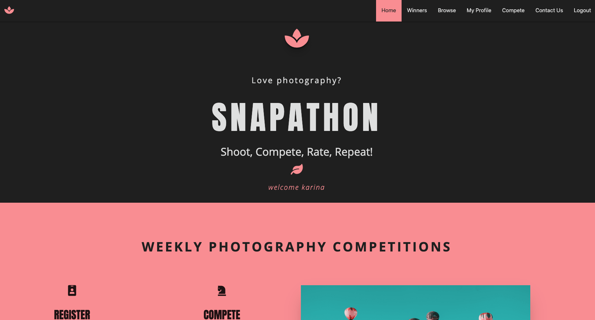
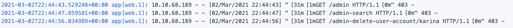
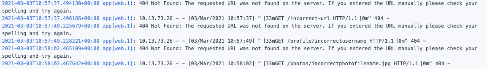
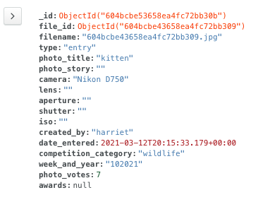
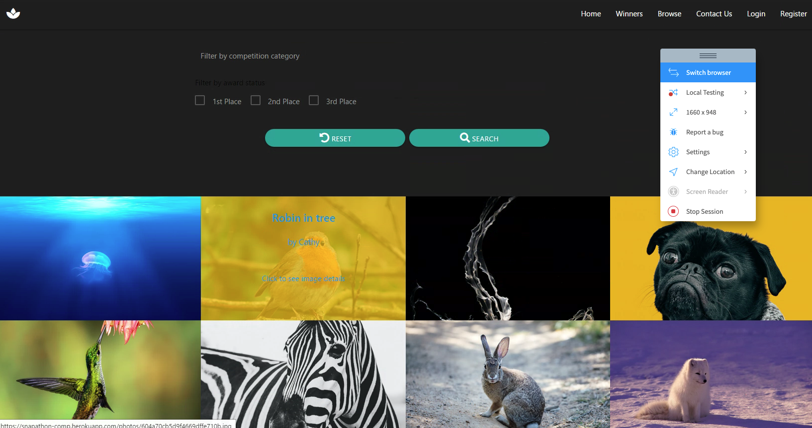
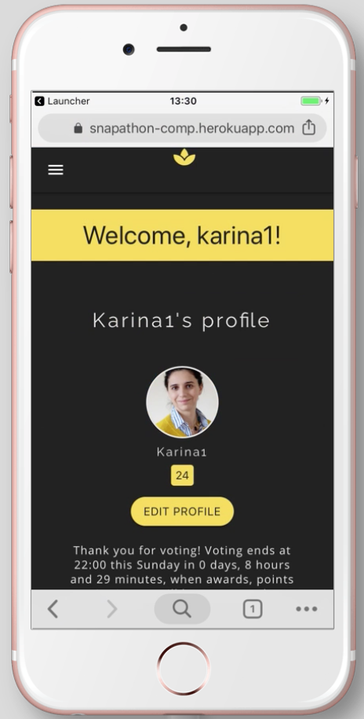

# **Snapathon Application: Testing**

# Testing Table Of Contents

* [**User Story Testing**](#user-story-testing)
  * [1. First Time User Goals Testing](#first-time-user-goals-testing)
  * [2. Returning User Goals Testing](#returning-user-goals-testing)
  * [3. Accessibility User Goals Testing](#accessibility-user-goals-testing)
  * [4. Application Creator User Goals Testing](#application-creator-user-goals-testing)
* [**Issues and bugs caught during testing**](#issues-and-bugs-caught-during-testing)
    * [1. browse()](#browse)
    * [2. winners()](#winners)
    * [3. get_photo()](#get_photo)
    * [4. edit_profile()](#edit_profile)
    * [5. compete()](#compete)
    * [6. base.html](#base-html)
    * [7. Integrating Email Functionality](#integrating-email-functionality)
    * [8. awards()](#awards)
    * [9. Error Messages](#error-messages)
    * [10. Flask-Talisman](#flask-talisman)
    * [11. Running APScheduler on the Free Version of Heroku](#running-apscheduler-on-the-free-version-of-heroku)
    * [12. vote()](#vote) 
* [**Status Code Testing**](#status-code-testing)
    * [1. 200 Status Code Testing](#200-status-code-testing)
    * [2. 302 Status Code Testing](#302-status-code-testing)
    * [3. 403 Status Code Testing](#403-status-code-testing)
    * [4. 404 Status Code Testing](#404-status-code-testing)
    * [5. 413 Status Code Testing](#413-status-code-testing)
    * [6. 415 Status Code Testing](#415-status-code-testing)
    * [7. 500 Status Code Testing](#500-status-code-testing)
* [**Functionality Testing**](#functionality-testing)
  * [**Base Functionality**](#base-functionality)
    * [1. Navigation](#1-navigation)
    * [2. Login](#2-login)
    * [3. Links](#3-links)
    * [4. Buttons](#4-buttons)
    * [5. Forms](#5-forms)
    * [6. Input Validation](#6-input-validation)
    * [7. Pagination](#7-pagination)
    * [8. Email](#8-email)
    * [9. Logout](#9-logout)
  * [**CRUD Functionality**](#crud-functionality)
    * [Create](#create)
        * [1. New User Registration](#1-new-user-registration)
        * [2. Entering the Competition](#2-entering-the-competition)
    * [Read](#read)
        * [1. Viewing a specific profile](#1-viewing-a-specific-profile)
        * [2. Browsing and filtering images](#2-browsing-and-filtering-images)
        * [3. Viewing a specific photo entry](#3-viewing-a-specific-photo-entry)
        * [4. Viewing award-winners](#4-viewing-award-winners)
        * [5. Viewing user control panel (admin only)](#5-viewing-user-control-panel-admin-only)
        * [6. Searching by username in control panel (admin only)](#6-searching-by-username-in-user-control-panel-admin-only)
    * [Update](#update)
        * [1. Update photo details](#1-update-photo-details)
        * [2. Update user details](#2-update-user-details)
        * [3. Update user details (admin)](#3-update-user-details-admin)
        * [4. Voting in the competition](#4-voting-in-the-competition)
    * [Delete](#delete)
        * [1. Delete Photo Entry](#1-delete-photo-entry)
        * [2. Delete User Account](#2-delete-user-account)
        * [3. Delete User Account (admin)](#3-delete-user-account-admin)
  * [**Testing the Temporal Processes**](#testing-the-temporal-processes)
  * [**Testing the Automated Processes**](#testing-the-automated-processes)
    * [Awards Function - Test 1](#awards-function-1)
    * [Awards Function - Test 2](#awards-function-2)
    * [Vote Function - Test 1](#vote-function)
* [**Security Testing**](#security-testing)
    * [Testing the CSRF Protection](#testing-the-csrf-protection)
    * [Testing the Sanitization of the Uploaded Filename](#testing-the-sanitization-of-the-uploaded-filenam)
    * [Testing the Approved File Extensions Security Measure](#testing-the-approved-file-extensions-security-measure)
    * [Testing the File Type Validation](#testing-the-file-type-validation)
    * [Testing the Uploaded File Size Limit](#testing-the-uploaded-file-size-limit)
    * [Testing Flask-Talisman and the CSP](#testing-flask-talisman-and-the-csp)
    * [Access Control Testing](#access-control-testing)
* [**Browser Testing**](#browser-testing)
    * [Desktop Browser Testing](#desktop-browser-testing)
    * [Mobile Browser Testing](#mobile-browser-testing)
* [**Responsivity Testing**](#responsivity-testing)
* [**Code Validators**](#code-validators)
    * [HTML Validators](#html-validators)
        * [W3C HTML Validator](#w3c-html-validator)
        * [W3C Link Checker](#w3c-link-checker)
    * [CSS Validators](#css-validators)
        * [W3C CSS Validator](#w3c-css-validator)
    * [JavaScript Validators](#javascript-validators)
        * [JSHint](#jshint)
    * [Python Validators](#python-validators)
        * [PEP8 Online](#pep8-online)
* [**Performance and Web Development Tools Testing**](#performance-and-web-development-tools-testing)
    * [Lighthouse](#lighthouse)
    * [Web Dev Measure](#web-dev-measure)
    

# User Story Testing 

## First Time User Goals Testing

<details><summary><b>click for tests</b></summary>

- __Easily understand the purpose of this web application. - PASS__
    - The landing page is almost wholly dedicated to elucidating the purpose and functionality
    of the application.
    - The application's name encapsulates meaning, giving the first clue towards purpose.
    - Then the landing page summarises the idea with a pithy tagline.
    - Then it expands that a tad more with icons and more specific language.
    - The timeline further explains purpose with the temporal component outlined.
    - The next section is aptly titled "How does this work"? and it further expands on the competitive aspect.
    - Finally, there is a collapsible that clarifies any and all questions a user might still have at this stage.

- __Quickly and easily understand how to navigate and use the application. - PASS__
    - As abovementioned the purpose and rules are evident.
    - As for 'using' the application, alongside the above, there are also clear links to "register" which is the first action taken by a future user.
    - When registered, a user is brought directly to their new profile page, where a message will indicate what stage of the competition is currently 
    running and what action the user can/should take.

- __Read the competition rules and how to enter and have these be clearly explained. - PASS__
    - The competition rules are available for viewing on the landing page for unregistered users. 
    - They are also available on the compete page for viewing alongside the entry upload form.
 
- __View an application that is visually and creatively appealing and physically easy to look at. - PASS__
    - The colours and layout have all been designed so as to enhance the visual / aesthetic appeal of the application, with a 
    specific eye to contrast and accessibility concerns as will be detailed below.

- __Browse images entered by other people to get a sense of what the application does and how it runs. - PASS__
    - The browse page is fully functional and allows both logged in an guest users to browse images. 

- __Filter my browsing by keyword, or by selecting only images that have won awards. - PASS__
    - The browse page allows logged in and guest users to search for and filter photos by keywords, competition categories & awards status.

- __View the most recent winning images and see how many points they got and who they were created by. - PASS__
    - The "winners" page lays out the most recent award-winning images & creators and allows users to click on an image to see more details.

- __Register an account using my email and password. - PASS__
    - Registration works perfectly and to this original user goal, I added a username requirement to the registration.

- __Confirm my password when registering, to ensure that I don't enter a typo. - PASS__
    - This functionality has been implemented into the registration form. 

- __Contact the application owner if I have any questions. - PASS__
    - The contact form functions to allow users to email the Snapathon admin directly.

</details>


## Returning User Goals Testing

<details><summary><b>click for tests</b></summary>

#### Login & Profile - ALL PASSED
- __Login to the application. - PASS__
    - Login functionality works perfectly.

- __View my profile. - PASS__
    - Users can view their own and others' profiles.

- __Upload an avatar. - PASS__
    - Users can upload, change and delete their profile-pics.

- __Edit my account information - change my password, username or avatar. - PASS__
    - Users can update their account details including their passwords, emails, usernames and profile-pics.

#### Competition - ALL PASSED
- __Enter an image for competition. - PASS__ 
    - Users can upload photos to the competition as long as they remain within the entry parameters.

- __Edit the details of the image I entered for competition. - PASS__ 
    - Users can update their photo's details using the "edit photo details" button when in the photo details view page.

- __Delete the image I entered for competition. - PASS__
    - Users can delete any of their images using the "delete photograph" button when in the photo details view page.

- __View all the images that have been entered into this week's competition. - PASS__
    - Users can view all the images collated together once the entry process has ended, so when voting opens. This was specifically structured this 
    way so as not to give anyone an unfair advantage. 
    - However users can also view the images in the browse section before the voting opens, but they will be mixed together with all other entries, 
    although they can be filtered by competition theme. 

- __Use my vote to vote for the image I think is the best. - PASS__
    - Users can vote for a single image, once voting opens.

#### Profile View & Functionality - ALL PASSED
- __See how many points I have won. - PASS__
    - A user's total points is displayed next to their profile photo on the profile view page.

- __See all the images I've entered into competition. - PASS__
    - A user can view all images they've entered into competition on their profile page under the "entries" tab.

- __View my award-winning images separately from the main collection. - PASS__ 
    - A user can view all award-winning images on their profile page under the "awards" tab.

- __View all the images I've voted for. - PASS__
    - A user can view all the images they have voted for on their profile page under the "votes" tab.

#### Other - ALL PASSED 
- __View other user profiles to see their images, who they've voted for and how many points they've won. - PASS__
    - A user can view other user profiles by clicking on the usernames on the winners page, by clicking on any of the thumbnails on the browse page 
    and then clicking on the username on that photo's details page, or (should they want to) by typing "profile/\<username>" in the url.
    - User profiles are open to public view.

- __Browse all the images entered from all competitions. - PASS__
    - The browse page allows logged in and guest users to browse all entries entered into all competitions.

- __Filter my browsing by keyword, or by selecting only images that have won awards. - PASS__
    - The browse page allows logged in and guest users to search for and filter photos by keywords, competition categories & awards status.

- __View the most recent award-winning images and see how many points they got and who they were created by. - PASS__
    - The "winners" page lays out the most recent award-winning images & creators and allows users to click on an image to see more details.

</details>

## Accessibility User Goals Testing 

<details><summary><b>click for tests</b></summary>

- __As a user who is colourblind, I want the colours and design elements used to employ sufficient contrast so that any visual cues are easily apparent. - PASS__
    - The colours and contrast was taken into account during the wireframing and initial planning stages of the application. 
    - They were checked and rechecked with Chrome's Web Disability Simulator after every design alteration.
    - The choice of yellow and dark grey was with an eye to its excellent contrast and how easily viewable it is by the greatest range of users.
    - None of the application's functionality is dependent on a user being able to correctly discern between colours. Colours are used to enhance the experience for 
    normally sighted users, such as "Delete" buttons being red, however they also have "delete" written on them, or they employ the use of icons that clearly illustrate 
    their purpose.
    - Here are some of the screenshot examples of how the application is viewed by colourblind users:

*__Total Colourblindness__*

<p align="center">
  
</p>

*__Yellow-Blue Colourblindness__*

<p align="center">
  
</p>

*__Red-Green Colourblindness__*

<p align="center">
  
</p>

- __As a keyboard user, I want to be able to navigate the application using the keyboard. - PASS__
    - All functionality is fully keyboard accessible.

- __As a user using screen reader technology, I want my screen reader to describe the page elements correctly. - PASS__
    - Aria-labels have been added to all important elements.
    - Elements have been written with an eye to the correct semantic HTML format to ensure the best possible experience for screen-reader dependent users.

</details>

## Application Creator User Goals Testing

<details><summary><b>click for tests</b></summary>

- __Create and maintain a user-friendly platform allowing photography enthusiasts to compete with each other and to inspire each other with excellent images. - PASS__ 
    - This application achieves the above. 

- __Ensure that the application is as accessible as possible to include as wide a variety of users as possible. - PASS__
    - As above I have developed this application with an eye to strong accessibility best practices.

- __Create a competition application that is re-usable for other fields, if this one proves popular. - PASS__
    - The format of this application would be easy to expand on, or re-produce for other arenas/industries. 

- __Eventually introduce a profit-earning aspect to the application, perhaps by monetizing awards for professional photographers .- IN DEVELOPMENT__
    - This has not yet been done, but remains a distinct possibility. 

</details>

<br>

#### __back to [contents](#testing-table-of-contents)__

<br>

# Issues and bugs caught during testing

## browse()

### Issue 1

When developing my search / filter method, I wanted to give users the option of filtering their searches by keywords, categories and awards. 
The default mongo db index $search method for $text indexes is an 'or' search, i.e. if a user types in "Mountain" and then chooses "Landscape" from
the category dropdown menu, the search would return all photos entered into landscape competitions AND all images with mountain as a keyword. 
What I wanted is an "and" search, so that the search would return all images entered into landscape competitions with "mountain" as a keyword.

### Fix

Unfortunately the mongoDB documentation was of no use here. It doesn't cover "and" searches, thankfully stack overflow had the answer. Separating 
the search terms with "" works as below: 

                { "$search": "\"mountain\" \"landscape\"" }


### Issue 2 

When integrating pagination with my search function, it worked fine for the regular browsing page, where all images are displayed. The full number of photos returned 
were correctly divided up and pagination laid out, however when the search was filtered, the pagination stopped working once a user clicked to go to page 2. The initial pagination
worked correctly, but then page 2 would just return all the images again, unfiltered. 

### Fix

I eventually changed and refactored the flask-paginate functionality into my function paginated_and_pagination_args() which worked for all pages. 
Thanks to [Ed Bradley](https://github.com/Edb83) & Kevin from Code Institute for some initial pointers on how to go about doing this.

### Issue 3 
In order to set the values of the search form to the values searched for by the user, I needed to pass the template variables from the pages to the javascript file.
```category``` & ```awards``` held the values of the user's search and because they represent one of multiple choices, I could not refer directly to the value in the form
field as with ```query```. 

An easy option would be to write inline JavaScript that used the template variables, however my CSP would not allow for that, without voiding the protection afforded by it.

### Fix
I created two hidden elements that printed the values of ```category``` and ```awards``` to the template, and then I was able to target those elements with JavaScript in my 
external script file, without altering my CSP.

## winners()

### Issue 1
When testing this function and page over the course of a week, all was working well until suddenly I was getting a 504 Gateway Time-out error message. 
<p align="center">
  
</p>

### Fix
I used a number of print statements in the function and discovered that the issue was here:

       
        if day_of_week in range(0,5) or day_of_week == 6 and hour_of_day < 22:
            images_to_display = get_winning_images_by_week_and_year(last_week_and_year)
            last_mon = week_before
            while last_mon.weekday() != 0:
                last_mon = last_mon - timedelta(days=1)

I had mistakenly used range(0,5) thinking that would *include* 5 (or weekday() == saturday), but range is not inclusive of the outer number, so it was ignoring
Saturday, and thankfully I was testing it on a Saturday, otherwise it probably would have gone unnoticed. Changing range to ```range(0,6)``` solved the issue. 

### Issue 2
As some photos are vertical and some are horizontal, the placement of the awards badge on the overlay was too far away and missing the image completely on vertical
images. I needed a way to set the left: position of the award depending on whether the image was vertical or horizontal. Another related issue was the width 
attribute of the winning images. For landscape images I needed the width to be the full 100%, but for vertical images I needed it to be maximum 100%, as the 
max-height was set at 600px and by forcing the image to take up 100% of the space, much of the image would be hidden. 

### Fix
I used the following function to conditionally set extra classes for the horizontal images, this was vertical images were the default and I could change the max-width: 100%
to width:100%, and I set the particular left: position for the horizontal awards as well. 

                function verticalOrHorizontalAwardImage(){
                    let photos = document.querySelectorAll('.award-photo')
                    photos.forEach(photo => {
                        if (photo.width > photo.height){
                            photo.classList.add('award-photo-horizontal')
                            let awardBadge = photo.nextElementSibling.children[0]
                            awardBadge.classList.add('award-horizontal')
                        }
                    })
                }

### Issue 3
The above worked, except sometimes the styles didn't seem to apply, and only on multiple page reloads would they work.

### Fix

## get_photo() 

### Issue 1

This is the photo detail page, and I wanted to dynamically set the "back to..." button to check what the source url was and then insert a link to go back to that particular page. 

This was coded using request.referrer in the get_photo() route and then that was passed into the template using a "source_url" variable, which was then reference conditionally for example:

            

            <a href="{{url_for('profile', username=photo.created_by)}}"><i class="fas fa-long-arrow-alt-left"></i>Back to {{username|capitalize}}'s Profile</a>
            
            

And so on... However if the user is logged in and viewing her/his own photo, they have the option of editing that photo's details. They see an "edit photo" button which brings them to the edit_photo
view, they edit a form that is pre-filled with the photo's details and click save. This then brings them back to the photo detail view. With the source_url code in the template, the act of them saving
changes to their image was causing the following error: 

<p align="center">
  
</p>

### Fix 1

Some investigation led me to the fact that "POST" methods do not have a "source_url" insofar as the request.referrer from a POST is None, which was throwing this error. As a fix, I added another IF statement
to the template, first checking IF there is a source_url, and if there is not, then it's most likely coming from the edit_photo view and does not require a "back to.." link as the user can just click on the "Edit photo
details" button again.

## edit_profile()

### Issue 1 
As part of the edit profile functionality I wanted to give users the option to delete any custom profile picture they had uploaded that they no longer wanted, but without
having to upload a replacement image. I wanted to include an X button on the update profile form which would allow them to just delete their current profile pic and
to revert to the default. 

This functionality proved a lot harder than imagined because unlike other input fields the "file" field could not automatically and easily link to the file object stored in the 
database, and there was no obvious way of determining how to display the delete button. 

### Fix 1
To solve this, I did a number of things: 

1. First in the edit_profile template, I checked whether the user had a custom profile photo uploaded and for users that did, I pre-filled the value field of the file input
with the unique filename of that image. 
2. Then I added a delete profile pic icon with a tooltip on hover to further explain its' purpose.
3. Then I devised a JavaScript function that listened for clicks on that icon and when clicked would create a hidden input field with a value to POST to my flask view.
This allowed me to write logic based on the specific situation whereby a user has a profile image and wants to just delete that image. 

I found that without this hidden field there were no attributes present and readable in the "file" input field that I could use to write conditional logic. 

## compete()

### Issue 1 & Fix 1

The difficulty here was in using gridfs to store the larger file type of a photograph. Mongo does not store images in their db directly, so I had to understand 
how the request object and gridfs work together to store files. 

        if 'photo' in request.files:
            photo = request.files['photo']

            file_id = mongo.save_file(photo.filename, photo)

The above code takes the file input with its name set to 'photo' from the request.files and sets that as a variable called photo. I then stored the result of saving that 
to mongo db in a variable called file_id which I was then able to add to the photo object as an attribute called file_id. Since this string is unique I could then reference it as below
in order to add that specific photo's _id to the user's photos array. Hence all three collections are connected: the photos, the users and the files.

            photo_to_add_to_user = mongo.db.photos.find_one({"file_id": file_id})
            photo_id_to_add_to_user = photo_to_add_to_user["_id"]


### Issue 2:

The method of retrieving and displaying files that gridfs uses made this functionality more complicated, as the send_file() function that it relies on, only uses the file's "filename"
to send the file. This was frustrating because it is quite possible that there be more than one photo with the same filename. 'photo.jpg' or the like. So as I had to rely on the filenames, 
instead of on the objectIds as I'd hoped, I needed a way to make every filename completely unique. 

### Fix:

I achieved this by creating a new filename, using the suffix (.png, .svg, .jpg) and then once the save_file() method had returned the file_id into my variable of the same name, I used a str() of 
this to create a filename for each image that is completely unique and identical to their file_id. I then updated the file in mongo to have this new filename. 

            filename_suffix = photo.filename[-4:]
            new_filename = str(file_id) + filename_suffix
             
            mongo.db.fs.files.update_one({"_id": file_id},
                                    { '$set': {"filename": new_filename}})


### Issue 3:
I wanted to implement a shuffle function for the vote page so that no one's images are given undue physical priority. For example if one image is always the first 
listed, and there are 50 images in the competition, which are paginated 10 per page, all images one page 1 are more than likely going to get more votes. 

### Fix:
This proved harder than imagined to fix, first I created a shuffle function that took an array and return a random shuffle of that array, which I then passed to the paginate
function. The problem with this is that it shuffled each time a new page was loaded, so a photo might appear on page 1, but appear again on page 4. So this implementation
was useless. 

My next thought was to shuffle the images at source, so as they emerge from Mongo DB, that way, they would not be shuffled each time the page is loaded. But that resulted in 
the exact same issue, just with the shuffle happening at an earlier stage.

I realised that there is a logical inconsistency with merging a random shuffle with pagination that is difficult to overcome. If the shuffle is truly random then we are left with
the initial problem that once a page is "turned" a photo can be on two pages at once, and some images may not display at all. 

As a compromise, I decided to increase the number of images per page to 50 for the vote and compete pages, and although this might increase the page loading time, at lease the shuffle
will be consistent and all images will display, I also changed the location of when the shuffle function is called. 

                this_weeks_entries = list(mongo.db.photos.find(
                        {"week_and_year": date_time.strftime("%V%G")}))

                pagination, photos_paginated = paginated_and_pagination_args(
                                            this_weeks_entries, 50, "page", "per_page")

                photos_paginated_copy = photos_paginated.copy()

                photos_paginated_shuffled = shuffle_array(photos_paginated_copy)

                return render_template("compete.html",
                                    this_weeks_entries=photos_paginated_shuffled,

As you can see from the above code, first I paginated the image array and then I shuffled them, this way even if there are more than 50 images and some are unlucky enough to
be pushed to page 2 or further, at least within those pages the order is randomised on each page load. 

This functionality will do for the first iteration of the application, but there is definitely room for improvement. 

## base.html

### Issue 1:
I needed a way to reference datetime in my navigation html and because the navigation html code was written in the base.html template, there was no route leading to it that I could use to include the datetime 
variables. 

### Fix:

I discovered @app.context_processor functions which run before the templates are rendered and allow you to inject things into the entire application. I used a context_processor for datetime. 

## Integrating Email functionality

### Issue 1:
I got the email working after collating many online tutorials, but the "sender" information that I was extracting from the form was not translating over to gmail where the emails could be read. So it looked like all 
the emails were being sent from the Snapathon gmail account, as below:

<p align="center">
  
</p>


### Fix:
I realised that this is expected behaviour, because it is the connected gmail account sending emails to itself. To pass on the sender information, I added the form sender into the message that gets delivered to the app's gmail, as below: 

            if request.method == "POST":
                with app.app_context():
                    msg = Message(subject="New Email From Contact Form")
                    msg.sender=request.form.get("email_of_sender")
                    msg.recipients=[os.environ.get('MAIL_USERNAME')]
                    message = request.form.get("message")
             -->    msg.body=f"Email From: {msg.sender} \nMessage: {message}"
                    mail.send(msg)
                    flash("Email Sent!")
                    return redirect(url_for('home'))

### Issue 2:
The email functionality was working fine in the local port, but when deployed to Heroku I was getting the following error: 

<p align="center">
  
</p>

### Fix:
I had not inputed my new mail configuration variables in the Heroku config vars input area. Once I did it connected perfectly.

## awards()

### Issue 1 

When the awards function was run, it was over awarding certain users. During testing I ran a number of simulations and found that 4 users in particular were being awarded
an illogical number of points. Everyone else was being awarded the correct number of user_points, and the awards were working correctly as far as the photos were concerned. 

### Fix 1 

I ran through the function line by line and using print() statements on every logical segment, I discovered that the users in question were being added twice to the valid_users
array. Eventually I realised that in testing the application I had uploaded more than the one allotted photo for each of those users and since the function is based on an assumption
of 1 entry per user per week, that fact was breaking the code. I deleted the offending extra images and it worked well again, but there is definitely room to refactor that code *if* 
I decide that the application could host more than a single competition per week, or if users are allowed upload more than one image per competition. 

### Issue 2 

During testing for edge-cases, I found 3 different but related scenarios that were breaking the application:
1. If no one voted for any of the entries during the week and the awards() function ran on schedule on Sunday night, it was throwing an error. 
2. If one photo got all the votes - error. 
3. If one photo got say 6 votes, one photo got 4 photos and no other photos got votes, the application was awarding 1st & 2nd place logically, but then awarding 3rd 
place to every other entry.

### Fix 2

When refactoring the code to account for these edge-cases, I firstly included ternary operators in my definition of all the vote_count variables. Checking to see if 
the arrays that they rely on had any data in them, i.e. were not 0. If they were 0, I made the count equal null. Then in defining each subsequent array, I first checked 
to make sure the count they relied on was not null/None.

            first_place_vote_count = max(array_of_scores) if array_of_scores else None

            if first_place_vote_count:
                second_place_vote_array = [n for n in array_of_scores if n != first_place_vote_count]

            second_place_vote_count = max(second_place_vote_array) if second_place_vote_array else None
            if second_place_vote_count:
                third_place_vote_array = [n for n in second_place_vote_array if n != second_place_vote_count]

            third_place_vote_count = max(third_place_vote_array) if third_place_vote_array else None

            return first_place_vote_count, second_place_vote_count, third_place_vote_count

In the next part of the awards logic, I then added an extra check ```and first_place_votes_needed > 0:``` to each level to ensure that the votes needed 
to receive an award were greater than 0, and only if they were does the code assign awards to those images, and thus down the line, points to those users. 

            for entry in photo_arr:
                if entry["photo_votes"] == first_place_votes_needed and first_place_votes_needed > 0:
                    database_var.db.photos.update_one(
                        {"filename": entry["filename"]},
                        {'$set': {"awards": 1}})
                    user = database_var.db.users.find_one(
                        {"username": entry["created_by"]})

                    if user not in first_place_users:
                        first_place_users.append(user)

## Error Messages

### Issue 1
413 Errors (request entity too large / Payload too large) were not passing to the error.html template to render correctly. In development I was getting a message 
saying the port was unresponsive. 

### Fix 1 
Using print() I was able to see that the error view was working correctly right up until the rendering of the template. If I switched from rendering a template to just 
returning the error message like this:

            @app.errorhandler(413)
            def payload_too_large(e):
                error = 413
                error_msg = "Sorry, but the file you're trying to upload is too large."
                return error_msg, 413

It worked fine, but I wanted my nicely styled error page to load, as with all other errors. Especially since this particular error would likely be thrown a lot as users try 
to upload large files. 

After some research I found the following note in the Flask documentation:

            Connection Reset Issue
            When using the local development server, you may get a connection reset error instead of a 413 response. 
            You will get the correct status response when running the app with a production WSGI server.

I checked it on the deployed version and it still wasn't working. 

Eventually after much stack overflowing, I made the executive decision to change the way the error was thrown. The preferred method is to set a configuration
variable like so: ```app.config['MAX_CONTENT_LENGTH'] = 750 * 750``` and then application will automatically throw a 413 error when that size is surpassed by any 
uploaded file. 

However as I could not get this working at a level whereby the user experience was not negatively impacted, I created my own function to check the file size of images 
before they are saved to the database. 

        def check_file_size(file, size_limit_in_bytes):
            file.seek(0, os.SEEK_END)
            file_length = file.tell()
            file.seek(0,0)

            if file_length > size_limit_in_bytes:
                return abort(413)
            else:
                return True

This worked a treat, so I was happy to use it instead of the Flask functionality, but with an eye to keeping the issue in mind for future projects. The only downside to using this method that I can see is that you must be cautious to include the function anywhere a file can be uploaded, whereas the config variable method would ensure the 
functionality is automatically incorporated on an application-wide basis. 

However, as all my uploads are served by one ```save_photo()``` function, and that calls the ```check_file_size``` function, I can be confident it applies site-wide.

## Flask-Talisman 

#### Issue 1

I installed flask-talisman to protect against a variety of common security threats and when I reloaded my application, it had changed it somewhat:

<p align="left">
  
</p>
<p align="left">
  
</p>

#### Fix 1

I gleaned that Talisman was not allowing the Materialize framework to do its job and it 
transpired that it was blocking a number of domains from sending data to the site, which of course
is what it does. To allow in the sources of: Google Fonts, Materialize and jQuery, as well as my own 
JavaScript files, I had to explicity tell Talisman that those sources were ok. I did so as below with a 
little help from Stack Overflow (attributed in README.md)

        csp = {
            'default-src': [
                '\'self\'',
                'cdnjs.cloudflare.com',
                'fonts.googleapis.com'
            ],
            'style-src': [
                "\'self\'",
                'cdnjs.cloudflare.com',
                'https://fonts.googleapis.com'
            ],
            'font-src': [
                "\'self\'",
                "https://fonts.gstatic.com"
            ],
            'img-src': '*',
            'script-src': [
                'cdnjs.cloudflare.com',
                'code.jquery.com',
                '\'self\'',
            ]
        }

        talisman = Talisman(app, content_security_policy=csp)

This code adds an extra layer of security as it allows in images from all sources, within the parameters of the 
security measures I have already set up for images, but it does not allow any other media files. 


## Running APScheduler on the Free Version of Heroku

#### Issue 1

The application was not running the Scheduled processes on time. I was only able to trigger the scheduled processes within my development environment within GitPod.

#### Fix

There were various issues I had overlooked:

1. I needed to add a second dyno to my Procfile --> ```clock: python jobs.py```

2. I needed to keep the application "awake" so that it would actually run the scheduled functions at the appointed times. For this I used [Kaffeine](https://kaffeine.herokuapp.com/) a nifty little app that pings Heroku apps every 30 minutes to keep them awake. 

3. I needed to change the kind of Scheduler I was using from "BackgroundScheduler" to "BlockingScheduler", this has something to do with how the schedulers exit together as per [this article on SO](https://stackoverflow.com/questions/39441337/how-do-you-schedule-cron-jobs-using-apscheduler-on-heroku).

4. I needed to scale the 'clock' process so there aren't multiple dynos doing the same work. This was done in the Heroku CLI using the command ```heroku ps:scale clock=1 --app snapathon-comp```

After implementing these changes the Scheduler worked to run the functions at the appointed times.

## vote()

#### Issue 1

An issue with the functionality of the application arose when I realise that during the voting period ( Friday at midnight until Sunday at 22:00 ) users could see
the points on the images by clicking into the photo details, or by looking at the profile "Votes" section of different users. Admittedly it would take some amount of independent 
focused research on behalf of the contestants, however if they did it, it would make it easy for a user to score points by voting for the image doing the best just before voting ends. 

#### Fix

I looked at the locations in the application that display points and I changed the code to make the points display only occur for photos whose week_and_year field was not equal 
to the current week_and_year. For the photo details page this line was added to the template itself: 

            {% if datetime.strftime("%V%G") != photo.week_and_year %}
                <h3 class="photo-points col s10 offset-s1 center-align">{{photo.photo_votes}} points</h3>
            


For the user profile page, I confined the logic to the view rather than the template:


        if photos_voted_for_array != []:
        for img in photos_voted_for_array:
            photo_obj = list(mongo.db.photos.find({"_id": img}))
            for photo in photo_obj:
                if photo["week_and_year"] != datetime.now().strftime("%V%G"):
                    photos_voted_for_objs.append(photo)  

Where ```photos_voted_for_objs``` was the array passed to the template. 

<br>

#### __back to [contents](#testing-table-of-contents)__

<br>


# Status Code Testing 

## 200 Status Code testing
<details><summary><b>click for tests</b></summary>

### Guest Users 

- /home - __PASS__ 
- /winners - __PASS__  
- /browse - __PASS__
- /profile/username - __PASS__
- /photos/photo_filename.jpg = __PASS__
- /home#contact-form - __PASS__  
- /login - __PASS__   
- /register - __PASS__  

<p align="left">
  
</p>

### Logged In Users

- /home - __PASS__ 
- /winners - __PASS__  
- /browse - __PASS__   
- /profile/username - __PASS__
- /edit-profile/username - __PASS__
- /photos/photo_filename.jpg - __PASS__
- /edit-photo/photo_filename.jpg - __PASS__  
- Competition Pages
    - /compete?username=username ('Compete' in navbar Mon-Fri) - __PASS__ 
    - /compete?username=username ('Vote' in navbar Sat-Sun until 22:00) - __PASS__ 
    - /compete?username=username ('Awards' in navbar Sun from 22:00-00:00) - __PASS__ 
- /home#contact-form - __PASS__ 

<p align="left">
  
</p>

### Admin Users
- /admin - __PASS__
- /home - __PASS__ 
- /winners - __PASS__  
- /browse - __PASS__
- /profile/username - __PASS__
- /edit-profile/username - __PASS__
- /admin-search - __PASS__
- /admin-delete-user-account/username - __PASS__
- /photos/photo_filename.jpg - __PASS__ 
- Competition Pages
    - /compete?username=username ('Compete' in navbar Mon-Fri) - __PASS__ 
    - /compete?username=username ('Vote' in navbar Sat-Sun until 22:00) - __PASS__ 
    - /compete?username=username ('Awards' in navbar Sun from 22:00-00:00) - __PASS__  
- /home#contact-form - __PASS__ 

<p align="left">
  
</p>

</details>

## 302 Status Code Testing
<details><summary><b>click for tests</b></summary>

The following url requests by the following categories of users should return a 302 redirect status code:

### Guest Users 

- /edit-profile/username -  __PASS__ 
- /delete-account/username -  __PASS__
- /edit-photo/photo_filename.jpg - __PASS__
- Competition Pages
    - /compete?username=username ('Compete' in navbar Mon-Fri) - __PASS__ 
    - /compete?username=username ('Vote' in navbar Sat-Sun until 22:00) - __PASS__ 
    - /compete?username=username ('Awards' in navbar Sun from 22:00-00:00) - __PASS__  
- /logout -  __PASS__
  
<p align="left">
  
</p>

### Logged In Users 

- /edit-profile/username (When the username to edit is not that of the logged in user) - __PASS__
- /edit-photo/photo_filename.jpg (When the photo's creator is not that of the logged in user) - __PASS__

<p align="left">
  
</p>

### Admin Users 

- /edit-photo/photo_filename.jpg - __PASS__

<p align="left">
  
</p>

</details>

## 403 Status Code Testing
<details><summary><b>click for tests</b></summary>

The following url requests by the following categories of users should return a 403 Forbidden status code:

### Guest Users 

- /admin -  __PASS__
- /admin-search - __PASS__
- /admin-delete-user-account/username - __PASS__ 

<p align="left">
  
</p>

### Logged In Users 

- /delete-account/username (When the username to delete is not that of the logged in user) -  __PASS__
- /admin -  __PASS__
- /admin-search - __PASS__
- /admin-delete-user-account/username - __PASS__ 

<p align="left">
  
</p>

</details>

## 404 Status Code Testing
<details><summary><b>click for tests</b></summary>

Any time any user types in an incorrect URL - they should receive a 404 status code.

Specifically important is that urls that are *almost* correct, as in they have the correct prefix, but lead to a non-existent profile or photo,
also return 404 status codes. 

### Guest Users 

- /totally-incorrect-url - __PASS__ 
- /profile/incorrectusername - __PASS__  
- /photos/incorrectphotofilename.jpg - __PASS__ 

<p align="left">
  
</p>

### Logged In Users 

- /totally-incorrect-url - __PASS__ 
- /profile/incorrectusername - __PASS__  
- /photos/incorrectphotofilename.jpg - __PASS__ 

<p align="left">
  
</p>

### Admin Users 

- /totally-incorrect-url - __PASS__ 
- /profile/incorrectusername - __PASS__  
- /photos/incorrectphotofilename.jpg - __PASS__ 
- /admin-delete-user-account/incorrect-username - __PASS__ 

<p align="left">
  
</p>


</details>

## 413 Status Code Testing
<details><summary><b>click for tests</b></summary>

<br>

If a user attempts to upload any file (image) with a filesize larger than 560KBs, the operation should be terminated and 
a 413 error: "Payload Too Large" should be returned.

This applies to both competition entries & profile photo uploads. The following tests were done:

- A profile photo upload attempt during user registration of a photo sized 579KBs.
- A profile photo update attempt via "Edit Profile" of a photo sized 640KBs.
- A competition entry upload attempt of a photo sized 628KBs.

These were all rejected and the correct status code & error message was returned. __PASS__ 


<p align="left">
  
</p>

<p align="left">
  
</p>

</details>

## 415 Status Code Testing
<details><summary><b>click for tests</b></summary>

<br>
A 415 "Unsupported Media Type" status code can arise in two ways:

1. If a user attempts to upload any file with an extension that is not one of the approved extensions:
['.jpg', '.png', '.gif', '.svg', '.jpeg']

2. If a user attempts to upload a file that is not an image file, even if it has the correct (fake) extension. 

This applies to both competition entries & profile photo uploads. The following tests were done:

- A profile photo update attempt via the "Update Profile" form of a photo with a .exe extension.
- A competition entry upload attempt of a photo with a .pdf extension.
- A competition entry upload attempt of a pages document with a .jpg extension. 
- A profile photo upload attempt via the user registration form of a photo with a .pages extension.

These were all rejected and the correct status code & error message was returned. __PASS__ 

<p align="left">
  
</p>

<p align="left">
  
</p>

</details>


<br>

#### __back to [contents](#testing-table-of-contents)__

<br>


# Functionality Testing

## Base Functionality
### __1. Navigation__ 
__PASS__

Testing process:
 
- Clicked through each navbar item to ensure they directed the user to the correct page. -- PASS
- Clicked through each sidebar (mobile navigation) item to ensure they directed the user to the correct page. -- PASS
- Checked every navigation link on the site to ensure they linked to the correct page. -- PASS
- Used [W3 Link Checker](https://validator.w3.org/checklink) to ensure there were no broken links on the page. (see details below in Validations section of this doc.) -- PASS 

### __2. Login__
__PASS__

Testing Proces:

- Created a bunch of dummy users and then periodically logged into their accounts when testing other aspects of the code. -- PASS
- Created an admin user and logged into that account as well. -- PASS
- Used Chrome Dev Tools to ensure a new session was created. -- PASS

<div align="center">
    
</div>


### __3. Links__
__PASS__

Testing process:
 
- Checked every link on the site to ensure they linked to the correct page. -- PASS
- Used [W3 Link Checker](https://validator.w3.org/checklink) to ensure there were no broken links on the page. -- PASS

### __4. Buttons__
__PASS__

Testing process:

- Ensure that any buttons without readable text have descriptive aria-labels. -- PASS
- Check that all form submit buttons, successfully POST the data they are meant to, by manually confirming the data's presence in the database. -- PASS
- Ensure that buttons are used specifically to submit data and are not a substitute for links. -- PASS

- Check that the "Vote" buttons sucessfully add 1 vote to the photograph in question. This was checked by manually verifying the votes in the database, as
well as via the longer "vote testing" processes outlined below. -- PASS

- Check that once a user has voted, that the "Vote" buttons disappear from the page. -- PASS

### __5. Forms__
__PASS__

Testing Process:

- Submitted all forms and then immediately manually checked both the Mongo database and the application response to 
ensure they submitted succesffully. -- PASS
- Submitted each form with various incorrect or forbidden inputs to ensure that the form was not submitted, and that the 
appropriate error message was displayed to the user.  -- PASS

### __6. Input Validations__
__PASS__

As Materialize comes with its own very useful set of form input validations, I have relied quite heavily on those validations and validation messages for this application, but I have supplemented them, specifically with the custom file upload validations. 

<details><summary><b>click for validations</b></summary>
<br>

#### __Contact Form Input Validations:__
<br>

1. Email and Message are both required fields. -- PASS
<br>
<div align="center">
    
</div>

<div align="center">
    
</div>
<br>

2. Email must match the regex pattern:  ```^([a-zA-Z0-9_\-\.]+)@([a-zA-Z0-9_\-\.]+)\.([a-zA-Z]{2,5})$``` -- PASS
<br>
<div align="center">
    
</div>
<br>

3. Email input must be between 4 - 65 characters in length -- PASS

4. Message input must be between 5 - 1000 characters in length -- PASS

- Materialize data-length attribute used here to display maximum message length to users.

<br>
<div align="center">
    
</div>
<br>

#### __Login Form Input Validations:__
<br>

1. Email is a required field. -- PASS

<div align="center">
    
</div>

2. Email must match the regex pattern:  ```^([a-zA-Z0-9_\-\.]+)@([a-zA-Z0-9_\-\.]+)\.([a-zA-Z]{2,5})$``` -- PASS

<div align="center">
    
</div>

3. Password is a required field. -- PASS

<div align="center">
    
</div>

4. Password must be between 6 - 25 characters in length. -- PASS

<div align="center">
    
</div>

#### __Registration Form Input Validations:__

<br>

1. Username must be present - it's a required field, cannot be left empty. -- PASS

<div align="center">
    
</div>

2. Username must be between 6 - 25 characters in length. -- PASS

<div align="center">
    
</div>

3. Email must be present - it's a required field. -- PASS

<div align="center">
    
</div>

4. Email must match the regex pattern:  ```^([a-zA-Z0-9_\-\.]+)@([a-zA-Z0-9_\-\.]+)\.([a-zA-Z]{2,5})$``` -- PASS

<div align="center">
    
</div>

5. If a file is uploaded and its extension is not one of: ['.jpg', '.png', '.gif', '.svg', '.jpeg'] then the POST should be cancelled and an error message displayed to the user. -- FAIL (currently not working properly)

6. If a file is uploaded and it is above the maximum size of 750 X 750 bytes (562KB) the POST should fail and an error page displayed to the user explaining why. -- FAIL (currently not working properly)

7. Password must be set. -- PASS

<div align="center">
    
</div>

8. Password must be confirmed. -- PASS

<div align="center">
    
</div>

9. Both Password & Password Confirmation must be between 6-25 characters in length -- PASS

<div align="center">
    
</div>

<div align="center">
    
</div>

10. Passwords must match. -- PASS

<div align="center">
    
</div>


#### __Update Profile Form Input Validations:__

<br>

1. Username must be present - it's a required field, cannot be updated to blank. -- PASS
<br>
<div align="center">
    
</div>
<br>

2. Username must be between 6 - 25 characters in length. -- PASS
<br>
<div align="center">
    
</div>
<br>

3. Email is a required field. -- PASS
<br>
<div align="center">
    
</div>
<br>

4. Email must match the regex pattern:  ```^([a-zA-Z0-9_\-\.]+)@([a-zA-Z0-9_\-\.]+)\.([a-zA-Z]{2,5})$``` -- PASS
<br>
<div align="center">
    
</div>
<br>

5. If a file is uploaded and its extension is not one of: ['.jpg', '.png', '.gif', '.svg', '.jpeg'] then the POST should be cancelled and an error message displayed to the user. -- FAIL (currently not working properly)
<br>

6. If a file is uploaded and it is above the maximum size of 750 X 750 bytes (562KB) the POST should fail and an error page displayed to the user explaining why. -- FAIL (currently not working properly)
<br>

7. Current password, new password & new password confirmation fields must all be between 6 - 25 characters in length. -- PASS
<br>
<div align="center">
    
</div>
<br>
<div align="center">
    
</div>
<br>
<div align="center">
    
</div>
<br>

8. If a user is trying to change their password they must enter a current password. -- PASS
<br>
<div align="center">
    
</div>

9. If a user is trying to change their password the current password they enter must be correct. -- PASS
<br>
<div align="center">
    
</div>

10. The new password must match the new password confirmation. -- PASS
<br>
<div align="center">
    
</div>

#### __Enter Competition Input Validations:__

1. A title for the entry, the photograph itself & the camera used are all required for entry into the competition. 
They must not be left blank. -- PASS
<br>
<div align="center">
    
</div>
<br>
<div align="center">
    
</div>
<br>
<div align="center">
    
</div>

2. If a file is uploaded and its extension is not one of: ['.jpg', '.png', '.gif', '.svg', '.jpeg'] then the POST should be cancelled and an error message displayed to the user. -- FAIL (currently not working properly)

3. If a file is uploaded and it is above the maximum size of 750 X 750 bytes (562KB) the POST should fail and an error page displayed to the user explaining why. -- FAIL (currently not working properly)

4. There are maximum character length validations set on the following inputs: -- PASS

    - Title: 45 chars -- PASS
    - Story: 600 chars -- PASS
    - Camera: 35 chars -- PASS
    - Lens: 20 chars -- PASS
    - Aperture: 20 chars -- PASS
    - Shutter Speed: 20 chars -- PASS
    - ISO: 20 chars -- PASS

In addition to the application not allowing the user to enter more than the maxlength validation allows for, I have also incorporated the Materialize character counter 
to further communicate these max-lengths to the user. 

<br>
<div align="center">
    
</div>

5. Users must tick that they have "read and agree to the terms and conditions" before they are allowed enter the competition. -- PASS

<br>
<div align="center">
    
</div>

#### __Edit Photo Details Input Validations:__

1. The title and the camera fields must remain filled. -- PASS
<br>
<div align="center">
    
</div>
<br>

<div align="center">
    
</div>


4. There are maximum character length validations set on the following inputs: -- PASS

    - Title: 45 chars -- PASS
    - Story: 600 chars -- PASS
    - Camera: 35 chars -- PASS
    - Lens: 20 chars -- PASS
    - Aperture: 20 chars -- PASS
    - Shutter Speed: 20 chars -- PASS
    - ISO: 20 chars -- PASS

In addition to the application not allowing the user to enter more than the maxlength validation allows for, I have also incorporated the Materialize character counter 
to further communicate these max-lengths to the user. 

<br>
<div align="center">
    
</div>

5. Users must tick that they have "read and agree to the terms and conditions" before they are allowed update their photo details. -- PASS

<br>
<div align="center">
    
</div>

#### __Delete Account Input Validations:__


1. Both Password & Password Confirmation must be between 6-25 characters in length -- PASS

<div align="center">
    
</div>

<div align="center">
    
</div>

2. Current password must be entered. -- PASS

<div align="center">
    
</div>

3. Password must be confirmed. -- PASS

<div align="center">
    
</div>

4. Passwords must match. -- PASS

<div align="center">
    
</div>


</details>

<br>

### __7. Pagination__
__PASS__

Testing Process:

- Ensured that the pagination links were visible on the browse page. -- PASS
- Ensured that the pagination links were visible on the vote page. -- PASS
- Ensured that clicking from pagination link 1 to 2 to 3 successfully works to display different images. -- PASS
- Checked that the pagination message correctly reflected the photo count and the page the user is currently viewing. -- PASS

<div align="center">
    
</div>

### __8. Email__
__PASS__

Testing Process:

- Used the contact form to send the connected SNAPATHON email account a dummy email from a dummy guest user. -- PASS
- Verified its successful receipt by logging into the email account and viewing the email, as below: -- PASS

<div align="center">
    
</div>

### __9. Logout__
__PASS__

Testing Process:

- Clicked logout and then manually ensured that the user did not have access to any of the logged in functionality. -- PASS
- Visually checked that the user received the correct successful logout flash message. -- PASS
- Navigated to the user's profile and ensured that they could not access restricted functionality: the "edit profile" function for example. -- PASS

<div align="center">
    
</div>


<br>

#### __back to [contents](#testing-table-of-contents)__

<br>


## CRUD Functionality

All the various CRUD actions were thoroughly manually tested by the creation, viewing, editing and destruction of 
multiple dummy users and competition entries.

### __Create__

### 1. New User Registration
__PASS__

Testing process:
- Click on one of the various "Register" links, and verify that the register page loads.
- Fill out username, email address, profile pic & both password fields correctly. 
- Click the "Register" button.
- Confirm successful redirection to the new user's profile page, with the username & profile 
photo displaying correctly. 
- Further confirmed by manually checking the Mongo database to confirm user creation.

<div align="center">
    
</div>
 
### 2. Entering the Competition
__PASS__

Testing process:
- Click on a link to the Compete page.
- Fill out the entry form including: title, uploading the entry, story, camera, lens, aperture, 
shutter speed, iso and checking the disclaimer.
- Click on the "Compete" button. 
- Verify that a successful submission screem appears displaying the uploaded entry.
- Verify that the uploaded image is visible on the user's profile page.
- Further confirmed by checking that a new entry was created in the Mongo database.

<div align="center">
    
</div>


### __Read__ 
<br>

### 1. Viewing a specific profile
__PASS__

Testing process:
- Navigate to the "recent winners" page. 
- Click on a winner's username to view their profile page.
- Navigate to the  "Browse Images" page.
- Click on an image. 
- On the image details page, click on the username of the image's creator.
- View the profile page. 

<div align="center">
    
</div>

### 2. Browsing and filtering images
__PASS__

Testing process:
- Navigate to the "Browse" page. 
- Click on any image to view its image details page.
- Click back to the browse images page, using the "back to browse" link.
- Click the pagination links to verify they work.
- Filter a search by searching for award-winning images only.
- Reset the search.
- Filter a search by searching for landscape images only.
- Reset the search.
- Filter a search by searching for images associated with the username: "karina".
- Reset the search.
- Filter a search by searching for archictectural images that have won awards and have the keyword "sky" attached to them.


<div align="center">
    
</div>


### 3. Viewing a specific photo entry
__PASS__

Testing process:
- Navigate to the "Browse" page. 
- Click on any image to view its image details page.
- Navigate to that photo's user.
- Click on another of their photos to be brought to that photo details page.
- Navigate to the Winner's Page.
- Click on one of the winning photos to be brought to that photo details page.


<div align="center">
    
</div>


### 4. Viewing award-winners 
__PASS__

Testing process:
- Navigate to the "Winners" page. 
- Scroll down and click on an image.
- Navigate back to the winner's page.
- Click on one of the winning photo's user's name.
- Verify the photo is displayed in the "Awards" tab on their user profile page.

<div align="center">
    
</div>

### 5. Viewing user control panel (admin only)
__PASS__

Testing process:
- Login as admin
- Should be automatically redirected to the admin user control panel. 
- Click on the pencil button to see the specific update user screen for admin users.

<div align="center">
    
</div>

### 6. Searching by username in user control panel (admin only)
__PASS__

Testing process:
- In the user control panel type a username and click search
- View the results.
- Reset the search fields.

<div align="center">
    
</div>

### __Update__

### 1. Update photo details
__PASS__

Testing process:
- As a logged in user, click into any of their images to view the photo details page.
- Click "Edit photo details"
- Edit the image details. 
- Click "Update Photo Details"
- Verify that the correct changes have been made by viewing the photo details page.

<div align="center">
    
</div>

### 2. Update user details
__PASS__

Testing process:
- As a logged in user viewing their profile page, click "edit profile".
- Edit the profile in some way. 
- Click "Save Changes"
- Verify that the correct changes have been saved by viewing the profile page.

<div align="center">
    
</div>

### 3. Update user details (admin)
__PASS__

Testing process:
- As a logged in admin user on the admin user control page, click "edit profile".
- Edit the profile in some way. 
- Click "Save Changes"
- Verify that the correct changes have been saved by viewing the profile page.

<div align="center">
    
</div>


### 4. Voting in the Competition
__PASS__

Voting could arguably be a "create" or an "update" process, but as this application's voting functionality
essentially updates the photo document in mongo, I will categorise it as an update.

Testing process:
- Click on a link to the Vote page.
- Click on a "vote" button to vote for a particular image.
- Verify that "Thank you for voting" & "you have voted" messages are displayed. 
- Verify that the vote buttons have disappeared.
- Verify that the photo voted for has a yellow "you voted for this image" overlay.
- Further confirmed by checking that the photo voted for has both been awarded an extra vote and that 
the user who voted for that image, now has that photo object id added to her photos_voted_for array in the Mongo database.

<div align="center">
    
</div>

### __Delete__

### 1. Delete Photo Entry
__PASS__

Testing process:
- As a logged in user on one of their photo details page, click "delete photograph". 
- Confirm the deletion by clicking "yes, delete it". 
- Verify that the photograph has been deleted.
- Double check the deletion by verifying that the photo is no longer in the "photos" collection, the "files" collection and the "chunks" collection in
the Mongo database.

<div align="center">
    
</div>

- If the user deletes a photo uploaded into the current week's competition and the day of the week is still between Mon-Fri, then the user should be able 
to upload a new image. This was tested by doing the latter. 

<div align="center">
    
</div>


### 2. Delete User Account
__PASS__

Testing process:
- As a logged in user on their profile page, click "edit profile". 
- Click "delete account". 
- Enter the user password twice.
- Account is deleted and user session ended.
- Verify the deletions in the database: the user, their profile photo, their entries - all successfully deleted from users, photos, files & chunks collections. 

<div align="center">
    
</div>


<br>

### 3. Delete User Account (admin)
__PASS__

Testing process:
- As a logged in admin user on the admin user control page, click delete button next to the profile to be deleted. 
- Click "delete account".
- Enter the admin password twice.
- Confirm the account deletion.  
- Check that the account has been deleted from admin user control. 
- Verify the deletions in the database: the user, their profile photo, their entries - all successfully deleted from users, photos, files & chunks collections. 

<div align="center">
    
</div>
<br>


#### __back to [contents](#testing-table-of-contents)__

<br>

# Testing the Temporal Processes

As many of the pages and application content changes depending on the day of the week and hour of the day, my manual testing needed to include a temporal element to ensure that the pages were behaving as planned and on schedule. 

## Main Application-Wide Temporal Changes 

### 1.Friday @ midnight

Testing Process:

Open up the application on Saturday and ensure that all of the following has happened:

- The "compete" page becomes a "vote" page. -- PASS
- The vote page displays all of the past week's entries with clickable "Vote" buttons underneath them. -- PASS
- The navbar link for this page changes from "compete" to "vote" -- PASS


### 2. Sunday @ 22:00 

Testing Process:

Open up the application on Sunday after 22:00PM and ensure that all of the following has happened:

- The awards and results are automatically calculated using APScheduler. -- PASS
- The winners page is updated to display this week's awards and results. -- PASS
- The "vote" page turns into an interim "holding" page directing users over to the winners page to view the results. -- PASS
<br>
<div align="center">
    
</div>
<br>
<br>
<div align="center">
    
</div>
<br>

- The navbar link changes from "vote" to "awards". -- PASS

<br>
<div align="center">
    
</div>
<br>
<br>
<div align="center">
    
</div>
<br>

## Smaller time-based features

### 1. Profile Page Countdowns
- The messages on a user's profile page are specific to their individual interaction with the application. 

- If it is between Monday & Friday and the user  *has not* entered the competition, they should see the following message: 

        "You still have to enter an image into this week's competition. You have 2 days, 3 hours and 34 minutes left to enter."

__PASS__

- If it is between Monday & Friday and the user *has* entered the competition, they should see the following message: 

        "Thank you for entering the competition. Voting opens in 4 days, 4 hours and 12 minutes."

__PASS__

- If it is between Saturday & Sunday before 22:00 and the user *has* entered the competition and *has* voted, they should see the following message: 

        "Thank you for voting! Voting ends at 22:00 this Sunday in 0 days, 4 hours and 41 minutes, when awards, points & winners will be announced."

__PASS__

- If it is between Saturday & Sunday before 22:00 and the user *has* entered the competition but *has not* voted, they should see the following message: 

        "You still have to vote for your favourite image. You have 0 days, 4 hours and 40 minutes left to vote. 
        If you don't vote, your entry's points will be reduced to 0.
        Go to VOTE and cast your vote!"

__PASS__

- If it is between Saturday & Sunday before 22:00 and the user *has not* entered the competition, they should see the following message: 

        "You did not enter this week's competition and therefore cannot vote. Voting ends at 22:00 this Sunday in 0 days, 2 hours and 3 minutes, 
        when awards, points & winners will be announced."

__PASS__

- If it is Sunday after 22:00 all users will see the following message: 

        "The winners have been announced! Head to WINNERS to see the results!"

__PASS__


<br>

#### __back to [contents](#testing-table-of-contents)__

<br>


# Testing the Automated Processes

## Awards Function
## Test 1

The awards() function runs automatically on a Sunday evening at 22:00 - and for the first tests I decided to change those settings and run it manually. 

Firstly I created a selection of dummy users and for each of them I entered 1 image into a dummy weekly competition. I then made each user vote for various images and recorded
who voted for which image. I created two spreadsheets: one recording what the user actions were and expected results, the other recording the photograph votes received and expected
awards. Basically a manual version of what automated tests would achieve. 

#|Photo Title | Votes Received | Photo Created By | Users Who Voted For Photo | Expected Awards | Actual Awards
---|------------ | -------------|--------------|----------------------|------------|--------
. | __*Test 1*__ 
1.| "Sunset of Fire"  | 7 | Eoghan | Anne1, Cathy, Frederick, Loretta, Monica, Orlaith, Derrick | 1st place | 1st place
2.| "Best Beach Ever"  | 3 | Frederick | Eoghan, Georgina, Horatio | 2nd place | 2nd place
3.|  "Lightening Attack"  | 3 | Ignacio | Barbara, Stephanie, Quentin | 2nd place | 2nd place
4.|  "Peace & Quiet"  | 2 | Derrick | Ignacio, Patricia | 3rd place | 3rd place
. | __*Test 2*__ 
1.| "Sunset of Fire"  | 7 | Eoghan | Anne1, Cathy, Frederick, Loretta, Monica, Orlaith, Derrick | 1st place | 1st place
2.| "Best Beach Ever"  | 3 | Frederick | Eoghan, Georgina, Horatio | 2nd place | 2nd place
3.|  "Lightening Attack"  | 3 | Ignacio | Barbara, Stephanie, Quentin | 2nd place | 2nd place
4.|  "Peace & Quiet"  | 2 | Derrick | Ignacio, Patricia | 3rd place | 3rd place

As you can see the awards and points logic functioned perfectly in both tests, but as below illustrates this manually testing strategy caught 
an inconsistency with the user_points. Once I solved it, test 2 ran correctly. 


#|User | User Photo | Photo User Voted For | Expected User Points From Awards | Expected User Points From Voting | Expected User Points Total | Actual User Points Total
---|------------ | -------------|--------------|----------------------|------------|--------|-----
. | __*Test 1*__ 
1.| Derrick | "Peace & Quiet" | "Sunset of Fire" | 3 | 3 | 6 | 6
2.| Eoghan | "Sunset of Fire" | "Best Beach Ever" | 7 | 2 | 9 | _*11*_
3.| Frederick | "Best Beach Ever" | "Sunset of Fire" | 5 | 3 | 8 | _*11*_
4.| Ignacio | "Lightening Attack" | "Peace & Quiet" | 5 | 1 | 6 | 6
. | __*Test 2*__ 
1.| Derrick | "Peace & Quiet" | "Sunset of Fire" | 3 | 3 | 6 | 6
2.| Eoghan | "Sunset of Fire" | "Best Beach Ever" | 7 | 2 | 9 | 9
3.| Frederick | "Best Beach Ever" | "Sunset of Fire" | 5 | 3 | 8 | 8
4.| Ignacio | "Lightening Attack" | "Peace & Quiet" | 5 | 1 | 6 | 6


I created two development functions clear_user_points() & clear_all_awards(), to quickly and easily clear the slate and re-test the awards() function as many times 
as needed. 

        def clear_user_points():
            all_users = list(mongo.db.users.find())
            for user in all_users:
                mongo.db.users.update_one({"username": user["username"]}, {'$set': {"user_points": 0}})
            print("All user points zeroed")


        def clear_all_awards():
            all_photos = list(mongo.db.photos.find())
            for photo in all_photos:
                mongo.db.photos.update_one({"filename": photo["filename"]}, {'$set': {"awards": None}})
            print("No photo has any awards now.")

This strategy helped me catch one issue that arose not because of the code logic, but because I had allowed 4 users to upload more than one image. 

<br>

### __Testing the "user must vote" rule contained in the awards() function.__ 
<br>

The rules of the competition state that if you enter the competition, you must vote for an image other than you own before 22:00PM on Sunday. Users who enter 
and who do not vote, will have their entry's points reduced to 0. This happens automatically as votes are counted. To test this, I created a dummy user called "Franny"
who entered an image of some leaves, and whose image got 100 votes between Friday night and Sunday at 22:00. Franny did not vote for any image. I then ran the awards()
function and made sure that her image's points were reduced to 0. 

#### Franny's user document before awards() is run:
<p align="left">
  
</p>

#### Franny's photo document before awards() is run:
<p align="left">
  
</p>

#### Franny's user document after awards() is run:
<p align="left">
  
</p>

#### Franny's photo document after awards() is run:
<p align="left">
  
</p>

As you can see the ```awards()``` function correctly reduced Franny's ```votes_to_use``` from 1 to 0, 
as well as reducing her photo "leaves"'s ```photo_votes``` from 100 to 0.
Leaves received more votes than any other photo in that competition, but did not win any awards, 
evidenced by its ```awards``` field remaining ```null```

## Awards Function
## Test 2

To ensure that everything including the AP Scheduler automaton worked well, I ran another test, but for this one I did not interfere with the timing 
of the logic.

### Test Setup:

1. Again, I created (and re-used) 32 dummy users and images and had them all enter a weekly competition with the theme of "Wildlife". 

2. I ensured that all the awards() logic was as it would in the final deployment. 

3. On Saturday I had 30 of the dummy users vote for their favourite images. 

4. 1 dummy user (harriet) "forgot" to vote and she received 7 votes on her image which would have been enough to give her the 1st place award. 
The expectation is that her photo's points are reduced to 0.

#### Harriet's photo "Kitten" before awards() is run at 22:00PM on Sunday night:

<p align="left">
  
</p>

### Test Hypotheses:

1. Harriet's image will be disqualified, its total points reduced to 0 and it will not receive an award.

2. Eoghan1's image "Zebby" will come first with 6 points.

3. Yasmine's image "Macaw" will come second with 4 points

4. Patricia's image "Turtle" will come third with 3 points. 

5. Other expected user points are outlined below in the chart used to keep track of scoring. 


### Test Results:

As you can see in the chart below, the function worked perfectly and all the predicted test results were correct. Harriet's entry was invalidated and the scoring continued 
unfazed to assign 1st, 2nd & 3rd and to calculate all the user points correctly. 

The results were checked firstly by going to the "Winners" page where the correct winning images & users were displayed.

<p align="center">
  
</p>

Then the users were individually verified in the Mongo database to ensure that everyone received the correct awards. 

#### Harriet's photo "Kitten" after awards() is run at 22:00PM on Sunday night:

<p align="left">
  
</p>

As everything was spot on, no further tests were needed for this function. 

#|User | User Photo | Photo User Voted For | Expected User Points From Awards | Expected User Points From Voting | Expected User Points Total | Actual User Points Total | Expected Awards | Actual Awards
---|------------ | -------------|--------------|----------------------|------------|--------|-----|---|--|
1.| Georgina | Night Swimming | kitten | 0 | 0 | 0 | 0 | 0 | 0
2.| Annie | Mr. Frederickson | zebby | 0| 3 | 3 | 3 | 0 | 0
3.| Anne1 | Humming Bird | snow on cat | 0 | 0 | 0 | 0 | 0|0
4.| Cathy | Robin in tree | turtle | 0 | 1 | 1 | 1 | 0| 0
5.| Eoghan1 | Zebby | dangerously pretty | 7 | 0 | 7 | 7 |1 | 1   
6.| Horatio | Hare today | macaw | 0 | 2 | 2 | 2 | 0 | 0
7.| Ignacio | Foxy | turtle | 0 | 1 | 1 | 1 | 0 | 0
8.| Jonathan | Birds of a Feather | oil painting | 0 | 0 | 0 | 0 |0 | 0
9.| Loretta | oil painting | zebby | 0 | 3 | 3 | 3 | 0| 0
10.| Monica | grass in the darkness still green | kitten | 0 | 0 | 0 | 0 | 0| 0
11.| Nicola | huffin' and puffin' | kitten | 0 | 0 | 0 | 0 | 0|0
12.| Orlaith | red | macaw | 0 | 2 | 2 | 2| 0| 0
13.| Patricia | turtle |  zebby | 3 | 3 | 6 | 6 | 3 | 3
14.| Quentin | singing | kitten  | 0 | 0 | 0 | 0| 0| 0
15.| Roberta | stripes | mr.frederickson | 0 | 0 | 0 | 0| 0| 0
16.| Franny | gliding | kitten | 0 | 0 | 0 | 0 |0 | 0
17.| Stephanie | pride of parnell | oil painting | 0 | 0 | 0 | 0| 0| 0
18.| Tristan | dangerously pretty | singing | 0 | 0 | 0 |0 | 0| 0
19.| Ursula | elephant | zebby | 0 | 3 | 3 | 3 | 0| 0
20.| Victoria | black tipped reef shark | huffin & puffin | 0 | 0 | 0 | 0 | 0| 0
21.| Karina | jellyfish | macaw | 0 | 2 | 2 |2 | 0| 0
22.| Xavier | palomino pony | turtle | 0 | 1 | 1 | 1| 0| 0
23.| Eoghan | cry of the moose | palomino pony | 0 | 0 | 0 | 0| 0| 0
24.| Yasmine | Macaw | kitten | 5 | 0 | 5 | 5| 2| 2
25.| Anthony | Fishypoo | jellyfish | 0 | 0 | 0 | 0| 0|0
26.| Guillerme | Flocking Geese | zebby | 0 | 3 | 3 | 3 | 0| 0
27.| Davina | Show Off | robin in tree | 0 | 0 | 0 |0 |0 | 0
28.| Henrietta |Tami the Horse | red | 0 | 0 | 0 |0 | 0| 0
29.| Harriet | Kitten | __DIDN'T VOTE__ | - | - | - | -| -| -
30.| Gareth | Fish Shoal | kitten | 0 | 0 | 0 | 0| 0| 0
31.| Bobby | Snow on Cat | macaw | 0 | 2 | 2 | 2 | 0| 0
32.| Dominic |Cristmas Bird | zebby | 0 | 3 | 3 | 3| 0| 0
 
<br>

#### __back to [contents](#testing-table-of-contents)__

<br>

# Security Testing

## Testing the CSRF Protection

CSRF is hard to test without actually attacking the site, which is outside the scope of this project. However I've listed below some of the 
checks I implemented so that I can reasonably assume that the site is protected. 

### Testing Process

- No important or site altering functionality is served by GET requests.
- Deleting accounts is a POST request that further requires password confirmation.
- All POST forms are embedded with CSRF tokens from WTF-Forms.
- The app is wrapped with: ```csrf = CSRFProtect(app)```

## Testing the Sanitization of the Uploaded Filename

Another security validation incorporated is the werkzeug ```secure_filename``` util. This is applied to the uploaded photo filename before it is saved to the database, to ensure that any dodgy filenames e.g. /paths/to/os/systems/etc.jpg are sanitized before they can do any damage.

### Testing Process

To test this I tried to upload various files with dodgy extensions.

Werkzeug does its job by transforming them with _ underscores e.g. 

- malicious/paths/os/users.jpg  --> malicious_paths_os_users.jpg
- ../../users/delete.png --> users_delete.png

Rendering them relatively harmless.

On top of that, the application code also works to rename the files anyway, to make them unique and to aid with the database connections.

## Testing the Approved File Extensions Security Measure

The application only accepts file uploads with the extensions of: ['.jpg', '.png', '.gif', '.svg', '.jpeg']. 

### Testing Process

- I attempted to upload a host of other file types such as .doc, .pdf, .exe & .zip
- I verified that the upload did not work and that the POST method was terminated.


__PASS__

## Testing the File Type Validation

A very important check on the file uploaded, is the ```imghdr.what()``` that verifies that the filetype is an image. This extends the
Approved File Type Extension Security Measure insofar as that measure checks the visible extension, but this one goes further to check 
the actual file type. 

### Testing Process
To test the functionality of this security code, I first created a .pages file and changed the extension to .jpg
With the code commented out, I tried to upload this file and it uploaded successfully as you can see below:

<p align="center">
  
</p>

Then I un-commented the file type validation code and after deleting the fake image, I tried again to upload it. This time,
the .pages masquerading as a .jpg was duly rejected and a 415 error was correctly returned to the user, as below:

<p align="center">
  
</p>

__PASS__

## Testing the Uploaded File Size Limit

The application only accepts files that are under 750 X 750 bytes in size. This is a useful validation for two reasons: it stops overly massive images from being uploaded that would slow the application down, and it stops a decent amount of potential security threats where hackers upload malicious programmes. 

### Testing Process:

To test this I tried to upload larger files and the upload forms, whether they were register, update profile or to enter an image into the competition, were rejected and the process halted.

__PASS__

## Testing Flask-Talisman and the CSP

Flask-Talisman adds a host of security features out of the box. These are described in detail in the README.md doc. 

### Testing Process

First I checked the Security Overview in Chrome Dev Tools:

<p align="center">
  
</p>

Then to test the overall efficacy of Flask-Talisman I used [Observatory by Mozilla](https://observatory.mozilla.org/) - a super useful security tool that scans your
site and reports on vulnerabilities. It lists all the key elements of security that Flask-Talisman integrates (as well as many others) and checks that they are functional.  

When fully secured, the site scored 105/100 (an A+) and passed 10 of the 11 tests, which I deemed good enough.

<p align="center">
  
</p>

Most notably the usefulness of Observatory is that it enabled me to notice where there were vulnerabilities and to improve the rating from a 65/100 score as shown below:

<p align="center">
  
</p>

__PASS__


## Access Control Testing

One of the most important aspects of security for any application using user logins is to ensure that other users cannot access private user accounts. 

To test that user accounts are secure, I attempted to access the private pages of both regular users and admin users. I did so both as a guest user and logged in a regular user *and* as an admin user.

These have been previously covered in the status code testing section, but to reiterate from a security standpoint:

As a guest user I manually typed in the urls for:

- /admin - Access denied. -- PASS
- /edit-profile/username - Access denied. -- PASS
- /edit-photo/filename - Access denied. -- PASS
- /admin-delete-user-account/username - Access denied -- PASS

As a regular user I manually typed in the urls for:

- /admin - Access denied. -- PASS
- /edit-profile/username - Access denied. -- PASS
- /edit-photo/filename - Access denied. -- PASS
- /admin-delete-user-account/username - Access denied -- PASS

As an admin user I manually typed in the urls for:
- /edit-photo/filename - Access denied. -- PASS

The delete functions to delete accounts & photos were purposefully written as POST methods for added security, so they cannot be accessed via url.

# Accessibility Testing 

In addition to the accessibility user story testing outlined above, I also undertook the following manual & automated tests:

## Lighthouse Accessibility Tests

The application scored very highly on the lighthouse measure of accessibility in Chrome Dev Tools: 

### Mobile: 

<p align="center">
  
</p>

### Desktop:

<p align="center">
  
</p>

## WAVE Web Accessibility Evaluation Tool

This is a [useful tool](https://wave.webaim.org/) for getting a quick overview of areas that might need some accessibility attention. It highlights areas of concern as well as good
accessibility practice and shows the code it references, as below: 

<p align="center">
  
</p>

## Web Accessibility by Level Access


Another automated accessibility checker that looks at a range of identifiers. Snapathon scored well:

<p align="center">
  
</p>


## Keyboard Manual Testing

- Everytime I added functionality I tested it to make sure it was fully keyboard accessible. 

- The application works perfectly for users relying solely on their keyboard. __PASS__

## Screen Reader Tests

-   I used Apple's voice over utility to test the screen reader accessibility of the site. 
- Which is how I discovered a surprising issue with Chrome specifically. When a text field receives focus and Chrome offers up suggestions of what to type in that field. (Something it does a lot), this interferes with the screen reader's ability to read the label of that text input. Instead of, for example: "Filter by Keyword" the screen reader will announce "Candidate List Shown".
- Thus many of the form labels are not read correctly by screen readers for users using Chrome. 
- Having researched it, there doesn't seem to be alot of options for developers in terms of getting around it, the onus is on Chrome to sort it out. Presumably users who use screen readers are aware of the issue and probably use a browser like FireFox where everything works perfectly.
- The [ChromeVox](https://chrome.google.com/webstore/detail/screen-reader/kgejglhpjiefppelpmljglcjbhoiplfn?hl=en) extension does seem to be aware of this, as the issue does not occur when a user uses it, but as an added issue, the ChromeVox seems to be programmed to ignore "Skip to Main" links. 
- The other issue I discovered with ChromeVox is that it interfered with keyboard access to the extent that I couldn't select to "Delete Account" when the extension was 
active. 
- In summary Chrome does not appear to be the best browser for users that rely on screen-reader technology.

- Other than these Chrome adventures, the application is fully screen-reader accessible. __PASS__

# Browser Testing

The application's responsivity and functionality was tested on all major browsers with the exception of Internet Explorer, as its usage is so low and it is due to be completely retired by 17th August 2021.

Here are the results of the browser testing using [Browser Stack](https://www.browserstack.com/):

## Desktop Browser Testing

<details><summary><b>click for test results</b></summary>

| OS  | Browser | Version | Design Check | Functionality Check | 
| ---- | ------- | ------- | :---: | :---: |
| **Windows 7, 8, 8.1 & 10**   | *Microsoft Edge*  |  89 (latest) / 90 (dev) |  | 
|   |   | 90 |  | 
|   |   | 89 |  | 
|   |   | 86 |  | 
|   |   | 85 |  | 
|   |   | 84 |  | 
|   |   | 83 |  | 
|   |   | 82 |  | 
|   |   | 81 |  | 
|   |   | 80 |  | 
|   |   | 18 |  | 
|   |   | 17 |  | 
|   |   | 16 |  | 
|   |   | 15 |  | x
| **Windows 7, 8, 8.1 & 10 &**  | *Firefox*  |  84 (latest)|  | 
|  **Mac OSX Mavericks and Newer** |   | 86 / 87 (beta) |  | 
|   |   | 87 |  | 
|   |   | 86 |  | 
|   |   | 85 |  | 
|   |   | 84 |  | 
|   |   | 83 |  | 
|   |   | 82 |  | 
|   |   | 81 |  | 
|   |   | 80 |  | 
|   |   | 79 |  | 
|   |   | 78 |  | 
|   |    | 36 |  | 
|   |    | 35 | X | 
| **Windows 7, 8, 8.1 & 10 &**   | *Chrome*  |  87 (latest)
| **Mac OSX Mavericks and Newer**  |   | 86 |  | 
|   |   | 85 |  | 
|   |   | 84 |  | 
|   |   | 83 |  | 
|   |   | 82 |  | 
|   |   | 81 |  | 
|   |   | 80 |  | 
|  |   | 49 |  | 
|  |   | 48 | X | 
| **Windows 7, 8, 8.1 & 10 &**  | *Opera*  |  73 (latest) |  | 
| **Mac OSX Mavericks and Newer**  |   | 72 |  | 
|   |   | 71 |  | 
|   |   | 68 |  | 
|   |   | 67 |  | 
|   |   | 66 |  | 
|   |   | 65 |  | 
|   |   | 36 |  | 
|    |    | 35 | X | 

For Mac systems nothing older than OSX Mavericks could sucessfully run the application, and for Windows nothing older than Windows 7. 

- On Windows desktops it worked perfectly on all versions of Microsoft Edge.
- On Windows Microsoft Edge v15 object-fit doesn't work so functionality and design are compromised.
- On Windows & Mac desktops it worked on all versions of Firefox from v36 upwards.
- On Windows & Mac desktops Firefox v35 and down, object-fit no longer functions.
- On Windows & Mac desktops it worked on all versions of Chrome from v49 upwards.
- On Windows & Mac desktops it worked on all versions of Opera from v36 upwards.

Below are just a selection of screenshots from the desktop browser testing:

__Windows 10 - Edge - OS 15:__ -- FAIL 

<br>
<p align="center">
  
</p>
<br>

__Windows 10 - Edge - OS 89:__ -- PASS

<br>
<p align="center">
  
</p>
<br>

__Mac - Firefox - OS 67:__ -- PASS

<br>
<p align="center">
  
</p>
<br>

__Mac - Chrome - OS 48 :__ -- FAIL

<br>
<p align="center">
  
</p>
<br>

__Mac - Chrome - OS 49 :__ -- PASS

<br>
<p align="center">
  
</p>
<br>

__Windows - Opera - OS 35 :__ -- FAIL

<br>
<p align="center">
  
</p>
<br>

__Windows - Opera - OS 47 :__ -- PASS

<br>
<p align="center">
  
</p>
<br>

</details>
<br>

## Mobile Browser Testing

<details><summary><b>click for test results</b></summary>

The application's responsivity and functionality were tested across a wide platform of mobile devices, operating systems and mobile browsers as outlined below:

| Mobile Device  | OS  | Browser | Design Check | Functionality Check | 
| ---- | ------- | ------- | :---: | :---: |
| **iPhone & iPad**   | 14  |  Safari & Chrome |  | 
|   | 13  | Safari & Chrome |  | 
|   | 12 | Safari & Chrome |  | 
|   | 11  | Chrome |  | 
|   | 10  | Chrome |  | 
|    | 11  | Safari | X | X
|    | 9  | Chrome | X | X
| **Samsung Galaxy S20, S9, S8, S10+, S10e, S9+, S8+, S7, S6, S5, S4, A51, A11, A10, A8, Note 20 - Note3**  | *10, 9, 8, 7, 6, 5, 4.4, 4.3*  |  Chrome, Firefox, Samsung Internet & UC Browser|  | 
|  **Google Pixel 5, 4, 3a, 3, 2, Pixel, PixelXL, Nexus6P, Nexus 6, 5, 9, 7** | 11, 10, 9, 8, 7.1, 7, 6, 5, 4.4, 5.1, 6  | Chrome, Firefox & UC Browser |  | 
|  **OnePlus 8, 7T, 7, 6T** | 10, 9  | Chrome, Firefox & UC Browser |  | 
|  **Moto G7 Play, Moto X 2nd Gen, Moto G 2nd Gen** | 9, 6, 5  | Chrome, Firefox & UC Browser |  | 
|  **Xiaomi Redmi Note** | 8  | Chrome, Firefox & UC Browser |  | 
|  **Vivo Y50** | 10  | Chrome & Firefox |  | 
|  **Oppo Reno 3 Pro** | 10  | Chrome & Firefox |  | 

<br>

As the above demonstrates there are issues running the application on Apple devices from versions 9 on Chrome & 11 on Safari.

Androids are far more backwards compatible, and using Browser Stack I found zero incompatibility testing the devices and OSs listed above.

Below is a selection of randomly selected screenshots of the application successfully running on a spectrum of mobile devices:

__iPhone IOS9 - Chrome :__ -- FAIL

<br>
<p align="center">
  
</p>
<br>

__iPhone IOS11 - Chrome :__ -- PASS

<br>
<p align="center">
  
</p>
<br>

__iPad IOS12 - Safari :__ -- PASS

<br>
<p align="center">
  
</p>
<br>

__Android OS 4.4 - Google Nexus :__ -- PASS

<br>
<p align="center">
  
</p>
<br>

__Android OS 4.3 - Samsung Galaxy Note 3 :__ -- PASS

<br>
<p align="center">
  
</p>
<br>

__Android OS 5 - Moto G2 :__ -- PASS

<br>
<p align="center">
  
</p>
<br>

__Android OS 9 - One Plus 7 :__ -- PASS

<br>
<p align="center">
  
</p>
<br>

__Android OS 9 - Xiaomi Redmi Note 8 :__ -- PASS

<br>
<p align="center">
  
</p>
<br>

__Android OS 10 - Oppo Reno 3 :__ -- PASS

<br>
<p align="center">
  
</p>
<br>

__Android OS 11 - Samsung Galaxy s21 :__ -- PASS

<br>
<p align="center">
  
</p>
<br>

</details>
<br>


<br>

#### __back to [contents](#testing-table-of-contents)__

<br>


# Responsivity Testing

In addition to the extensive responsivity section in this application's [README.md](README.md) file, I also used Chrome's [Responsive Viewer](https://chrome.google.com/webstore/detail/responsive-viewer/inmopeiepgfljkpkidclfgbgbmfcennb?hl=en) for a great overview of how different pages act responsively, and where breakpoint issues arose. 

These tests were part-automated insofar as the responsive viewer enabled me to test the app simultaneously across a number of devices. 

<p align="left">
  
</p>

Finally I also employed the standard Chrome Dev Tools Mobile emulator, but with caution, as I had already discovered from previous projects that it is not 100% accurate when 
emulating functionality. For that, I relied more on actually using as many different devices as I could get my hands on, along with asking friends and family who use different
phones and tablets to test the app for me. 

<p align="center">
  
  
  
</p>


<br>

#### __back to [contents](#testing-table-of-contents)__

<br>

# Code Validators

## HTML Validators

### W3C HTML Validator

This proved quite useful. I found that Jinja templating made it easy to end up with broken tags. The validator caught these 
and I refactored appropriately.

Some warnings raised:

1. There was a warning that the content security policy was a bad one. But since the application scored so highly during security 
testing and since this issue has also [been raised by other developers](https://github.com/validator/validator/issues/438),
it's not an issue.

2. The validator also flagged that the Flash Messages section had no header, which of course is intentional. 
### W3C Link Checker

- Passed with no issues and no invalid links or anchors.

<p align="center">
  
</p>

## CSS Validators

### W3C CSS Validator

- Two non-issues were raised as errors:

1. The validator claimed that "text-decoration-thickness" doesn't exist, but as of 2019 it does exist.
2. "Value Error : background 92% is not a color-stop value )" - Again the validator is incorrect and a quick Stack Overflow
found multiple developers complaining about [this].(https://stackoverflow.com/questions/64754909/css-validator-error-value-error-background-100-is-not-a-color-stop-value)

- Multiple "Warnings" were raised, all of which were about vendor extensions.

So other than the above issues that can safely ignored, the CSS validated perfectly. 

__PASS__

## JavaScript Validators

### JSHint

## Python Validators

### PEP8 Online


<br>

#### __back to [contents](#testing-table-of-contents)__

<br>


# Performance and Web Development Tools Testing

## Lighthouse

As illustrated below, the final application scored highly in all categories of the Lighthouse Tests. The accessibility results have been covered above, but the remaining tests are here:

### Mobile Lighthouse Test Results:

#### Summary:

<br>

<p align="center">
  
</p>

#### Performace

<br>

<p align="center">
  
</p>

#### Best Practices

<br>

<p align="center">
  
</p>

#### SEO

<br>

<p align="center">
  
</p>


### Desktop Lighthouse Test Results:

#### Summary:

<br>

<p align="center">
  
</p>

#### Performace

<br>

<p align="center">
  
</p>

#### Best Practices

<br>

<p align="center">
  
</p>

#### SEO

<br>

<p align="center">
  
</p>

<br>

#### __back to [contents](#testing-table-of-contents)__

<br>
