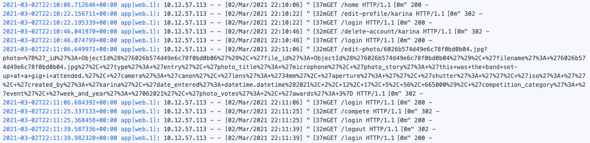

# **Snapathon Application: Testing**

# Testing Table Of Contents

* [**User Story Testing**](#user-story-testing)
  * [1. First Time User Goals Testing](#first-time-user-goals-testing)
  * [2. Returning User Goals Testing](#returning-user-goals-testing)
  * [3. Accessibility User Goals Testing](#accessibility-user-goals-testing)
  * [4. Application Creator User Goals Testing](#application-creator-user-goals-testing)
* [**Issues and bugs caught during testing**](#issues-and-bugs-caught-during-testing)
    * [1. browse()](#browse)
    * [2. winners()](#winners)
    * [3. get_photo()](#get-photo)
    * [4. edit_profile()](#edit-profile)
    * [5. compete()](#compete)
    * [6. base.html](#base-html)
* [**Status Code Testing**](#status-code-testing)
    * [1. 200 Status Code Testing](#200-status-code-testing)
    * [2. 302 Status Code Testing](#302-status-code-testing)
    * [3. 403 Status Code Testing](#403-status-code-testing)
    * [4. 404 Status Code Testing](#404-status-code-testing)
    * [5. 413 Status Code Testing](#413-status-code-testing)
    * [6. 415 Status Code Testing](#415-status-code-testing)
    * [7. 500 Status Code Testing](#500-status-code-testing)
* [**Functionality Testing**](#functionality-testing)
  * [**Base Functionality**](#base-functionality)
    * [1. Navigation](#navigation)
    * [2. Login](#login)
    * [3. Links](#links)
    * [4. Buttons](#buttons)
    * [5. Forms](#forms)
    * [6. Input Validation](#input-validation)
    * [7. Pagination](#pagination)
    * [8. Email](#email)
    * [9. Logout](#logout)
  * [**CRUD Functionality**](#crud-functionality)
    * [Create](#create)
        * [1. New User Registration](#new-user-registration)
        * [2. Entering the Competition](#entering-the-competition)
    * [Read](#read)
        * [1. Viewing a specific profile](#viewing-a-profile)
        * [2. Browsing and filtering images](#browsing-and-filtering-images)
        * [3. Viewing a specific photo entry](#viewing-a-specific-photo-entry)
        * [4. Viewing award-winners](#viewing-award-winners)
        * [5. Viewing user control panel (admin only)](#viewing-user-control)
    * [Update](#update)
        * [1. Update photo details](#update-photo-details)
        * [2. Update user details](#update-user-details)
        * [3. Update user details (admin)](#update-user-details-admin)
    * [Delete](#delete)
        * [1. Delete Photo Entry](#delete-photo-entry)
        * [2. Delete User Account](#delete-user-account)
        * [3. Delete User Account (admin)](#delete-user-account-admin)
  * [**Automated Processes**](#automated-processes)
    * [1. Awards Function - Test 1](#awards-function-test-1)
    * [2. Awards Function - Test 2](#awards-function-test-2)
    * [3. Vote Function - Test 1](#vote-function-test-1)
* [**Browser Testing**](#browser-testing)
    * [Desktop Browser Testing](#desktop-browser-testing)
    * [Mobile Browser Testing](#mobile-browser-testing)
* [**Responsivity Testing**](#responsivity-testing)
* [**Code Validators**](#code-validators)
    * [HTML Validators](#html-validators)
        * [W3C HTML Validator](#w3c-html-validator)
        * [W3C Link Checker](#w3c-link-checker)
    * [CSS Validators](#css-validators)
        * [W3C CSS Validator](#w3c-css-validator)
    * [JavaScript Validators](#javascript-validators)
        * [JSHint](#jshint)
    * [Python Validators](#python-validators)
        * [PEP8 Online](#pep8-online)
* [**Performance and Web Development Tools Testing**](#performance-and-web-development-tools-testing)
    * [Lighthouse](#lighthouse)
    * [Web Dev Measure](#web-dev-measure)
    

        

# User Story Testing 

## First Time User Goals Testing

<details><summary><b>click for tests</b></summary>

- __Easily understand the purpose of this web application. - PASS__
    - The landing page is almost wholly dedicated to elucidating the purpose and functionality
    of the application.
    - The application's name encapsulates meaning, giving the first clue towards purpose.
    - Then the landing page summarises the idea with a pithy tagline.
    - Then it expands that a tad more with icons and more specific language.
    - The timeline further explains purpose with the temporal component outlined.
    - The next section is aptly titled "How does this work"? and it further expands on the competitive aspect.
    - Finally, there is a collapsible that clarifies any and all questions a user might still have at this stage.

- __Quickly and easily understand how to navigate and use the application. - PASS__
    - As abovementioned the purpose and rules are evident.
    - As for 'using' the application, alongside the above, there are also clear links to "register" which is the first action taken by a future user.
    - When registered, a user is brought directly to their new profile page, where a message will indicate what stage of the competition is currently 
    running and what action the user can/should take.

- __Read the competition rules and how to enter and have these be clearly explained. - PASS__
    - The competition rules are available for viewing on the landing page for unregistered users. 
    - They are also available on the compete page for viewing alongside the entry upload form.
 
- __View an application that is visually and creatively appealing and physically easy to look at. - PASS__
    - The colours and layout have all been designed so as to enhance the visual / aesthetic appeal of the application, with a 
    specific eye to contrast and accessibility concerns as will be detailed below.

- __Browse images entered by other people to get a sense of what the application does and how it runs. - PASS__
    - The browse page is fully functional and allows both logged in an guest users to browse images. 

- __Filter my browsing by keyword, or by selecting only images that have won awards. - PASS__
    - The browse page allows logged in and guest users to search for and filter photos by keywords, competition categories & awards status.

- __View the most recent winning images and see how many points they got and who they were created by. - PASS__
    - The "winners" page lays out the most recent award-winning images & creators and allows users to click on an image to see more details.

- __Register an account using my email and password. - PASS__
    - Registration works perfectly and to this original user goal, I added a username requirement to the registration.

- __Confirm my password when registering, to ensure that I don't enter a typo. - PASS__
    - This functionality has been implemented into the registration form. 

- __Contact the application owner if I have any questions. - PASS__
    - The contact form functions to allow users to email the Snapathon admin directly.

</details>


## Returning User Goals Testing

<details><summary><b>click for tests</b></summary>

#### Login & Profile - ALL PASSED
- __Login to the application. - PASS__
    - Login functionality works perfectly.

- __View my profile. - PASS__
    - Users can view their own and others' profiles.

- __Upload an avatar. - PASS__
    - Users can upload, change and delete their profile-pics.

- __Edit my account information - change my password, username or avatar. - PASS__
    - Users can update their account details including their passwords, emails, usernames and profile-pics.

#### Competition - ALL PASSED
- __Enter an image for competition. - PASS__ 
    - Users can upload photos to the competition as long as they remain within the entry parameters.

- __Edit the details of the image I entered for competition. - PASS__ 
    - Users can update their photo's details using the "edit photo details" button when in the photo details view page.

- __Delete the image I entered for competition. - PASS__
    - Users can delete any of their images using the "delete photograph" button when in the photo details view page.

- __View all the images that have been entered into this week's competition. - PASS__
    - Users can view all the images collated together once the entry process has ended, so when voting opens. This was specifically structured this 
    way so as not to give anyone an unfair advantage. 
    - However users can also view the images in the browse section before the voting opens, but they will be mixed together with all other entries, 
    although they can be filtered by competition theme. 

- __Use my vote to vote for the image I think is the best. - PASS__
    - Users can vote for a single image, once voting opens.

#### Profile View & Functionality - ALL PASSED
- __See how many points I have won. - PASS__
    - A user's total points is displayed next to their profile photo on the profile view page.

- __See all the images I've entered into competition. - PASS__
    - A user can view all images they've entered into competition on their profile page under the "entries" tab.

- __View my award-winning images separately from the main collection. - PASS__ 
    - A user can view all award-winning images on their profile page under the "awards" tab.

- __View all the images I've voted for. - PASS__
    - A user can view all the images they have voted for on their profile page under the "votes" tab.

#### Other - ALL PASSED 
- __View other user profiles to see their images, who they've voted for and how many points they've won. - PASS__
    - A user can view other user profiles by clicking on the usernames on the winners page, by clicking on any of the thumbnails on the browse page 
    and then clicking on the username on that photo's details page, or (should they want to) by typing "profile/\<username>" in the url.
    - User profiles are open to public view.

- __Browse all the images entered from all competitions. - PASS__
    - The browse page allows logged in and guest users to browse all entries entered into all competitions.

- __Filter my browsing by keyword, or by selecting only images that have won awards. - PASS__
    - The browse page allows logged in and guest users to search for and filter photos by keywords, competition categories & awards status.

- __View the most recent award-winning images and see how many points they got and who they were created by. - PASS__
    - The "winners" page lays out the most recent award-winning images & creators and allows users to click on an image to see more details.

</details>

## Accessibility User Goals Testing 

<details><summary><b>click for tests</b></summary>

- __As a user who is colourblind, I want the colours and design elements used to employ sufficient contrast so that any visual cues are easily apparent. - PASS__
    - The colours and contrast was taken into account during the wireframing and initial planning stages of the application. 
    - They were checked and rechecked with Chrome's Web Disability Simulator after every design alteration.
    - The choice of yellow and dark grey was with an eye to its excellent contrast and how easily viewable it is by the greatest range of users.
    - None of the application's functionality is dependent on a user being able to correctly discern between colours. Colours are used to enhance the experience for 
    normally sighted users, such as "Delete" buttons being red, however they also have "delete" written on them, or they employ the use of icons that clearly illustrate 
    their purpose.
    - Here are some of the screenshot examples of how the application is viewed by colourblind users:

*__Total Colourblindness__*

<p align="center">
  
</p>

*__Yellow-Blue Colourblindness__*

<p align="center">
  
</p>

*__Red-Green Colourblindness__*

<p align="center">
  
</p>

- __As a keyboard user, I want to be able to navigate the application using the keyboard. - PASS__
    - All functionality is fully keyboard accessible.

- __As a user using screen reader technology, I want my screen reader to describe the page elements correctly. - PASS__
    - Aria-labels have been added to all important elements.
    - Elements have been written with an eye to the correct semantical format to ensure the best possible experience for screen-reader dependent users.

</details>

## Application Creator User Goals Testing

<details><summary><b>click for tests</b></summary>

- __Create and maintain a user-friendly platform allowing photography enthusiasts to compete with each other and to inspire each other with excellent images. - PASS__ 
    - This application achieves the above. 

- __Ensure that the application is as accessible as possible to include as wide a variety of users as possible. - PASS__
    - As above I have developed this application with an eye to strong accessibility best practices.

- __Create a competition application that is re-usable for other fields, if this one proves popular. - PASS__
    - The format of this application would be easy to expand on, or re-produce for other arenas/industries. 

- __Eventually introduce a profit-earning aspect to the application, perhaps by monetizing awards for professional photographers .- IN DEVELOPMENT__
    - This has not yet been done, but remains a distinct possibility. 

</details>

# Issues and bugs caught during testing

## browse()

### Issue 1

When developing my search / filter method, I wanted to give users the option of filtering their searches by keywords, categories and awards. 
The default mongo db index $search method for $text indexes is an 'or' search, i.e. if a user types in "Mountain" and then chooses "Landscape" from
the category dropdown menu, the search would return all photos entered into landscape competitions AND all images with mountain as a keyword. 
What I wanted is an "and" search, so that the search would return all images entered into landscape competitions with "mountain" as a keyword.

### Fix

Unfortunately the mongoDB documentation was of no use here. It doesn't cover "and" searches, thankfully stack overflow had the answer. Separating 
the search terms with "" works as below: 

                { "$search": "\"mountain\" \"landscape\"" }


### Issue 2 

When integrating pagination with my search function, it worked fine for the regular browsing page, where all images are displayed. The full number of photos returned 
were correctly divided up and pagination laid out, however when the search was filtered, the pagination stopped working once a user clicked to go to page 2. The initial pagination
worked correctly, but then page 2 would just return all the images again, unfiltered. 

### Fix

I eventually changed and refactored the flask-paginate functionality into my function paginated_and_pagination_args() which worked for all pages. 
Thanks to [Ed Bradley](https://github.com/Edb83) & Kevin from Code Institute for some initial pointers on how to go about doing this.

### Issue 3 
In order to set the values of the search form to the values searched for by the user, I needed to pass the template variables from the pages to the javascript file.
```category``` & ```awards``` held the values of the user's search and because they represent one of multiple choices, I could not refer directly to the value in the form
field as with ```query```. 

An easy option would be to write inline JavaScript that used the template variables, however my CSP would not allow for that, without voiding the protection afforded by it.

### Fix
I created two hidden elements that printed the values of ```category``` and ```awards``` to the template, and then I was able to target those elements with JavaScript in my 
external script file, without altering my CSP.

## winners()

### Issue 1
When testing this function and page over the course of a week, all was working well until suddenly I was getting a 504 Gateway Time-out error message. 
<p align="center">
  
</p>

### Fix
I used a number of print statements in the function and discovered that the issue was here:

       
        if day_of_week in range(0,5) or day_of_week == 6 and hour_of_day < 22:
            images_to_display = get_winning_images_by_week_and_year(last_week_and_year)
            last_mon = week_before
            while last_mon.weekday() != 0:
                last_mon = last_mon - timedelta(days=1)

I had mistakenly used range(0,5) thinking that would *include* 5 (or weekday() == saturday), but range is not inclusive of the outer number, so it was ignoring
Saturday, and thankfully I was testing it on a Saturday, otherwise it probably would have gone unnoticed. Changing range to ```range(0,6)``` solved the issue. 

### Issue 2
As some photos are vertical and some are horizontal, the placement of the awards badge on the overlay was too far away and missing the image completely on vertical
images. I needed a way to set the left: position of the award depending on whether the image was vertical or horizontal. Another related issue was the width 
attribute of the winning images. For landscape images I needed the width to be the full 100%, but for vertical images I needed it to be maximum 100%, as the 
max-height was set at 600px and by forcing the image to take up 100% of the space, much of the image would be hidden. 

### Fix
I used the following function to conditionally set extra classes for the horizontal images, this was vertical images were the default and I could change the max-width: 100%
to width:100%, and I set the particular left: position for the horizontal awards as well. 

                function verticalOrHorizontalAwardImage(){
                    let photos = document.querySelectorAll('.award-photo')
                    photos.forEach(photo => {
                        if (photo.width > photo.height){
                            photo.classList.add('award-photo-horizontal')
                            let awardBadge = photo.nextElementSibling.children[0]
                            awardBadge.classList.add('award-horizontal')
                        }
                    })
                }

### Issue 3
The above worked, except sometimes the styles didn't seem to apply, and only on multiple page reloads would they work.

### Fix

## get_photo() 

### Issue 1

This is the photo detail page, and I wanted to dynamically set the "back to..." button to check what the source url was and then insert a link to go back to that particular page. 

This was coded using request.referrer in the get_photo() route and then that was passed into the template using a "source_url" variable, which was then reference conditionally for example:

            

            <a href="{{url_for('profile', username=photo.created_by)}}"><i class="fas fa-long-arrow-alt-left"></i>Back to {{username|capitalize}}'s Profile</a>
            
            

And so on... However if the user is logged in and viewing her/his own photo, they have the option of editing that photo's details. They see an "edit photo" button which brings them to the edit_photo
view, they edit a form that is pre-filled with the photo's details and click save. This then brings them back to the photo detail view. With the source_url code in the template, the act of them saving
changes to their image was causing the following error: 

<p align="center">
  
</p>

### Fix 1

Some investigation led me to the fact that "POST" methods do not have a "source_url" insofar as the request.referrer from a POST is None, which was throwing this error. As a fix, I added another IF statement
to the template, first checking IF there is a source_url, and if there is not, then it's most likely coming from the edit_photo view and does not require a "back to.." link as the user can just click on the "Edit photo
details" button again.

## edit_profile()

### Issue 1 
As part of the edit profile functionality I wanted to give users the option to delete any custom profile picture they had uploaded that they no longer wanted, but without
having to upload a replacement image. I wanted to include an X button on the update profile form which would allow them to just delete their current profile pic and
to revert to the default. 

This functionality proved a lot harder than imagined because unlike other input fields the "file" field could not automatically and easily link to the file object stored in the 
database, and there was no obvious way of determining how to display the delete button. 

### Fix 1
To solve this, I did a number of things: 

1. First in the edit_profile template, I checked whether the user had a custom profile photo uploaded and for users that did, I pre-filled the value field of the file input
with the unique filename of that image. 
2. Then I added a delete profile pic icon with a tooltip on hover to further explain its' purpose.
3. Then I devised a JavaScript function that listened for clicks on that icon and when clicked would create a hidden input field with a value to POST to my flask view.
This allowed me to write logic based on the specific situation whereby a user has a profile image and wants to just delete that image. 

I found that without this hidden field there were no attributes present and readable in the "file" input field that I could use to write conditional logic. 

## compete() function

### Issue 1 & Fix 1

The difficulty here was in using gridfs to store the larger file type of a photograph. Mongo does not store images in their db directly, so I had to understand 
how the request object and gridfs work together to store files. 

        if 'photo' in request.files:
            photo = request.files['photo']

            file_id = mongo.save_file(photo.filename, photo)

The above code takes the file input with its name set to 'photo' from the request.files and sets that as a variable called photo. I then stored the result of saving that 
to mongo db in a variable called file_id which I was then able to add to the photo object as an attribute called file_id. Since this string is unique I could then reference it as below
in order to add that specific photo's _id to the user's photos array. Hence all three collections are connected: the photos, the users and the files.

            photo_to_add_to_user = mongo.db.photos.find_one({"file_id": file_id})
            photo_id_to_add_to_user = photo_to_add_to_user["_id"]


### Issue 2:

The method of retrieving and displaying files that gridfs uses made this functionality more complicated, as the send_file() function that it relies on, only uses the file's "filename"
to send the file. This was frustrating because it is quite possible that there be more than one photo with the same filename. 'photo.jpg' or the like. So as I had to rely on the filenames, 
instead of on the objectIds as I'd hoped, I needed a way to make every filename completely unique. 

### Fix:

I achieved this by creating a new filename, using the suffix (.png, .svg, .jpg) and then once the save_file() method had returned the file_id into my variable of the same name, I used a str() of 
this to create a filename for each image that is completely unique and identical to their file_id. I then updated the file in mongo to have this new filename. 

            filename_suffix = photo.filename[-4:]
            new_filename = str(file_id) + filename_suffix
             
            mongo.db.fs.files.update_one({"_id": file_id},
                                    { '$set': {"filename": new_filename}})


### Issue 3:
I wanted to implement a shuffle function for the vote page so that no one's images are given undue physical priority. For example if one image is always the first 
listed, and there are 50 images in the competition, which are paginated 10 per page, all images one page 1 are more than likely going to get more votes. 

### Fix:
This proved harder than imagined to fix, first I created a shuffle function that took an array and return a random shuffle of that array, which I then passed to the paginate
function. The problem with this is that it shuffled each time a new page was loaded, so a photo might appear on page 1, but appear again on page 4. So this implementation
was useless. 

My next thought was to shuffle the images at source, so as they emerge from Mongo DB, that way, they would not be shuffled each time the page is loaded. But that resulted in 
the exact same issue, just with the shuffle happening at an earlier stage.

I realised that there is a logical inconsistency with merging a random shuffle with pagination that is difficult to overcome. If the shuffle is truly random then we are left with
the initial problem that once a page is "turned" a photo can be on two pages at once, and some images may not display at all. 

As a compromise, I decided to increase the number of images per page to 50 for the vote and compete pages, and although this might increase the page loading time, at lease the shuffle
will be consistent and all images will display, I also changed the location of when the shuffle function is called. 

                this_weeks_entries = list(mongo.db.photos.find(
                        {"week_and_year": date_time.strftime("%V%G")}))

                pagination, photos_paginated = paginated_and_pagination_args(
                                            this_weeks_entries, 50, "page", "per_page")

                photos_paginated_copy = photos_paginated.copy()

                photos_paginated_shuffled = shuffle_array(photos_paginated_copy)

                return render_template("compete.html",
                                    this_weeks_entries=photos_paginated_shuffled,

As you can see from the above code, first I paginated the image array and then I shuffled them, this way even if there are more than 50 images and some are unlucky enough to
be pushed to page 2 or further, at least within those pages the order is randomised on each page load. 

This functionality will do for the first iteration of the application, but there is definitely room for improvement. 

## base.html template

### Issue 1:
I needed a way to reference datetime in my navigation html and because the navigation html code was written in the base.html template, there was no route leading to it that I could use to include the datetime 
variables. 

### Fix:

I discovered @app.context_processor functions which run before the templates are rendered and allow you to inject things into the entire application. I used a context_processor for datetime. 

## Integrating Email functionality

### Issue 1:
I got the email working after collating many online tutorials, but the "sender" information that I was extracting from the form was not translating over to gmail where the emails could be read. So it looked like all 
the emails were being sent from the Snapathon gmail account, as below:

<p align="center">
  
</p>


### Fix:
I realised that this is expected behaviour, because it is the connected gmail account sending emails to itself. To pass on the sender information, I added the form sender into the message that gets delivered to the app's gmail, as below: 

            if request.method == "POST":
                with app.app_context():
                    msg = Message(subject="New Email From Contact Form")
                    msg.sender=request.form.get("email_of_sender")
                    msg.recipients=[os.environ.get('MAIL_USERNAME')]
                    message = request.form.get("message")
             -->    msg.body=f"Email From: {msg.sender} \nMessage: {message}"
                    mail.send(msg)
                    flash("Email Sent!")
                    return redirect(url_for('home'))

### Issue 2:
The email functionality was working fine in the local port, but when deployed to Heroku I was getting the following error: 

<p align="center">
  
</p>

### Fix:
I had not inputed my new mail configuration variables in the Heroku config vars input area. Once I did it connected perfectly.

## awards()

### Issue 1 

When the awards function was run, it was over awarding certain users. During testing I ran a number of simulations and found that 4 users in particular were being awarded
an illogical number of points. Everyone else was being awarded the correct number of user_points, and the awards were working correctly as far as the photos were concerned. 

### Fix 1 

I ran through the function line by line and using print() statements on every logical segment, I discovered that the users in question were being added twice to the valid_users
array. Eventually I realised that in testing the application I had uploaded more than the one allotted photo for each of those users and since the function is based on an assumption
of 1 entry per user per week, that fact was breaking the code. I deleted the offending extra images and it worked well again, but there is definitely room to refactor that code *if* 
I decide that the application could host more than a single competition per week, or if users are allowed upload more than one image per competition. 

### Issue 2 

During testing for edge-cases, I found 3 different but related scenarios that were breaking the application:
1. If no one voted for any of the entries during the week and the awards() function ran on schedule on Sunday night, it was throwing an error. 
2. If one photo got all the votes - error. 
3. If one photo got say 6 votes, one photo got 4 photos and no other photos got votes, the application was awarding 1st & 2nd place logically, but then awarding 3rd 
place to every other entry.

### Fix 2

When refactoring the code to account for these edge-cases, I firstly included ternary operators in my definition of all the vote_count variables. Checking to see if 
the arrays that they rely on had any data in them, i.e. were not 0. If they were 0, I made the count equal null. Then in defining each subsequent array, I first checked 
to make sure the count they relied on was not null/None.

            first_place_vote_count = max(array_of_scores) if array_of_scores else None

            if first_place_vote_count:
                second_place_vote_array = [n for n in array_of_scores if n != first_place_vote_count]

            second_place_vote_count = max(second_place_vote_array) if second_place_vote_array else None
            if second_place_vote_count:
                third_place_vote_array = [n for n in second_place_vote_array if n != second_place_vote_count]

            third_place_vote_count = max(third_place_vote_array) if third_place_vote_array else None

            return first_place_vote_count, second_place_vote_count, third_place_vote_count

In the next part of the awards logic, I then added an extra check ```and first_place_votes_needed > 0:``` to each level to ensure that the votes needed 
to receive an award were greater than 0, and only if they were does the code assign awards to those images, and thus down the line, points to those users. 

            for entry in photo_arr:
                if entry["photo_votes"] == first_place_votes_needed and first_place_votes_needed > 0:
                    database_var.db.photos.update_one(
                        {"filename": entry["filename"]},
                        {'$set': {"awards": 1}})
                    user = database_var.db.users.find_one(
                        {"username": entry["created_by"]})

                    if user not in first_place_users:
                        first_place_users.append(user)

## Error Messages

### Issue 1
413 Errors (request entity too large / Payload too large) were not passing to the error.html template to render correctly. In development I was getting a message 
saying the port was unresponsive. 

### Fix 1 
Using print() I was able to see that the error view was working correctly right up until the rendering of the template. If I switched from rendering a template to just 
returning the error message like this:

            @app.errorhandler(413)
            def payload_too_large(e):
                error = 413
                error_msg = "Sorry, but the file you're trying to upload is too large."
                return error_msg, 413

It worked fine, but I wanted my nicely styled error page to load, as with all other errors. Especially since this particular error would likely be thrown a lot as users try 
to upload large files. 

After some research I found the following note in the Flask documentation:

            Connection Reset Issue
            When using the local development server, you may get a connection reset error instead of a 413 response. 
            You will get the correct status response when running the app with a production WSGI server.

I checked it on the deployed version and it still wasn't working. (FINISH)

# Status Code Testing 

## 200 Status Code testing
<details><summary><b>click for tests</b></summary>

### Guest Users 

- /home - __PASS__ 
- /winners - __PASS__  
- /browse - __PASS__
- /profile/username - __PASS__
- /photos/photo_filename.jpg = __PASS__
- /home#contact-form - __PASS__  
- /login - __PASS__   
- /register - __PASS__  

<p align="left">
  
</p>

### Logged In Users

- /home - __PASS__ 
- /winners - __PASS__  
- /browse - __PASS__   
- /profile/username - __PASS__
- /edit-profile/username - __PASS__
- /photos/photo_filename.jpg - __PASS__
- /edit-photo/photo_filename.jpg - __PASS__  
- Competition Pages
    - /compete?username=username ('Compete' in navbar Mon-Fri) - __PASS__ 
    - /compete?username=username ('Vote' in navbar Sat-Sun until 22:00) - __PASS__ 
    - /compete?username=username ('Awards' in navbar Sun from 22:00-00:00) - __PASS__ 
- /home#contact-form - __PASS__ 

<p align="left">
  
</p>

### Admin Users
- /admin - __PASS__
- /home - __PASS__ 
- /winners - __PASS__  
- /browse - __PASS__
- /profile/username - __PASS__
- /edit-profile/username - __PASS__
- /admin-search - __PASS__
- /admin-delete-user-account/username - __PASS__
- /photos/photo_filename.jpg - __PASS__ 
- Competition Pages
    - /compete?username=username ('Compete' in navbar Mon-Fri) - __PASS__ 
    - /compete?username=username ('Vote' in navbar Sat-Sun until 22:00) - __PASS__ 
    - /compete?username=username ('Awards' in navbar Sun from 22:00-00:00) - __PASS__  
- /home#contact-form - __PASS__ 

<p align="left">
  
</p>

</details>

## 302 Status Code Testing
<details><summary><b>click for tests</b></summary>

The following url requests by the following categories of users should return a 302 redirect status code:

### Guest Users 

- /edit-profile/username -  __PASS__ 
- /delete-account/username -  __PASS__
- /edit-photo/photo_filename.jpg - __PASS__
- Competition Pages
    - /compete?username=username ('Compete' in navbar Mon-Fri) - __PASS__ 
    - /compete?username=username ('Vote' in navbar Sat-Sun until 22:00) - __PASS__ 
    - /compete?username=username ('Awards' in navbar Sun from 22:00-00:00) - __PASS__  
- /logout -  __PASS__
  
<p align="left">
  
</p>

### Logged In Users 

- /edit-profile/username (When the username to edit is not that of the logged in user) - __PASS__
- /edit-photo/photo_filename.jpg (When the photo's creator is not that of the logged in user) - __PASS__

<p align="left">
  
</p>

### Admin Users 

- /edit-photo/photo_filename.jpg - __PASS__

<p align="left">
  
</p>

</details>

## 403 Status Code Testing
<details><summary><b>click for tests</b></summary>

The following url requests by the following categories of users should return a 403 Forbidden status code:

### Guest Users 

- /admin -  __PASS__
- /admin-search - __PASS__
- /admin-delete-user-account/username - __PASS__ 

<p align="left">
  
</p>

### Logged In Users 

- /delete-account/username (When the username to delete is not that of the logged in user) -  __PASS__
- /admin -  __PASS__
- /admin-search - __PASS__
- /admin-delete-user-account/username - __PASS__ 

<p align="left">
  
</p>

</details>

## 404 Status Code Testing
<details><summary><b>click for tests</b></summary>

Any time any user types in an incorrect URL - they should receive a 404 status code.

Specifically important is that urls that are *almost* correct, as in they have the correct prefix, but lead to a non-existent profile or photo,
also return 404 status codes. 

### Guest Users 

- /totally-incorrect-url - __PASS__ 
- /profile/incorrectusername - __PASS__  
- /photos/incorrectphotofilename.jpg - __PASS__ 

<p align="left">
  
</p>

### Logged In Users 

- /totally-incorrect-url - __PASS__ 
- /profile/incorrectusername - __PASS__  
- /photos/incorrectphotofilename.jpg - __PASS__ 

<p align="left">
  
</p>

### Admin Users 

- /totally-incorrect-url - __PASS__ 
- /profile/incorrectusername - __PASS__  
- /photos/incorrectphotofilename.jpg - __PASS__ 
- /admin-delete-user-account/incorrect-username - __PASS__ 

<p align="left">
  
</p>


</details>

## 413 Status Code Testing
<details><summary><b>click for tests</b></summary>
</details>

## 415 Status Code Testing
<details><summary><b>click for tests</b></summary>
</details>

## 500 Status Code Testing
<details><summary><b>click for tests</b></summary>
</details>

# Testing the Automated Processes

## Testing the awards() function
The awards() function runs automatically on a Sunday evening at 22:00 - and for the first tests I decided to change those settings and run it manually. 

Firstly I created a selection of dummy users and for each of them I entered 1 image into a dummy weekly competition. I then made each user vote for various images and recorded
who voted for which image. I created two spreadsheets: one recording what the user actions were and expected results, the other recording the photograph votes received and expected
awards. Basically a manual version of what automated tests would achieve. 

#|Photo Title | Votes Received | Photo Created By | Users Who Voted For Photo | Expected Awards | Actual Awards
---|------------ | -------------|--------------|----------------------|------------|--------
. | __*Test 1*__ 
1.| "Sunset of Fire"  | 7 | Eoghan | Anne1, Cathy, Frederick, Loretta, Monica, Orlaith, Derrick | 1st place | 1st place
2.| "Best Beach Ever"  | 3 | Frederick | Eoghan, Georgina, Horatio | 2nd place | 2nd place
3.|  "Lightening Attack"  | 3 | Ignacio | Barbara, Stephanie, Quentin | 2nd place | 2nd place
4.|  "Peace & Quiet"  | 2 | Derrick | Ignacio, Patricia | 3rd place | 3rd place
. | __*Test 2*__ 
1.| "Sunset of Fire"  | 7 | Eoghan | Anne1, Cathy, Frederick, Loretta, Monica, Orlaith, Derrick | 1st place | 1st place
2.| "Best Beach Ever"  | 3 | Frederick | Eoghan, Georgina, Horatio | 2nd place | 2nd place
3.|  "Lightening Attack"  | 3 | Ignacio | Barbara, Stephanie, Quentin | 2nd place | 2nd place
4.|  "Peace & Quiet"  | 2 | Derrick | Ignacio, Patricia | 3rd place | 3rd place

As you can see the awards and points logic functioned perfectly in both tests, but as below illustrates this manually testing strategy caught 
an inconsistency with the user_points. Once I solved it, test 2 ran correctly. 


#|User | User Photo | Photo User Voted For | Expected User Points From Awards | Expected User Points From Voting | Expected User Points Total | Actual User Points Total
---|------------ | -------------|--------------|----------------------|------------|--------|-----
. | __*Test 1*__ 
1.| Derrick | "Peace & Quiet" | "Sunset of Fire" | 3 | 3 | 6 | 6
2.| Eoghan | "Sunset of Fire" | "Best Beach Ever" | 7 | 2 | 9 | _*11*_
3.| Frederick | "Best Beach Ever" | "Sunset of Fire" | 5 | 3 | 8 | _*11*_
4.| Ignacio | "Lightening Attack" | "Peace & Quiet" | 5 | 1 | 6 | 6
. | __*Test 2*__ 
1.| Derrick | "Peace & Quiet" | "Sunset of Fire" | 3 | 3 | 6 | 6
2.| Eoghan | "Sunset of Fire" | "Best Beach Ever" | 7 | 2 | 9 | 9
3.| Frederick | "Best Beach Ever" | "Sunset of Fire" | 5 | 3 | 8 | 8
4.| Ignacio | "Lightening Attack" | "Peace & Quiet" | 5 | 1 | 6 | 6


I created two development functions clear_user_points() & clear_all_awards(), to quickly and easily clear the slate and re-test the awards() function as many times 
as needed. 

        def clear_user_points():
            all_users = list(mongo.db.users.find())
            for user in all_users:
                mongo.db.users.update_one({"username": user["username"]}, {'$set': {"user_points": 0}})
            print("All user points zeroed")


        def clear_all_awards():
            all_photos = list(mongo.db.photos.find())
            for photo in all_photos:
                mongo.db.photos.update_one({"filename": photo["filename"]}, {'$set': {"awards": None}})
            print("No photo has any awards now.")

This strategy helped me catch one issue that arose not because of the code logic, but because I had allowed 4 users to upload more than one image. 

### Testing the "user must vote" rule contained in the awards() function. 

The rules of the competition state that if you enter the competition, you must vote for an image other than you own before 22:00PM on Sunday. Users who enter 
and who do not vote, will have their entry's points reduced to 0. This happens automatically as votes are counted. To test this, I created a dummy user called "Franny"
who entered an image of some leaves, and whose image got 100 votes between Friday night and Sunday at 22:00. Franny did not vote for any image. I then ran the awards()
function and made sure that her image's points were reduced to 0. 

#### Franny's user document before awards() is run:
<p align="left">
  
</p>

#### Franny's photo document before awards() is run:
<p align="left">
  
</p>

#### Franny's user document after awards() is run:
<p align="left">
  
</p>

#### Franny's photo document after awards() is run:
<p align="left">
  
</p>

As you can see the ```awards()``` function correctly reduced Franny's ```votes_to_use``` from 1 to 0, 
as well as reducing her photo "leaves"'s ```photo_votes``` from 100 to 0.
Leaves received more votes than any other photo in that competition, but did not win any awards, 
evidenced by its ```awards``` field remaining ```null```

## Testing the awards() function 2

To ensure that everything including the AP Scheduler automaton worked well, I ran another test, but for this one I did not interfere with the timing 
of the logic.

### Process:

1. Again, I created (and re-used) 31 dummy users and images and had them all enter a weekly competition with the theme of "Architecture". 

2. I ensured that all the awards() logic was as it would in the final deployment. 

3. On Saturday I had 29 of the dummy users vote for their favourite images. 

4. 2 dummy users "forgot" to vote and they are for testing the "user must vote" rule. Their photo's points should be reduced to 0. 

5. 


## Testing the Vote logic

### Issue 1

An issue with the functionality of the application arose when I realise that during the voting period ( Friday at midnight until Sunday at 22:00 ) users could see
the points on the images by clicking into the photo details, or by looking at the profile "Votes" section of different users. Admittedly it would take some amount of independent 
focused research on behalf of the contestants, however if they did it, it would make it easy for a user to score points by voting for the image doing the best just before voting ends. 

### Fix 1 

I looked at the locations in the application that display points and I changed the code to make the points display only occur for photos whose week_and_year field was not equal 
to the current week_and_year. For the photo details page this line was added to the template itself: 

            {% if datetime.strftime("%V%G") != photo.week_and_year %}
                <h3 class="photo-points col s10 offset-s1 center-align">{{photo.photo_votes}} points</h3>
            


For the user profile page, I confined the logic to the view rather than the template:


        if photos_voted_for_array != []:
        for img in photos_voted_for_array:
            photo_obj = list(mongo.db.photos.find({"_id": img}))
            for photo in photo_obj:
                if photo["week_and_year"] != datetime.now().strftime("%V%G"):
                    photos_voted_for_objs.append(photo)  

Where ```photos_voted_for_objs``` was the array passed to the template.  

# Input Validation

## Registration Form

Various validations were employed to ensure the registration form saved the correct inputs to the database. 

1. The 'required' attribute was added to *all* inputs to ensure that no blank fields are returned. 

2. For usernames the 'min-length' attribute was set to 5 and the 'max-length' to 25.

3. For passwords, the 'min-length' attribute was set to 6 and the 'max-length' to 25.

4. For the email input the 'pattern' attribute was employed to use regex to ensure only valid email formats are entered. 

        pattern="^([a-zA-Z0-9_\-\.]+)@([a-zA-Z0-9_\-\.]+)\.([a-zA-Z]{2,5})$"

    This is not a failsafe regex for email, however it will suffice for the first iteration of this application. 

5. On the backend side of things, both usernames and emails are checked against existing data in the database to ensure neither have already been registered. 

6. Also on the backend, the password & password confirmation fields are checked against each other, to ensure they match and to protect against typos. 

## Compete form for uploading user's photos into competition

- Validations:

### Limiting the maximum size of uploaded files

This was achieved using a config instruction: ```app.config['MAX_CONTENT_LENGTH'] = 1024 * 1024``` This effectively stops any request body that is larger
than 1MB. Flask automatically halts any large requests and returns a 413 status code. This is a useful validation for two reasons: it stops overly massive images from being uploaded
that would slow the application down, and it stops a decent amount of potential security threats where hackers upload malicious programmes. 

### Limiting the type of files that can be uploaded 

This was achieved again by using a config instruction: ```app.config['UPLOAD_EXTENSIONS'] = ['.jpg', '.png', '.gif', '.svg', '.jpeg']``` Which was then referenced in 
the compete() method for uploading photos. When the file is received but before it is saved to the database, the compete() function checks if it is one of these acceptable 
file types and if not, it throws an error: 

        file_extension = os.path.splitext(photo.filename)[1]
            if file_extension not in app.config['UPLOAD_EXTENSIONS']:
                abort(400, "Sorry that file extension is not allowed. Please reformat your image to one of the following acceptable file types: jpg, svg, jpeg, png or gif")

This further limits the ability of users with malicious intent to upload damaging files to the database.

### Sanitizing the filenames for further security 

Another security validation incorporated is the werkzeug ```secure_filename``` util. This is applied to the uploaded photo filename before it is saved to the database, to ensure that any
dodgy filenames e.g. /paths/to/os/systems/etc.jpg are sanitized before they can do any damage. 


## Security Considerations

### WTF-forms & CSRF Protection

### Flask-Talisman 

#### Issue 1

I installed flask-talisman to protect against a variety of common security threats and when I reloaded my application, it had changed it somewhat:

<p align="left">
  
</p>
<p align="left">
  
</p>

#### Fix 1

I gleaned that Talisman was not allowing the Materialize framework to do its job and it 
transpired that it was blocking a number of domains from sending data to the site, which of course
is what it does. To allow in the sources of: Google Fonts, Materialize and jQuery, as well as my own 
JavaScript files, I had to explicity tell Talisman that those sources were ok. I did so as below with a 
little help from Stack Overflow (attributed in README.md)

        csp = {
            'default-src': [
                '\'self\'',
                'cdnjs.cloudflare.com',
                'fonts.googleapis.com'
            ],
            'style-src': [
                "\'self\'",
                'cdnjs.cloudflare.com',
                'https://fonts.googleapis.com'
            ],
            'font-src': [
                "\'self\'",
                "https://fonts.gstatic.com"
            ],
            'img-src': '*',
            'script-src': [
                'cdnjs.cloudflare.com',
                'code.jquery.com',
                '\'self\'',
            ]
        }

        talisman = Talisman(app, content_security_policy=csp)

This code adds an extra layer of security as it allows in images from all sources, within the parameters of the 
security measures I have already set up for images, but it does not allow any other media files. 